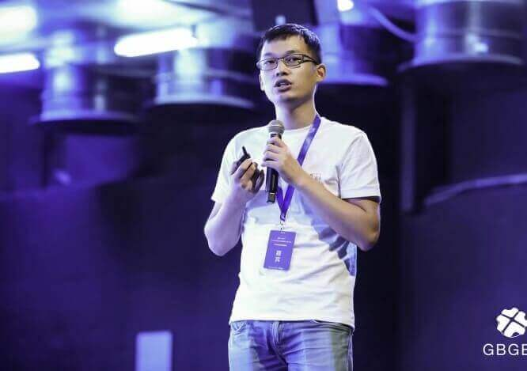
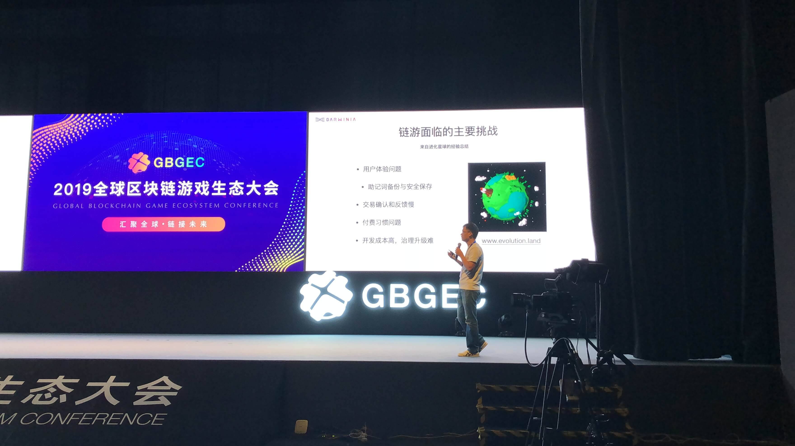

2019年08月02日，Darwinia Co-Founder Denny受邀出席了全球区块链游戏生态大会#GBGEC，并发表演讲。

<!--truncate-->

Denny表示“Polkadot提供了一个新的解决方案，解决大家所面临跨链的两大难题：共享安全性和共享运行时，这个是Polkadot最有价值的方向，我们认为基于Polkadot做跨链的服务是最佳的。”

Darwinia将在最近发布新一版的Testnet以及Web Wallet，欢迎社区成员积极参与。