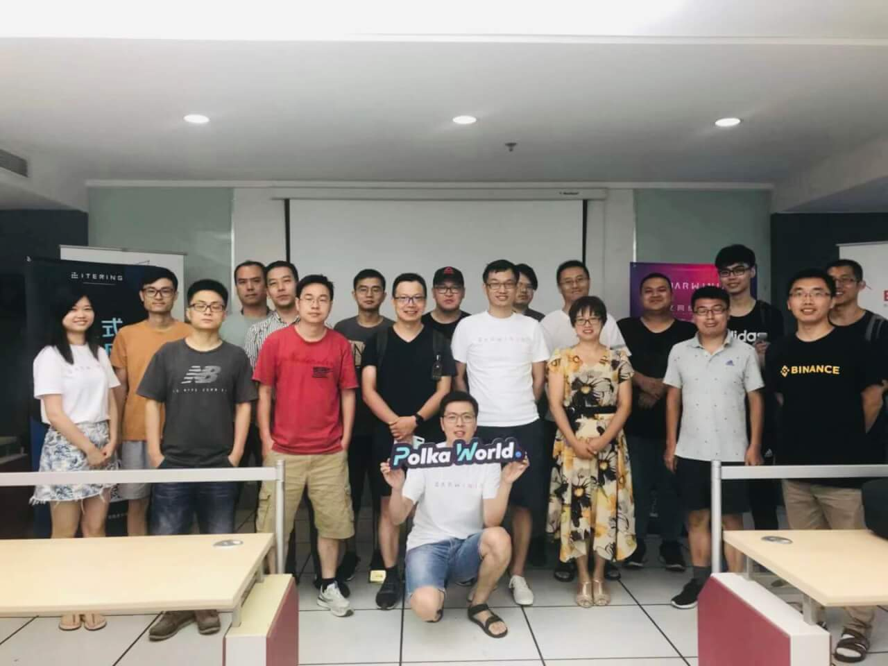

2019 年 08 月 03 日，由 Darwinia 和 PolkaWorld 联合举办的 Substrate Workshop 第六期在南京顺利举办。

<!--truncate-->

来自 Darwinia 的讲师王大锤、刘畅和吴旻哲分别分享了 Substrate 源码概览、如何基于 Substrate 一键发链和如何扩展原生 Substrate 模块。近 20 位开发者参与了此次 Workshop。

