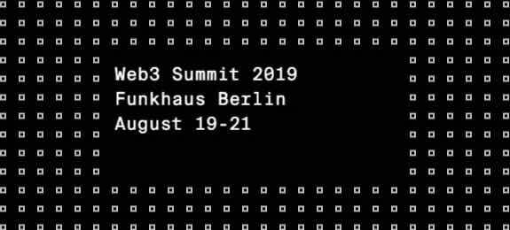

Polkadot 首个应用平行链 Darwinia Network（达尔文网络）受 Web3 Foundation 邀请，将参加于今年夏天 8 月 19 日至 21 日在柏林 Funkhaus 举行的 Web3 Summit，并发表主题演讲：Non-fungible Token Identifiability。

<!--truncate-->

在 Web3 峰会期间，Darwinia 还将参加 W3F 与 BGA 联合主办的游戏产业 Meetup，该 Meetup 将讨论当下区块链游戏面临的主要痛点和合作新机遇，Summit 持票者可直接参加。

时间：2019.08.19 16:30 - 18:00
地点：Hackernode of Web3 Summit

除此之外，Darwinia 还同时受邀参加 10 月 29 日 W3F 在法国巴黎举办的 GameConnection 活动。

Web3 Summit 是一场为期 3 天的聚会，旨在为去中心化项目团队搭建协作与交流桥梁 。世界各地的与会者飞来柏林，在会议期间举办工作坊与技术活动，并通过展示研究与演示技术 demo 来分享开发心得，帮助其他开发者能够在前人的经验基础上继续开发开源项目。去年，共计超过 900 名开发者、研究人员和创业者齐聚第一届 Web3 峰会。
