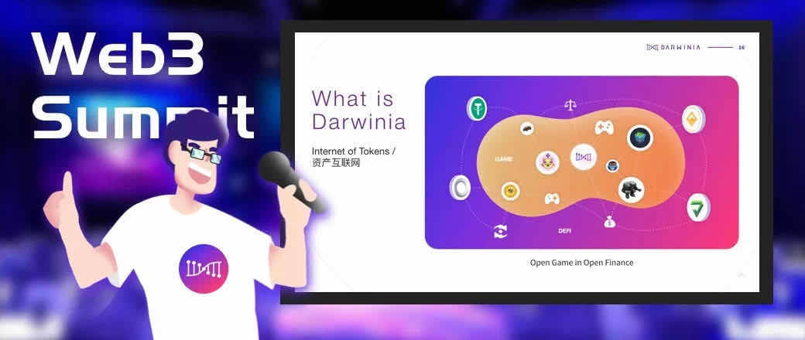
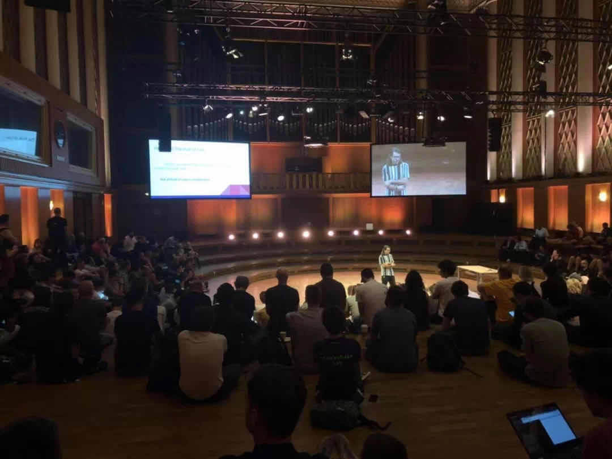
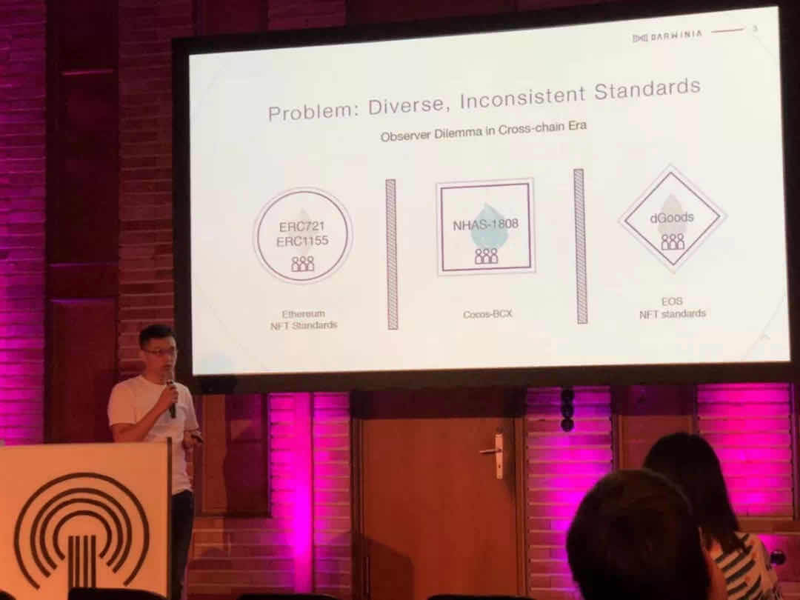

Web3基金会举办的Web3 Summit于8月19日至21日在德国柏林举行。Web3基金会主席、Substrate及Polkadot创始人Gavin Wood博士与众多Polkadot生态项目方及合作伙伴在本次会议上面向全球开发者和社区成员进行了分享。达尔文网络（Darwinia Network）创始人Denny Wang与Alex Chien应邀参会，进行了题为「非同质化资产可识别性」（Non-fungible Token Identifiability）的主体演讲。

<!--truncate-->

从加密猫（CryptoKitty）热潮开始，非同质化资产（NFT）在各类链游及dApp中作为去中心资产或道具被广泛接受，各条公链也制定了相关标准，如ERC1155，NHAS1808，EOS NFT Standard等，但由于标准类型繁多，导致各类NFT资产之间的相互兼容与识别变得较为复杂。

因此，达尔文网络提出了“星际资产编码标准”，通过对不同类型的通证进行预定义分段编码，实现自省性与全局唯一性，为各类不同标准的通证资产及信息跨链交互提供了新的解决方案。星际资产编码标准现已支持Ethereum、EOS、TRON等多条公链，在Polkadot主网上线后，Darwinia将接入平行链插槽，并据此为更多公链提供跨链支持。

**关于Dr. Gavin Wood**

Gavin Wood博士是以太坊创始人之一，以太坊代码工程的主要实现者，起草了以太坊技术白皮书，同时他也是智能合约开发语言Solidity的发明者，Parity的发起人，Substrate架构创始人，跨链技术Polkadot和Web3.0的先行者。从某种意义上来说，90%的区块链开发人员都受益于他的贡献。

**Darwinia项目进展**

近期，达尔文网络将发布第二个测试版本 Darwinia PoC-2 Testnet（Crayfish小龙虾）。此次将发布的版本中，达尔文官方完善了基础功能，并提升了测试网的稳定性，同时对Staking机制进行了升级，Darwinia WebWallet也将上线。 

早在今年7月3日，达尔文上线了Darwinia PoC-1 Testnet（Trilobita三叶虫），PoC-1版的测试网仅对节点和开发者开放，测试持续了一个月的时间，在此期间，共计30个节点参与测试。