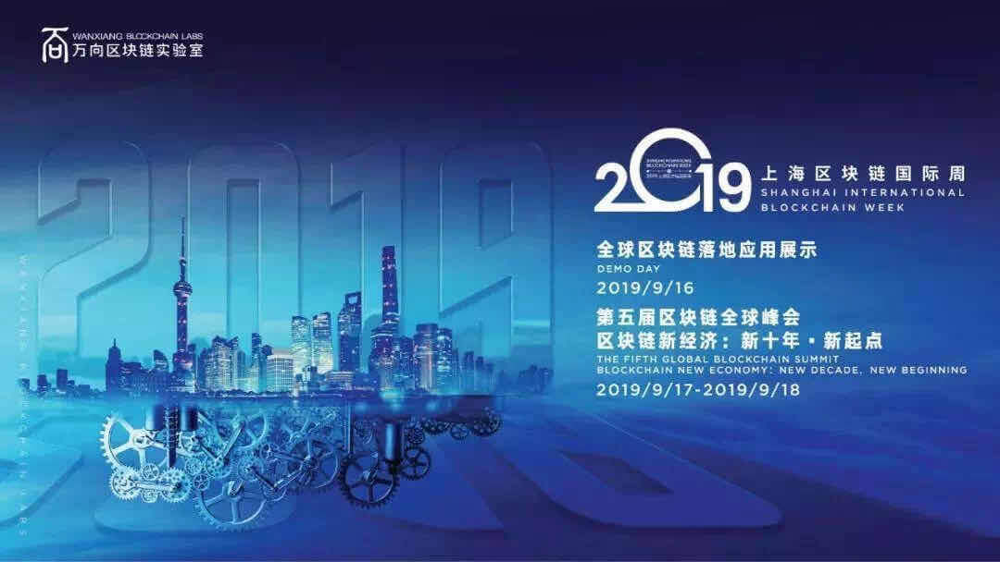
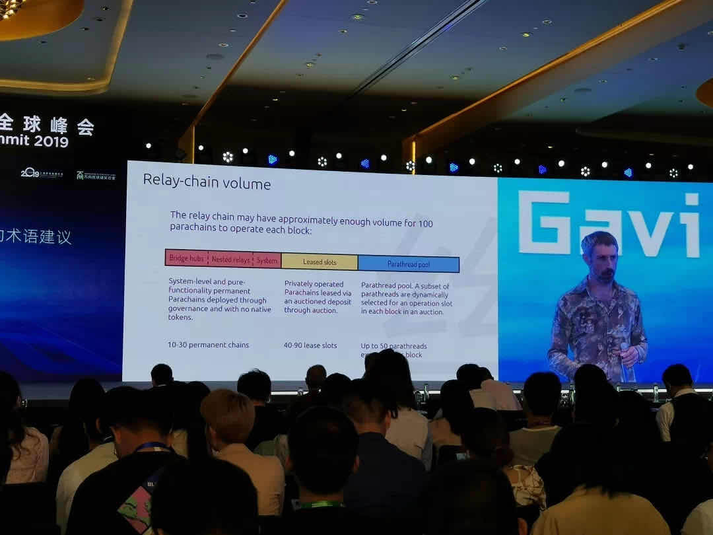
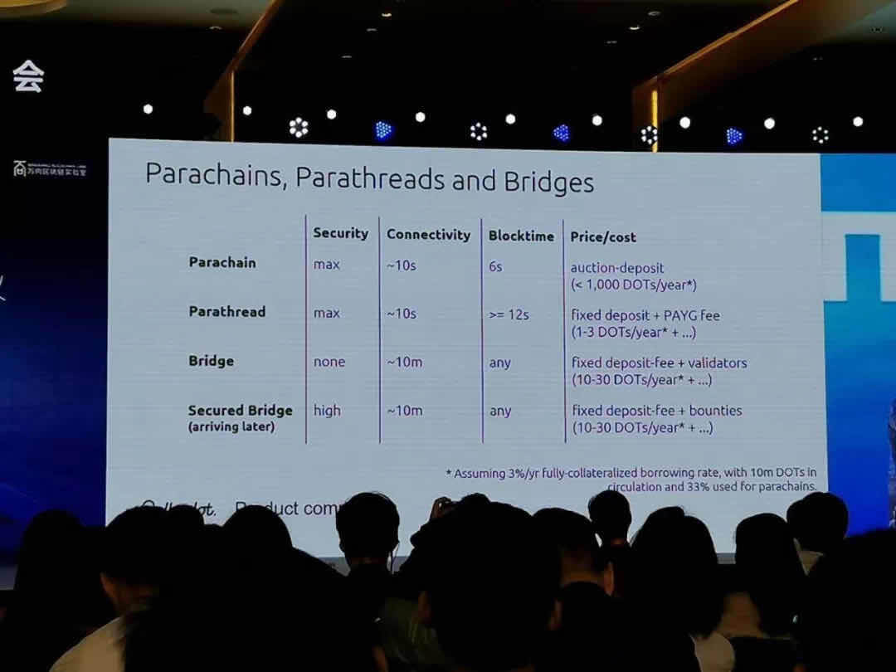
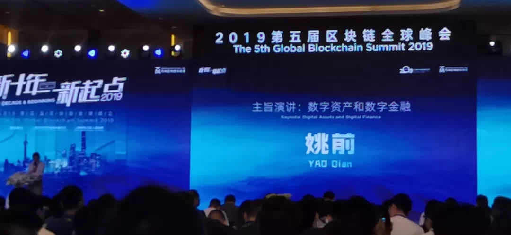
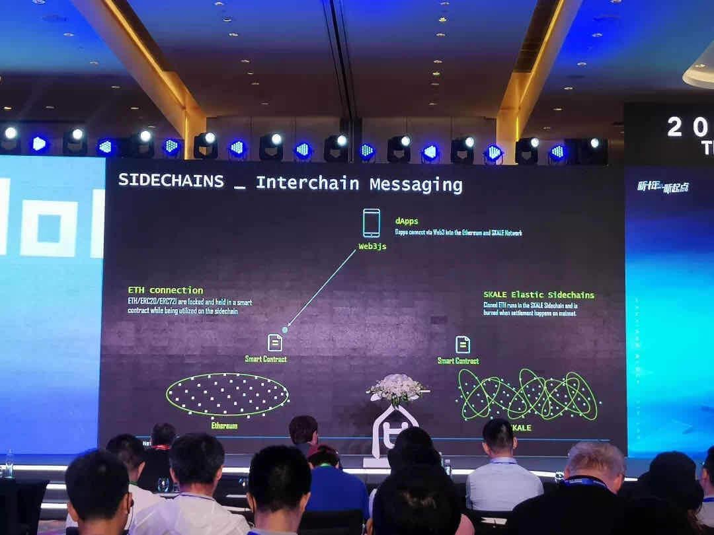

万向区块链峰会看点**

本周是上海区块链周，在一周时间内，全行业的各类项目方、创始人、技术大咖云集上海，各种酒会，演讲，Meetup 让人眼花缭乱，分身乏术。其中，最为核心的就是 16-18 日为期 3 天的万向区块链实验室全球峰会。

万向区块链全球峰会今年已经是第五届，每年都会邀请全球区块链行业的各路精英来到会场各抒己见，而参会听众则能从嘉宾的演讲与讨论中一窥行业未来的走向。在峰会的讲台上，已经诞生了很多个十分具有影响力的成功项目，那么今年的峰会又爆出了哪些令人激动的信息呢？大家就随着我们达尔文网络一探究竟。

<!--truncate-->

**1**

首先要说的，自然是大家期待的 Polkadot 创始人 Gavin Wood，Gavin 的头衔数量之多、分量之重，怕是堪比“龙妈”：以太坊联合创始人、黄皮书作者、Solidity 语音发明者、Web3 倡议发起人，Polkadot 创始人…..等等，每一个都具有谱写区块链发展历程的分量。就连他上台之前的主持人介绍，都极为罕见的提到“我知道今天有很多人期待 Gavin Wood 博士的到来”，Polkadot 项目的热度与关注度可见一斑（这也让坐在下面 Polkadot 生态的达尔文网络底气十足）





与其他嘉宾不同，Gavin 开场先跟大家聊起了哲学：“信任”与“真理”的区别。关于这点，单独拿出来说大家都能明白，前者是主观判断，后者是客观事实。但在社会运行当中，我们其实更多是在主观的“相信”，比如相信支付宝、相信银行。其根本原因在于，社会行为本身就是人与人的互动，在这种互动中很难排除人的不稳定因素，造就一个 trust-less 的环境。茫茫人海，真理难觅，也许在 Gavin 内心深处真正想要实现的，是一个构筑在代码之上的天下无贼吧。

Gavin 的演讲固然精彩，不过更值得我们思考的，是为什么他要用接近一半的时间去讨论“信任”与“真理”，一个看上去与 Polkadot 没有直接关联的话题。归根结底，区块链技术解决的是信任的问题，而 Polkadot 实现的，就是在无需信任的情况下，实现跨链资产与信息的互操作。这里的“无需信任”，是指经过 Polkadot 实现的互操作结果，使用者无需去考虑是否真实、正确，因为这些结果已经由波卡的跨链共识在无人的情况下确保真实、正确、有效了。所以虽然 Gavin 没有明说，其实 Polkadot 能够给我们的，就是一个关于跨链的、无限趋近的真理。

```
Code is law，what code give is trustless, What trustless on chain is truth, It is truth we trust.
```

关于 Polkadot 本身，Gavin 这次倒没有带来更新的内容。毕竟 KSM 测试网络都上线了，Polkadot 的主要功能和结构都已经基本定型，也无需赘述了。倒是这次 Gavin 对 Polkadot 的四种产品：Parachian, Parathred, Bridge, Secured Bridge,做了明确的梳理，并且列出了使用的价格，让大家心里对 Polkadot 的未来有了底。

**2**

本次峰会另一位超重量级嘉宾，就是前央行数字货币研究所所长、中国证券登记结算公司党委副书记、总经理 姚前。





姚总的演讲在 17 日早上，整个会场座无虚席，甚至后面还站着不少人，这个景象在本次峰会可谓绝无仅有，其它嘉宾演讲时或多或少都有参会人员在茶歇区讨论、对接。姚总的演讲可以简单的归纳为：社会资产数字化，及其核心：法币数字化。在演讲的后半部分，讲了不少有关智能合约审核的问题，联想到近期已经公布的人民币数字货币，其中可谓大有内涵。

在今后，买卖双方通过智能合约的方式订立合同，买方在签收货物之后，付款通过智能合约自动执行，从而极大改善尾款回收的问题，甚至可以由点极面的扩大到供应链金融的层面，为银行保理、受托支付、贷后监管等各项业务，创造全新的风控管理系统。人民币数字化了，社会资产数字化了，随之而来就是跨链交互。拿刚才的例子来说，物流数据链、企业内部数据链、人民币数字货币、银行、税务等各个部门都会有自己的区块链数据结构，一笔交易可能会涉及多条区块链之间的跨链交互（物流、金融、税务），这给跨链业务的发展带来了极大的空间，在此之中必有达尔文网络大展宏图的机遇。

**3**

纵观三天的议程，可圈可点的亮点非常多，比如被 SEC 批准合规发行代币、且对 Dapp 开发者极其友好的 Blockstack，日本央行岸道信带来的日本与欧洲央行合作的区块链支付结算系统 Stella 详情，有 PWC 带来的全球区块链企业收购与并购分析，及微众银行关于区块链社会治理参考框架：善度，第三天 V 神精彩的圆桌讨论等等。再看到近一周内各种在上海召开的会议，无不清晰展现着区块链这个行业的脉动与活力。随着 Web3 不断的走进，达尔文网络必将在区块链这片大的天空下，展现自身不断进化的身影。 
