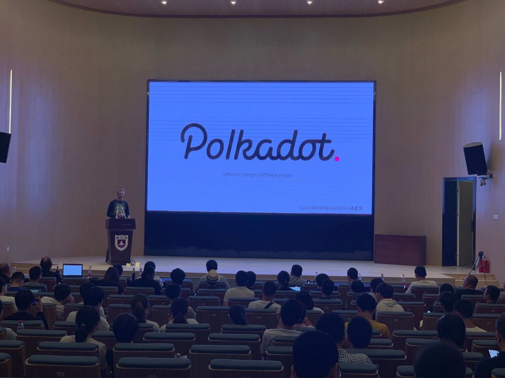
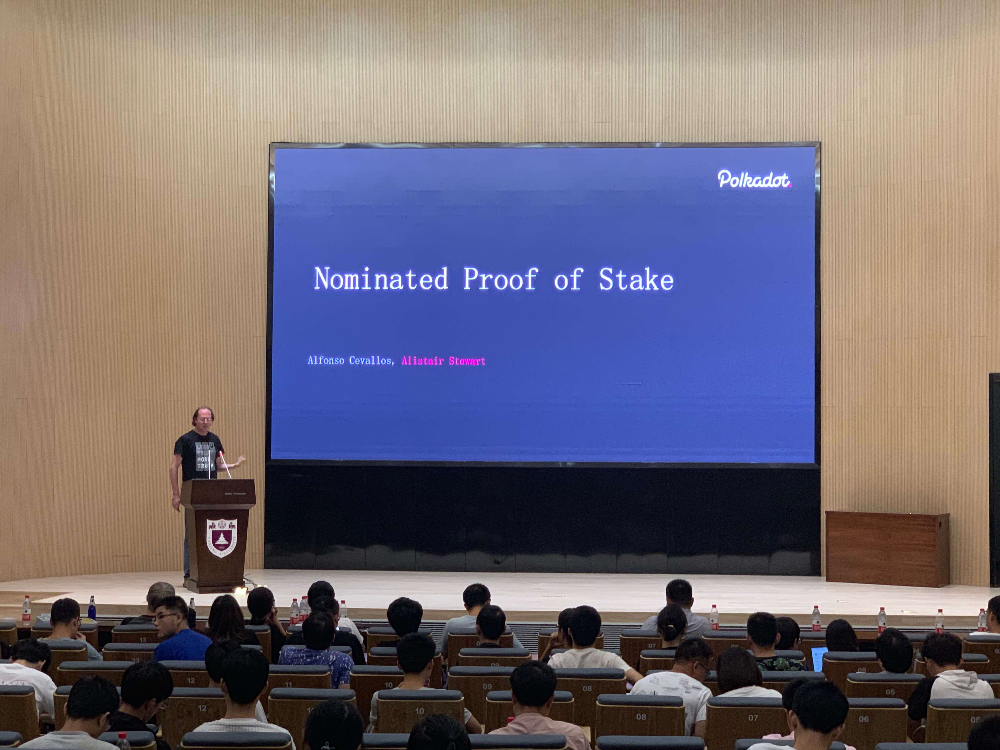
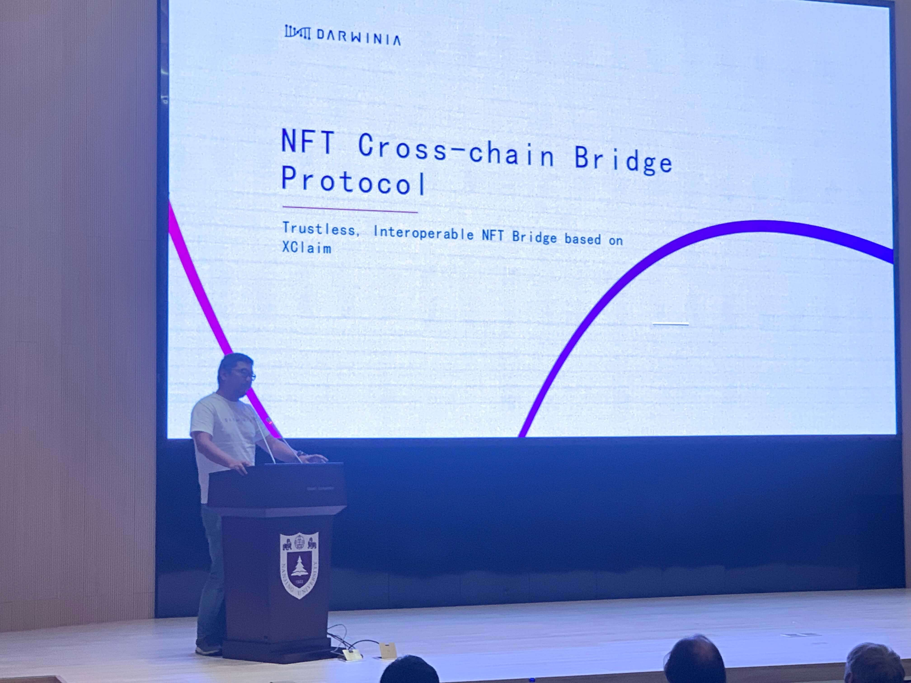

2019 年 9 月 19 日，Polkadot（波卡）中国行南京站见面会在南京大学成功举办。Gavin Wood 博士、Alistair Stewart 博士和 Darwinia Co-Founder Alex Chien 共同在本次会议上发表了演讲。

本次活动由 Polkadot、W3F、南京大学普惠三农金融科技创新研究中心以及 Darwinia 联合举办，由南大普惠金融科创中心主任丁晓蔚教授开场致词，近 200 位波卡技术爱好者、开发人员及南大师生参与了本次活动。

<!--truncate-->

**Gavin Wood:深度解读 Polkadot**

与以往不同，在本次活动当中 Gavin Wood 博士用了近 2 个小时向大家详细阐述了波卡网络的各个方面，可谓分量十足。波卡是一个通过跨链交互来链接其它区块链网络的网络（ Network of networks ），其跨链交互是通过 Parachain（平行链），Parathread (平行线程)，Bridge（桥）和 Secured Bridge 来实现的，能够支持 100 条不同的平行链进行跨链交互操作。

Parachain 和 Parathread 在工作方式上并无不同，但是在 DOT 花费和出块时间上有所差异，Parathread 或为相对便宜，随用随付的方案。波卡基于 Substrate 架构开发，该架构为 Aura，Parachain，SHA256，Ethhash 等各类 POS/POW 共识算法提供支持，为开发人员提供了非常便捷易于部署的区块链 SDK。

Gavin Wood 博士演讲结束之后的互动提问环节也是本次见面会的亮点之一，他现场回答了爱好者提出的一些非常有趣问题，其中包括：对同为跨链项目，Polkadot 与 Cosmos 的比较；以及波卡与以太坊之间的竞争与合作。对前者，Gavin 博士认为波卡的架构与分片策略 (Sharding) 或能提供更稳定、更安全、更具效率的跨链解决方案，而对于后者，Gavin 博士认为任何从事不同业务的区块链网络不存在真正意义上的竞争关系，而仅仅从市值方面去比较波卡和以太坊是没有意义的（nonsense）。

**Alistair Stewart:NPOS 共识机制**

Web3 基金会首席科学家 Alistair Stewart 博士向大家讲解了波卡网络使用的 NPOS（提名式权益证明）机制。

POS 共识机制经过为期几年的区块链技术发展迭代，取得了不小的进步。波卡网络提出的 NPOS 共识，由 100 至 1000 个高性能节点对网络传输进行验证，而这些验证人节点由 DOT 持有人以提名的方式（Nominate）选出。当选的验证人可以获得出块奖励与转账手续费等经济激励，并且所有的收入在当选的验证人中平分，且与其获得的选票（提名）数量无关，这就避免了 BPOS 共识中节点收益不均的问题，同时也能够让所有的验证人获得更平均的选票（stake）

**Alex Chien:NFT 跨链桥协议**

波卡生态项目 Darwinia 在本次活动中由联合创始人 Alex Chien 首次提出了 NFT 跨链桥协议。NFT 是非同质资产的简称，在各类区块链游戏中被广泛运用。

Darwinia 的 NFT 跨链桥协议可以让不同区块链网络中的 NFT 道具、资产实现跨链转移和互操作。该协议基于 XClaim 模型，使用智能合约在 Backing Blockchain 上锁定并验证资产，在 Issuing Blockchain 上发行对应的 NFT 资产实现跨链资产转移，并且采用哈伯格税收定价法来确定、调整抵押物价值。

Darwinia 是波卡生态的应用平行链和转接桥，同时也有独立于波卡运行的 solo 模式。Darwinia 提供 NFT 跨链转接桥、稳定币转接桥、游戏应用链和支付应用链，并具备 NFT 解析、链上随机数、分布式密钥管理等模块。

Darwinia 已经启动了代号“小龙虾”的测试网络，并计划在年底前启动主网，将在 2020 年第二季度提供其特有的应用链 SDK 支持工具。

Darwinia 于今年 8 月在 Web 3 Summit 上作为来自中国的波卡生态项目之一发表了演讲，除 Web3 基金会之外，还有 SNZ、Mathwallet、MakerDAO 等知名合作伙伴。
