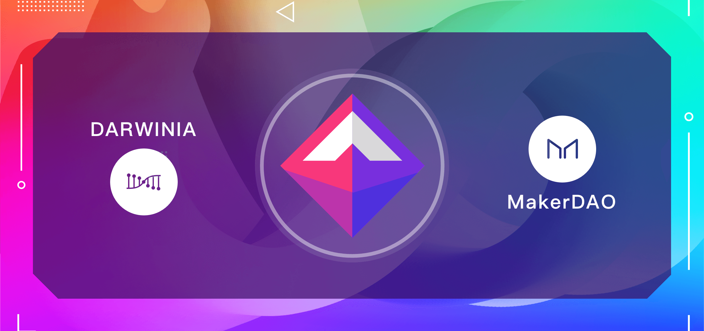

**Darwinia 将搭建 DAI 的跨链转接桥**

Darwinia 将搭建稳定币 DAI 跨链转接桥，并基于 Substrate 开发支付应用链，DAI 将成为其跨链转接桥支持的首个稳定币。稳定币 DAI 将可通过 Darwinia 网络跨链至波卡平行链和 Darwinia 应用链。

<!--truncate-->

DAI 的跨链转接桥将允许用户使用 Darwinia 网络作为转接桥在以太坊网络和 Darwinia 网络间转移代币，例如 DAI 作为基于 ERC20 的稳定币可从以太坊转接桥合约进入，并转移至 Darwinia 网络，进入波卡其他平行链，或者 Darwinia 支付应用链。

MakerDAO 中国区主管潘超表示，DAI 和 Darwinia 网络的合作对于扩展 Defi 生态系统中的开放游戏应用起到了很好的示范作用。后续，Darwinia 网络还将在其网络上开发类似 Uniswap 的去中心化的兑换协议，以对接稳定币支付系统，将系统收到的手续费收入转化成原生通证 RING，将系统收益分发给 Staking 参与者。

Darwinia Co-Founder Denny 同时表示，Darwinia 正在研究高性能高 TPS 的应用链支付方案，以更好的让用户使用稳定币来进行链上支付。通过这样的基础设施改进，将有机会降低游戏用户在支付方面的使用门槛，通过使用稳定币代替来价格波动高的原生货币有利于提高普及率，用户将可以使用稳定币 DAI 来购买游戏道具和资产。推动区块链技术在游戏行业的大规模使用一直是 Darwinia 网络主要愿景之一，目前区块链游戏行业仍然面临很多用户体验挑战和基础设施门槛，稳定币支付网络就是其中重要的一方面，跨链转接桥技术和 Substrate 技术是非常重要的适合用来改进基础设施的新技术。

**关于 MakerDAO & DAI**

MakerDAO 是基于以太坊区块链网络的金融协议，由 a16z、SNZHolding 等国内外知名机构投资。

MakerDAO 提供最大的分布式稳定币 DAI 及衍生品。DAI 由链上资产足额抵押担保发行，和美元保持 1:1 锚定，1 DAI = 1 美元。个人和企业可以通过兑换 DAI 或者抵押借 DAI 获得避险和流动资金。

DAI 在质押贷款、保证金交易、国际转账、跨境慈善、供应链金融等方面都有落地应用。
