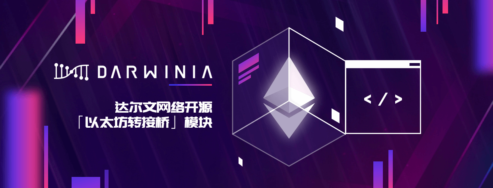
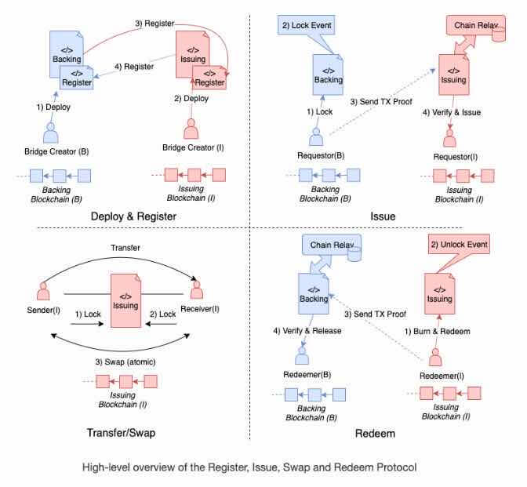

Dawinia 正在研发去中心化资产背书技术，包括高性能跨链中继服务 Darwinia Relay，异构链跨链转接桥，非标资产跨链标准，跨链兑换协议等等。

<!--truncate-->

最近，Darwinia 开源了其基础版以太坊跨链转接桥 Eth-relay 模块的实现，Eth-relay 是 Darwinia 去中心化资产背书技术的核心模块之一，Eth-relay 模块源代码地址：

https://github.com/darwinia-network/darwinia/tree/develop/srml/eth-relay

常见的跨链转接桥方案可以分为同构链和异构链两类，对于同构链来说，由于享有共享安全池、相同账户体系、密码学原语以及共识算法，不同链之间的连接相对来说比较容易，例如波卡就可以通过共享安全池、XCMP 和 SPREE 等模块实现平行链之间的跨链。

跨链真正的挑战是异构链之间的连接，目前异构链方案中，一般分为多签信托节点和基于 Light Client 的转接桥方案，其中相对安全和稳定的方案是基于对手链轻节点的桥接链解决方案。

回顾一下跨链转接桥的历史，之前开源的有 Consensys 研发的 BTC Relay，这是一个 BTC 至 ETH 的单向桥，通过使用以太坊智能合约实现 BTC 的 Light Client 来验证 BTC 上的交易。此外，还有 Kyber Network 开发的 WaterLoo EOS-ETH 双向转接桥，分别在 ETH 和 EOS 上实现对手链的轻节点，但是因为智能合约的运行成本比较高，WaterLoo 对于 Ethash 的验证逻辑还是做了一些妥协，没有做到完全去中心化。此次，Darwinia 开源的 eth-relay 模块是使用 Subtrate 开发和实现的，相对于智能合约，Substrate 运行时模块提供更多的灵活性，特别是在燃料费和运行成本方便可以做很多优化，在保证完全去中心化的基础上还可以提供更好的经济可行性。

Eth-relay 模块是一个 ETH-Darwinia 单向桥，通过在 Darwinia 中开发一个以太坊的 Light Client 实现。最近，Darwinia 还将发布一项最新的转接桥研究成果 Darwinia Relay，Darwinia Relay 是一个通用的跨链转接桥方案，主要是为了解决了成本和性能问题，因为传统的跨链转接桥需要中继对手链上的每一个区块头至链上轻客户端，如果对手链的出块速度很快，那么区块头的上链成本就会非常高昂，使得方案变得经济不可行，而无法大规模应用。Darwinia Relay 通过在链上实现一个 Super Light Client，在降低成本的同时实现跨链验证的目的。Super Light Client 使用了特殊的 MMR 数据结构，目前已经被 Grin、Beam 等项目采用，但是在对手链不支持 Super Light Client 的情况下，链上实现 Super Light Client 还有很多链下实现没有遇到的挑战，Darwinia Relay 创新性的解决了链上实现 Super Light Cient 的挑战，并整合成一套经济可行的跨链转接桥方案，为未来异构链的跨链提供一个方向。

**重新定义达尔文（DARWINIA）**

达尔文网络（DARWINIA）基于 Substrate 开发的跨链应用枢纽和资产互联网络。

达尔文网络是开放的应用跨链协议，主要专注于建设未来资产互联网络，包括游戏资产和非标资产的跨链，稳定币的跨链，应用链跨链等业务。

目前，达尔文网络已经多个应用领域达成合作，包括与 EvolutionLand 合作的游戏资产跨链业务支持，同时与 MakerDAO 合作，将搭建稳定币 DAI 跨链转接桥，并基于 Substrate 开发支付应用链，DAI 将可以通过 Darwinia 网络跨链至波卡平行链和 Darwinia 网络。

为了推进这些业务，Dawinia 正在研发去中心化资产背书技术，包括高性能跨链中继服务 Darwinia Relay，异构链跨链转接桥，非标资产跨链标准，跨链兑换协议等等。

通过达尔文网络，用户将可以使用达尔文网络来实现资产的跨链转账和流通，开发者可以通过使用达尔文网络便捷的跨链基础服务，实现应用链资产的跨链互联。
