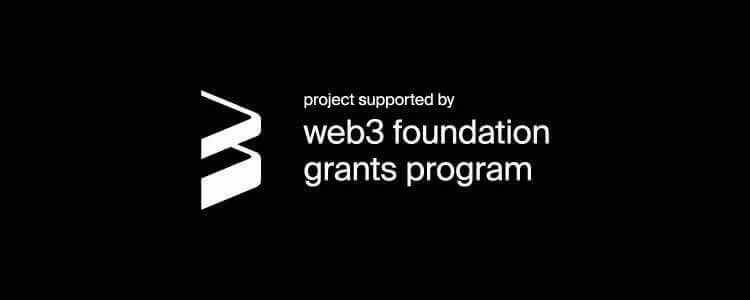

1

Web3 Foundation announced a new list of W3F Grants for its funding plan. The project Scale submitted by the Darwinia development team Itering([*www.itering.io*](http://www.itering.io/)), who has received the investment support of Web3 Foundation and has become the officially recognized project of the Web3 ecosystem and Polkadot.

<!--truncate-->

**What is Scale**

Scale is a substrate JSON-RPC API client and libraries implemented in ruby language for general use. It contains the implementation of low-level data formats, various substrate types and also supports metadata. This work is the prerequisite of our subsequent series of projects. We hope to easily access Polkadot and Substrate through our familiar language ruby, such that the applications based on Polkadot / Substrate can be developed at a fast pace. We plan to develop some substrate-based web games. The back end of these applications is prepared to be developed in ruby language, and then interact with nodes or synchronize data through RPC.

**About Itering**

Itering ([www.itering.io](http://www.itering.io/)) is a blockchain technology company founded in Singapore in 2018. Most of people in this company are senior blockchain developers and experts in the blockchain core technology and participate in the development the open source projects of Bitcoin, Ethereum, NEO, etc. The blockchain core development is the most important part of current development, especially the cross chain technology.

The Darwinia Network is also developed by Itering and focus on the assets exchange and help blockchain applications cross-chain. The first integration part of Darwinia Network facing on gaming is Evolution Land, which is also developed by Itering in 2018 to 2019, and have Ethereum Land and Tron Land. The goal of Itering is to promote the massive adoption of blockchain and iterate to a trust-free future. The Scale is the first big step in blockchain games and Evolution Land, and also let the Darwinia Network move much forwards to the goal.