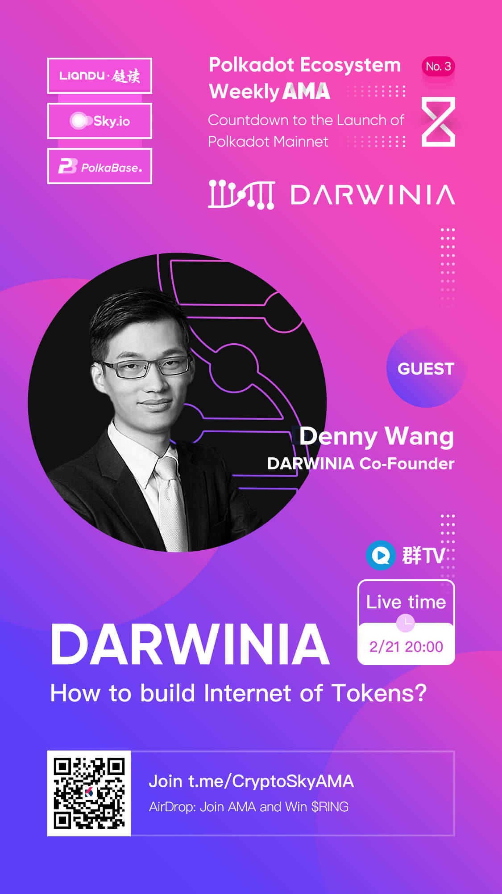
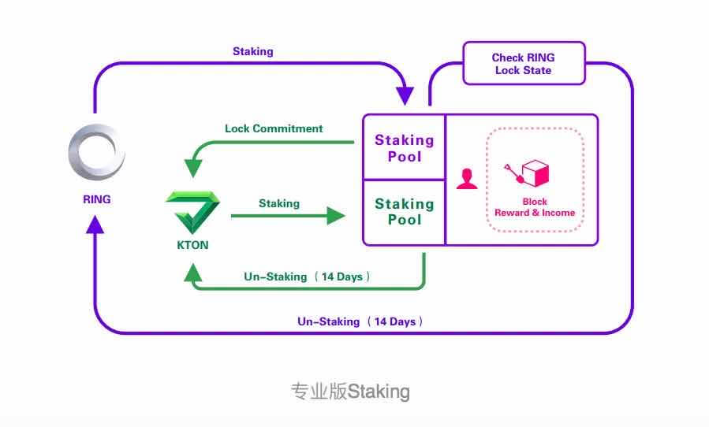
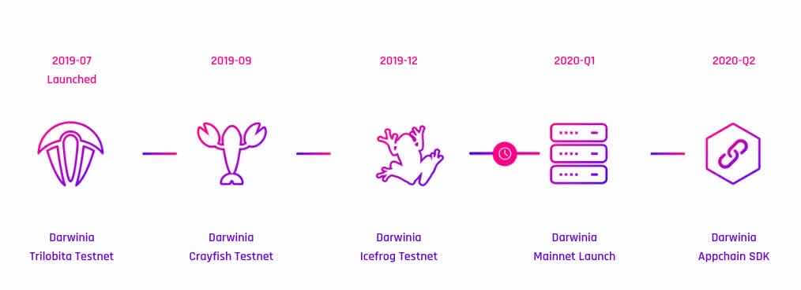

非常荣幸能够参加「链读」AMA，以下是此次AMA的全部内容。

主持人：Yuki，链读品牌负责人
嘉宾：王晓寅，DARWINIA Co-Founder

<!--truncate-->

**01、您好，请先简单介绍下Darwinia这个项目，它主要是想要解决一个什么样的问题，主要的应用方向是什么？**

Darwinia主要是基于Substrate开发的跨链应用枢纽和资产互联网络，主要为区块链应用提供应用互操作和资产跨链服务。目前已开展业务方向主要包括NFT非标资产上链服务和跨链市场，稳定币的跨链转接桥，还有资产兑换协议等等。

目前已经有一些项目计划使用Darwinia的应用跨链服务，包括开放区块链游戏Evolution Land，还有DAI支付应用链，NFT上链服务，NFT跨链拍卖市场等等，这些项目都将成为Darwinia早期生态的重要成员。

**02、据了解你们两位Co-Founder都是Bitshares（比特股）早期核心成员，可以讲讲你们的一些经历吗？**

大概从2012年开始，我们两位Co-Founder就已经开始接触和了解加密社区，Bitshares是其中一个非常重要和有意思的项目，最早提出了一些去中心化交易所和稳定币的概念，这些概念的应用到今天已经有了长足的发展和落地。Bitshares是我们参与比较深的一个开源项目，我个人还曾经参与过Bitshares 1.0的核心开发，当然我们一直保持开放心态，对整个加密生态和其他项目也有关注和参与，例如Ethereum, MakerDAO, NEO等等。

大概2018年的时候，我们成立了Itering新加坡公司(https://www.itering.io/)，现在是Darwinia开源软件的开发商，也是Darwinia的主要开发团队。

**03、为什么会选择加入到波卡生态？现在越来越多的团队转到Substrate/Polkadot生态，波卡有哪些吸引你们的？现在在波卡上的开发过程中还存在哪些问题？**

最早是因为有关注以太坊，所以对Gavin Wood和Parity做的工作也一直比较感兴趣，最终决定加入波卡生态，我想还是因为Substrate，我们都知道Substrate是一个开发区块链的框架，目前的主要实现语言是Rust，大概19年初的时候，我们当时在考察一些前沿的区块链工程技术时，也深入的研究了一下Substrate，发现这个框架的设计在很多方面是非常具有前瞻性的，包括模块化设计，运行时环境等等，再加上之前对Parity的印象很好，所以大概有了一个感觉，那就是基于Substrate开发的应用链未来应该会有一个蓬勃的发展。

另外，Substrate框架跟我们团队的匹配度很高，我们的团队Itering一直致力于区块链应用的大规模落地，因此研究和开发的技术方案主要针对应用落地这个方向，包括跨链技术Darwinia Relay，分布式秘钥管理服务DKMS，链上随机数，NFT可识别性等等，同时，区块链网络又是一个复杂的网络系统，需要有很坚强的底层支撑和安全保障，应对这个问题离不开广泛的开源社区帮助和强有力的合作伙伴。通过一年多的使用与学习，我们认为Substrate是非常有棒的一个区块链框架内核，有意思的是，我们的团队也被其主要实现语言Rust圈粉。

早先，我也开发和使用过其他的一些区块链开源框架，例如Bitshares所使用的Graphene框架，其设计理念在2013时还是很新颖和前沿的，但是我认为有点可惜的是，Graphene因为没有得到持续的支持和维护，这之后没能在区块链开源社区快速发展起来，有一些设计也没有能够得到更新，现在的发展已经显得有点停滞。区块链项目和其推动的开源框架有时候会存在发展重心的问题，希望Polkadot和Substrate可以跳过Graphene曾经遇到的这个坑，让Substrate框架能够长久的惠及整个行业。

目前，短时间内，我们期待Substrate 2.0可以尽快稳定下来，可以早日投入生产环境，同时，作为开发者我也认同 It’ll be done when it’s done.

除了Substrate之外，波卡还有很多其他的设计很吸引我们，其中包括跨链架构，共享安全池的平行链设计，SPREE模块，Web Assembly技术等等，这些技术将可以打造真正无需信任的跨链网络，而不仅仅是在区块链网络之间建立消息沟通机制。

**04、DARWINIA既然是Polkadot生态的一员，你觉得DARWINIA在Polkadot生态中的独特之处是什么？**

DARWINIA既然是Polkadot生态的一员，你觉得DARWINIA在Polkadot生态中的独特之处是什么？

按照我的理解，Polkadot致力于打造一个跨链的骨干网络，而Darwinia更多的面向应用和相互连接的资产，因此Darwinia将可以依托这些应用和资产帮助Polkadot生态打造更丰富的落地应用，让普通用户早日间接享受Polkadot跨链的便利。

同时，Darwinia创新性的提出了去中心化背书技术和Darwinia Relay技术，这些技术将可以帮助打造更多的异构链跨链转接桥，在帮助Darwinia实现资产互联的同时，也在帮助Polkadot生态打造更多的跨链转接桥基础设施。

**05、作为波卡生态的第一个游戏链，游戏和应用链有哪些跨链业务？**

Darwinia是波卡生态中最早在游戏方向开展业务的成员，Itering开发了一款链游Evolution Land，已经上线以太坊和波场，后面还计划基于Substrate研发游戏应用链，并成为Darwinia的一个子链。这个方向的技术难点主要是如何开发出一个适合Substrate的高并发并且出块速度快的共识算法，我们已经在进行相关的研究，相信不久之后大家可以看到解决方案。

另外，Darwinia还把跨链NFT资产作为优先级最高的业务拓展方向，游戏资产无疑是NFT资产中最重要的一类，将会帮助我们获得很多的游戏玩家用户。通过发挥跨链和可连接性方面的优势，可以比较容易的形成一个跨链NFT交易市场。与此同时，Darwinia作为跨链应用枢纽和资产连接网络，提供的是通用的跨链和连接服务，游戏业务只是Darwinia应用生态的一个部分，还有很多其他的业务可以在上面生根发芽，比如Defi发展很快，而且应用都比较落地，可以挖掘很多机会，我们也有打算在这个方向进行更多合作和探索。

**06、你们可能是第一个采用双通证的Polkadot生态项目，为什么要采用双通证？这有什么优势？**

Darwinia虽然有两个通证RING和KTON，但它们其实并不是对等关系，而是主次关系，KTON本质上是RING的衍生通证，通过在Staking过程中承诺锁定RING一段时间获得，因此RING才是最原生的通证。

RING是达尔文网络的原生资产，是基础通证，作为支付通证和燃料通证。燃料费又包含交易费用、合约执行费用、网络带宽费用、存储费用等。

KTON是由用户主动锁定RING获得的，初始供应量为0，用户可以选择锁定RING 3至36个月不等。KTON的本质是给与承诺长期锁定RING的用户进行流动性丧失的弥补，KTON本身可以交易，转让。KTON作为承诺锁定通证，是Commitment通证化的表现，只能通过锁定RING获得。我们对POS有一些不一样的理解，传统的POS很多都是基于一个币龄的设计，所谓的币龄就是过去持有这个Token多长时间，然后基于这个做一个权益的工作量证明，但是我们认为这并不是衡量权益工作量证明的最佳的一个口径，我们认为最佳的是基于Commitment，也就是说你未来承诺持有这个币多长时间，这是我们的一个思考和结论，基于这个我们才有一些不一样的设计。而KTON就是基于这个考虑设计出来的，并且KTON和RING一样也可以参与Staking。

**07、双通证是如何进行Staking的，Staking机制又是怎样的？**

在Darwinia中，RING和KTON都可以参与Staking，而KTON又是通过RING参与Staking时锁定而来，因此Staking会比其他的Staking系统稍微复杂一点，具体可以参考下图：

在系统内部，为了更准确的标识RING和KTON对Staking的贡献比，我们引入了类似POW系统中的算力概念，以代表两种通证对Staking的贡献。在默认设置中，所有的RING和所有的KTON所贡献的算力数量是一样的，而每个用户的算力多少，由其参与Staking的通证占所有Staking通证的比例计算得来。

然后再回到经济模型上，用户持有RING和KTON都可以进行Staking，可以获得收益。Staking的过程可以理解为POS挖矿，开始Staking了就能获得收入，解除Staking之后，RING和KTON都需要14天才能到账。

所有用户可以获得的Staking总数之和是达尔文网络每年的通胀总数。Staking产生的总收入初始按照1:1的比例，分配给所有采用RING去Staking和采用KTON去Staking的客户。也就是说如果初期KTON数量很少，则Staking KTON的用户能获得是收益就会变的很多。RING和KTON持有人都可以参与社区治理，未来达尔文网络的子链接入也需要通过RING来获得插槽。

**08、DARWINIA目前有哪些合作伙伴？**

Polkadot是我们最重要的合作伙伴，具体来说包括一系列跟W3F和Parity的合作，我们一直积极参与波卡生态建设，包括参与一些线上线下活动，最近也拿到了W3F的一个Grant。

其他的合作伙伴还有MakerDAO，麦子钱包，imToken，币乎，Staking节点运营商等等，这些合作伙伴的加入帮助Darwinia丰富了自己的生态。未来我们还有更多的合作伙伴将加入，包括已经很多已经宣布和未宣布的。

**09、跟MakerDAO在会有什么进一步的合作吗，Defi方向你们有什么想法？**

在去年，我们已经宣布将会跟MakerDAO合作，Darwinia将搭建稳定币DAI跨链转接桥，并基于Substrate开发支付应用链，DAI将成为其跨链转接桥支持的首个稳定币。稳定币DAI将可通过Darwinia网络跨链至波卡平行链和Darwinia应用链。

DAI的跨链转接桥将允许用户使用Darwinia网络作为转接桥在以太坊网络和Darwinia网络间转移代币，例如DAI作为基于ERC20的稳定币可从以太坊转接桥合约进入，并转移至Darwinia网络，进入波卡其他平行链，或者Darwinia支付应用链。

Darwinia正在研究高性能高TPS的应用链支付方案，以更好的让用户使用稳定币来进行链上支付。通过这样的基础设施改进，将有机会降低游戏用户在支付方面的使用门槛，通过使用稳定币代替来价格波动高的原生货币有利于提高普及率，用户将可以使用稳定币DAI来购买游戏道具和资产。推动区块链技术在游戏行业的大规模使用一直是Darwinia网络主要愿景之一，目前区块链游戏行业仍然面临很多用户体验挑战和基础设施门槛，稳定币支付网络就是其中重要的一方面，跨链转接桥技术和Substrate技术是非常重要的适合用来改进基础设施的新技术。

目前，我们正在沟通具体的Token Bridge方案，在方案确定后，下一步最终要的是将方案落实，并开发实现出来。

谈到Defi，我们认为Defi是开放金融运动重要的形式之一，有着非常好的可组合性，最近聊的火热的FlashLoan就有体现合约可组合性的威力，因此Darwinia将会把主要精力放在现有资产的组合和连接，而非重新创造新的资产，这也符合我们作为跨链应用枢纽和资产互联网的愿景。目前我们已经计划在落地的Defi业务方向包括不少这方面的例子，其中就有Dai跨链转接桥和支付应用链，类Uniswap的资产兑换协议，NFT交易市场等等，都是这一思路的体现。我们也非常欢迎各个公链上的Defi资产和应用跟我们进行合作，我们的跨链技术将帮助你们到达更广阔的市场。

**10、Darwinia-ETH Relay Module（跨链转接桥模块）这个方案跟其他现有的方案有哪些区别？技术创新点是什么？**

已经发布的Relay module是Darwinia Relay体系的一个先行概念验证版本。目前行业中的跨链解决方案主要分为两类，同质链跨链：比如波卡系各个平行链，由于都采用Substrate开发，共享验证人池，所以通过波卡这个中继链实现跨链比较容易；而异构链跨链的解决方案基本上是近似联盟信托的方式，引入多签、质押等机制，通过信任一组受托人来维护跨链资产安全的。

回顾一下跨链转接桥的历史，之前开源的有Consensys研发的BTC Relay，这是一个BTC至ETH的单向桥，通过使用以太坊智能合约实现BTC的SPV客户端来验证BTC上的交易。此外，还有Kyber Network开发的WaterLoo EOS-ETH双向转接桥，分别在ETH和EOS上实现对手链的轻节点，但是因为智能合约的运行成本比较高，WaterLoo对于Ethash的验证逻辑还是做了一些妥协，没有做到完全去中心化。此次，Darwinia开源的 eth-relay模块是使用Subtrate开发和实现的，相对于智能合约，Substrate运行时模块提供更多的灵活性，特别是在燃料费和运行成本方便可以做很多优化，在保证完全去中心化的基础上还可以提供更好的经济可行性。

Eth-relay模块是一个ETH-Darwinia单向桥，通过在Darwinia中开发一个以太坊的Light Client实现。最近，Darwinia还将发布一项最新的转接桥研究成果Darwinia Relay。

Darwinia Relay是一个基于超级轻客户端的解决方案。吸取了早期BTCRelay失败的经验，可以解决性能和经济可行的问题，其引入了Merkle Mountain Range（MMR）承诺，Optimistic Verification Game，Super Light Client框架，Relay激励模型等技术实现基于事实且无需信任任何中心或半中心化实体的异构链跨链转接桥。并且，通过以Darwinia为中继，搭建与外部链之间的桥，使得资产可以自由的在各个异构区块链网络中流转移动。

目前Darwinia Relay的设计正在进行内部Review，详细的方案将会在Review之后公开。

**11、项目目前是什么进度，什么时候正式上线，开发路线计划？**

从去年7月份开始，我们已经陆续发布了三个测试网络，最近的一个测试网络是Icefrog，可以在Subscan浏览器(https://subscan.io/)查看这个测试网络的数据 https://icefrog.subscan.io/。目前主要的功能已经开发完成，但还需要进行更多的安全审计和测试，此外，我们也在等待Substrate稳定下来，最终主网上线的时间应该会比Polkadot主网稍微晚一点，目前估计在三四月份概率比较大。在主网上线之前，我们还会发布我们最后一个测试网络，我们希望这个测试网络将会长久的运营，即使是主网上线之后也会保留，供开发者测试使用。

我们目前在招聘Rust，有兴趣的小伙伴可以联系我们，邮箱：hello@darwinia.network

