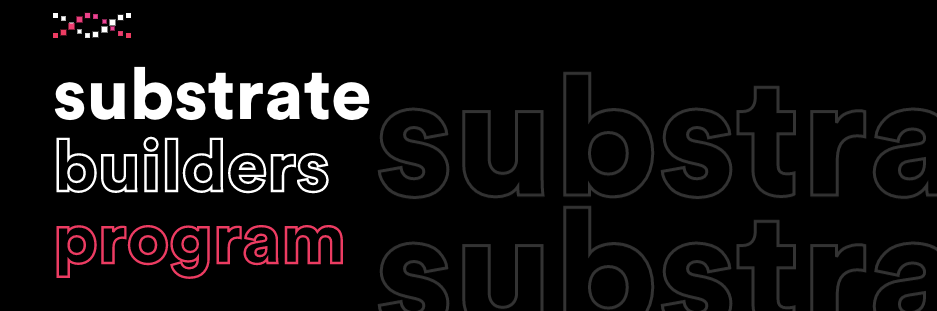

**我们很高兴地宣布，Darwinia加入了Substrate Builders Program。**

<!--truncate-->

Substrate Builders Program项目是Parity（Polkadot开发团队）主导的，专门为Substrate使用者创建的一个“家园”。在这个家园中，使用者们可以通过线上、电话会议等方式，分享使用Substrate开发过程中踩过的坑和解决经验。同时，Substrate Builders Program还提供商业发展的帮助、技术和社区支持。

加入Builder Program后，Darwinia将和各路优秀的开发者一起探讨区块链世界，进行思想碰撞，在Parity的指导下，Darwinia会充分吸收百家之长来促进自身更好的发展。

按照目前的发展情况，Darwinia的开发工作进展顺利，并且即将要进入最后一版公开的测试网阶段。