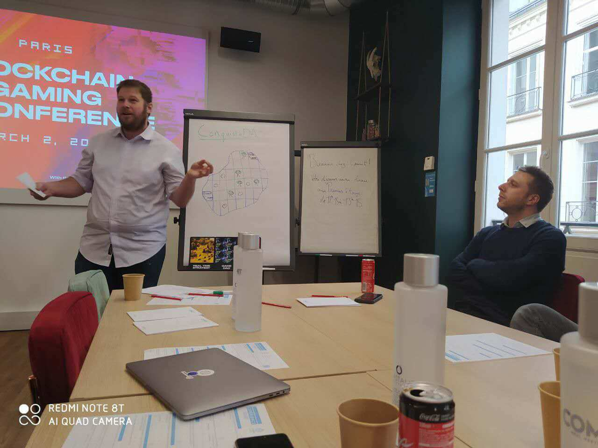

2020年3月2日至8日，Darwinia应邀参加了由Web3基金会、UBISOFT、BGALLIANCE在2号共同举办的区块链游戏会议#BGU2020。

<!--truncate-->

作为区块链游戏的从业人员，Darwinia和XAYA、Axie Infinity、Sandbox等国际知名团队一起，为区块链游戏对于不同的游戏场景进行了深度探讨，包括：可交易性、合规性、升级治理、账号管理及安全性。

Darwinia除了Evolution Land的区块游戏外，还有能承载区块链游戏以及各式资产交换的Darwinia Network，并且持续更新区块链的最新技术。