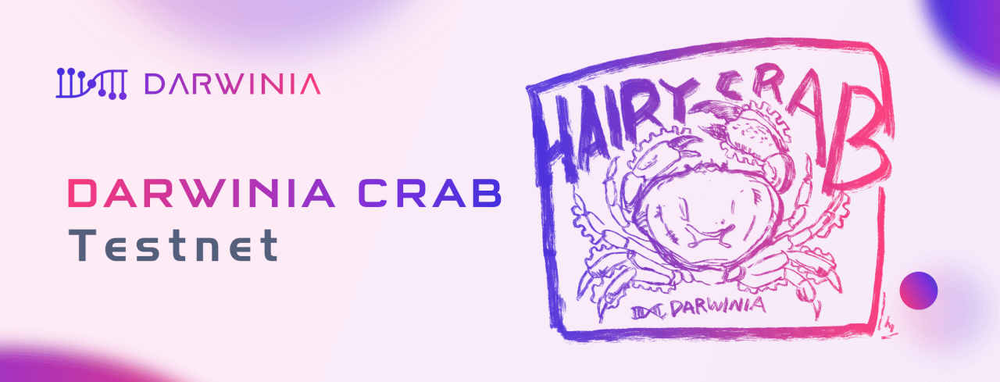

Darwinia Crab Testnet（PoC-4）即将发布！

Darwinia Crab Testnet（简称 Crab网络）是Darwinia主网上线前的最后一版测试网络，是一个金丝雀网络，为Darwinia的升级和应用部署提供模拟和测试环境，测试环境不仅包含测试所需要的软件运行环境和网络环境，还包括测试经济博弈的经济环境。

<!--truncate-->

**对于Crab网络，需要着重了解以下几点：**

1、Crab网络的定位类似于Polkadot的Kusama网络，Expect Chaos是一个合理的预期。
2、Crab网络将被设计成一个长期运行的测试网络，但是无法排除会因为意外的情况或者故障导致其停止运行。
3、Crab网络是一个测试网络，其目的主要是为了测试和进行各种激进的实验，因此运行在其上通证和资产除了实验和测试价值之外，没有其他的价值。
4、Crab网络的通证分别为CRING和cKTON，参数与Darwinia主网一样，并使用相同的Staking机制和通胀模型。CRING的初始供应量为 2000M，cKTON的供应量为0。

**为了让Crab网络能够一定程度的模拟真实经济环境，Darwinia将计划：**

1、目前RING（ERC-20和TRC-20的RING，包括存单部分）的持有者，将可免费获得CRING（AirDrop），比例为 1 RING = 1 CRING。
2、官方将在2020年3月3日-10日期间，随机选取快照时间及块高，并在快照后公布结果，并据此进行空投。空投分发方式为Crab网络上线后用户自行领取，此次AirDrop不针对KTON持有者。
3、在Darwinia主网上线之后，创建一个Darwinia主网和Crab网络之间的Token Bridge，并使CRING和RING在长期内可以做到相互兑换，兑换比例为 1 RING = 100 CRING。
4、Darwinia将预留40M RING作为CRING的背书资产，供Token Bridge的背书模块使用。
5、其他计划还包括Faucet水龙头搭建，提供CRING测试币给需要的开发者免费获取，以及测试以太坊主网Eth-relay Module等等。

从去年7月份开始，DARWINIA已经陆续发布了三个测试网络，目前主要的功能已经开发完成，正在进行更多的安全审计和测试。

**以下是Darwinia Testnet历史版本：**

Daiwinia PoC-1 Testnet: Trilobita (2019-07)
Daiwinia PoC-2 Testnet: CrayFish (2019-09)
Daiwinia PoC-3 Testnet: IceFrog (2019-12)
