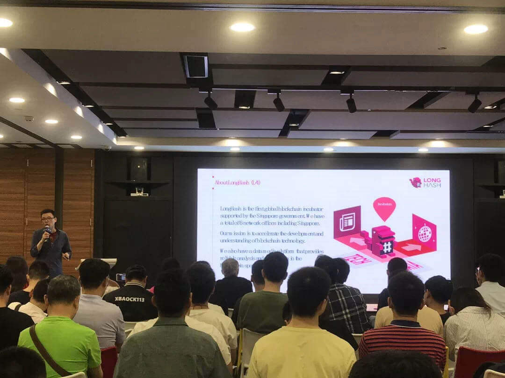

test 2019年7月20日，「波卡中国行 Meetup 上海站」在华虹大厦顺利举办，Gavin Wood（Polkadot/Parity）、Alistair Stewart（W3F）

<!--truncate-->

LongHash联合创始人陈彦丰进行了开场致辞/分享了波卡生态的孵化支持情况。波卡/Partity创始人Gavin Wood博士介绍了波卡网络开发的最新进展，并介绍了波卡发展的线路图。除此之外首次宣布了关于Parathreads（平行线程）的设想。Web3 Foundation研究员Alistair Stewart博士分享了如何解决区块链中的数据可用性和有效性问题。
