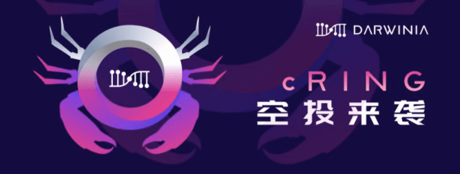

A portion of the initial supply of the Crab‘s CRING will be distributed to the holders of RING & DOT, they will get CRING (Airdrop) for free.

Darwinia took a snapshot of RING & DOT holders on March 20, 2020. RING & DOT holders can check / receive CRING after Crab launched.

<!--truncate-->

DOT airdrop ratio: 1 DOT = 50 CRING, RING airdrop ratio: 1 RING = 1 CRING.

The snapshot contains the RING of ERC-20 and TRC-20, including the deposit certificate part in Gringotts. KTON is not in the scope of this snapshot.

## About Darwinia Crab Network

Darwinia Crab Testnet (Crab for short) is a Canary Network for Darwinia, The positioning of Crab is similar to Polkadot's Kusama Network. Expect Chaos is a reasonable expectation.

Crab Network is not just a testnet, it will be a long-term network, but it cannot be ruled out that it will stop running due to unexpected conditions or failures.

Crab mainly provides simulation and test environment for Darwinia's upgrade and application deployment, perform various radical experiments. The test environment includes not only the software operation environment and network environment required for testing, but also the test economic environment.

For Crab to simulate the real economic environment to a certain extent, Crab has the same parameters as Darwinia Mainnet, and use the same Staking mechanism and inflation model. Crab’s tokens are CRING and CKTON, the initial supply of CRING is 2000M, and the supply of CKTON is 0.

CRING and CKTON have got real value. After the Darwinia Mainnet launched, a Token Bridge will be built between Darwinia Mainnet and Crab, allowing CRING and RING to be mutually exchangeable in the long term, with a conversion ratio of 1 RING = 100 CRING. Darwinia will reserve 40M RING as the backed asset of CRING for the Cryptocurrency Backed Asset Model(CBA Model). Darwinia Mainnet is the backing chain, Crab Network is the issuing chain, CRING is CBA.
