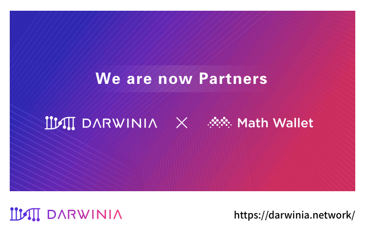

Darwinia Network（达尔文网络）宣布与 MathWallet（麦子钱包）正式达成战略合作伙伴关系。

<!--truncate-->

合作将从Polkadot生态推广、技术支持、活动举办、社群互动等多角度进行，共同助力Polkadot、DARWINIA生态建设。未来，双方还将在行业研究、技术开发、资产安全、社区服务等领域继续展开深度合作，共同推进Polkadot、DARWINIA、Staking生态良性持续发展。

MathWallet将为DARWINIA网络提供钱包支持，Staking工具开发，通过为用户提供高质量的产品，帮助用户更好地了解DARWINIA网络原生资产、了解DARWINIA生态，同时提供API帮助开发者开发应用。MathWallet还会成为DARWINIA网络的一个创世节点，用户可直接在钱包内参与投票，获得利息奖励。MathWallet作为节点可以自主验证所有链上数据，为用户提供安全的交易数据和链上交易操作服务，有效接入DARWINIA网络全网的流动性。

## 关于 MathWallet（麦子钱包）

MathWallet是一个多平台的跨链钱包，产品包括APP钱包、网页钱包、浏览器插件钱包、硬件钱包等，且支持BTC、ETH、EOS、Cosmos、币安链、ONT、Polkadot、VeChain等30个公链，支持去中心化的跨链交易，构建了一个多链的DApp生态系统，并参与多个PoS公链的节点生态。麦子钱包的投资人包括分布式资本、Fundamental Labs等著名区块链投资机构。

Math官网/钱包下载：http://www.mathwallet.org/

## 关于 Darwinia Network（达尔文网络）

达尔文网络是基于Substrate开发的跨链桥接网络，专注于建设未来资产互联网络，包括非标资产拍卖市场，稳定币的跨链，资产交易兑换等领域。

目前阶段，Darwinia 即将发布最终版的测试网，欢迎社区的小伙伴关注/参加！

最新消息，Darwinia 将对 RING & DOT 持有者进行空投  
https://mp.weixin.qq.com/s/6tZFYa3d7ujpas2XJ30rbw