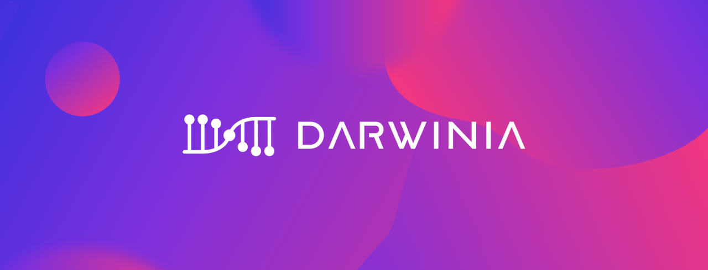

The recent coronavirus outbreak has a huge impact worldwide and it also caused difficulties and uncertainties to the crypto world.

<!--truncate-->

Darwinia Foundation and Darwinia Network core project team have been embracing open source vision and decentralized practices of development all along the way. We are trying to minimize the risk of the situation and the result so far has been satisfactory. I am sharing with you our recent progress updates:

## Development Progress

### Crab Network

From the latest testnet “Icefrog” we have collected feedback from community users, node operators, and validators. We are able to fix bugs and make improvements. We are preparing to launch a canary version of the next testnet “Crab Network” which will be a permanent network. Its function will be similar to Kusama. New features will be deployed on Crab Network first and its state and data will not be reset or erased. To make the network more economically serious to participants, Darwinia Foundation will allocate 2% of RING’s initial supply to Crab Network. We will take a snapshot of RING allocation state on Ethereum and Tron late this month. Native test coin cRING of Crab Network will be distributed based on the snapshot proportionally. We will also do an airdrop to Polkadot DOT holders to attract traffic and awareness. Crab Network is targeted to launch at the end of March or early April. Supporting tools such as blockchain explorer, wallets, token claiming tools, documentation, and guides are 90–95% done respectively.

### Scale Codec receives Web3 Foundation Grant

Developed by our team, Scale codec is a low-level library tool implemented using Ruby language to support Darwinia Network. With its open-source and public good nature, which will benefit any projects using the substrate framework, Scale received a grant from the Web3 foundation.

### Substrate Builders Program

After several rounds of interviews with Parity coordinator and developers, we were selected to enter the Substrate Builders Program. We have got better access to support resources of development tools, closer collaborations with other project teams, dev team from Parity as well as capital resources.

### Subscan, a better explorer

As a supporting side project, subscan.io is a blockchain explorer and dApp, which targets substrate-based networks. It has been open-sourced and the beta version has been released. It supports Kusama, Edgeware, and Darwinia Icefrog testnet for now and it will support more coming networks including but not limited to Darwinia Crab network, Darwinia Mainnet, Polkadot, Acala Network, etc.

### Ethereum-Darwinia Bridge Demo

We have implemented a PoC module of a decentralized bridge between Ethereum and Darwinia Testnet with Darwinia Relay/Bridge technology.

### DAI Token Bridge

We have reached out to the MakerDAO foundation and proposed to build a decentralized bridge for DAI token to cross Ethereum to Polkadot. The proposal is under review.

### Polkadot Venture Netwok

Polkadot is about to start an initiative known as Polkadot Venture Network and Darwinia has been added as a featured project.

### Website Revamped

Check out our revamped website [https://darwinia.network](https://darwinia.network/) for more details

## Re-positioning

As we have made a technical breakthrough regarding value transfer across heterogeneous blockchain networks in a truly decentralized manner, we have branded this technology as Darwinia Relay/Bridge. Darwinia Network is no longer limited as a “Gaming Parachain with NFT features” as perceived by the market at the moment. It will serve as critical infrastructure, supporting cross-chain value transfer across smart contract enabled blockchain networks. Cross-chain NFT markets or cross-chain games such as “Evolution Land” will still be deployed on Darwinia Network, but they will serve as showcases for protocol upgrade from a single chain to a cross-chain version. Protocols including DEX, liquidity, DeFi, and others can leverage Darwinia Network to achieve cross-chain interoperability. We are updating our website and other marketing materials to deliver this message to the community.

## Marketing and Community

Various marketing engagements and efforts have been deployed to interact with community users and increase participation and awareness. Major events are listed below:

### Bounty Program Introduced

A bounty program is announced to reward code contributors, bug reporters, security auditors as their contributions are recognized and accepted with the respective amount of tokens.

### Zoom Online Workshop and Meetup “Chain Reaction”

“Chain Reaction” is a workshop/meetup targeting technical professionals as well as the general public. On 20th, Feb, we hosted a zoom-based online workshop for developers. This is the 6th workshop for developers since its introduction last July. Normally it’s an offline and onsite workshop, but this time we did it online via Zoom. Topics included “Codec in Substrate”, “Substrate and Smart Contract”, and “Darwinia Cross-chain Bridge”.

### Polkabase AMA “How to build internet of tokens”

In cooperation with Polkabase, co-founder Denny talked about “How to build internet of tokens” on Wechat channels interacting with more than 500 audiences.

### Web3 BGU2020 / ETHCC

Invited by the Web3 Foundation, Darwinia Team attended the Blockchain Gaming Conference 2020 in France, where we discussed many topics about blockchain games, non-fungible tokens. Afterward, we attended ETHCC.

### Polkadot Ecosystem seminar hosted by BIKI

A joint online seminar organized by BIKI, founders from ChainX, Darwinia, Edgeware, Phala and Acala introduced project visions and discussed topics including, the next trend, Polkadot ecosystem, and more.

## New partners

Darwinia is pleased to announce a formal strategic partnership with MathWallet.

The cooperation will be carried out from multiple perspectives such as Polkadot ecosystem promotion, technical support, meetups, community interaction, etc. Jointly help Polkadot and Darwinia ecosystem construction.

Math wallet is also our long term ally to carry out in-depth cooperation in the fields of industry research, technology development, asset security and community service, jointly promote sustainable and resilient development of Darwinia and Polkadot.

## Developers

Core developers are mainly based in Nanjing, some collaborators and contributors are based in Shanghai, Taiwan, and other countries. Shortly after the Chinese Spring Festival, the team has started working. As we are used to collaborating remotely, this practice has worked well and we have retained full development speed efficiently. No one is infected by the coronavirus, fortunately.

## Mainnet Launch

Crab Network is launching soon, we will watch and monitor this testnet for at least 1 month to decide if it’s ready to launch the Mainnet. If things go well, we are happy to see the Mainnet live in Q2.

## Stay Updated with Darwinia

Twitter: https://twitter.com/DarwiniaNetwork
Telegram: https://t.me/DarwiniaNetwork
Medium: https://medium.com/@DarwiniaNetwork
Reddit: https://www.reddit.com/r/DarwiniaFans/
Riot：https://matrix.to/#/!HIyWQGUzgpkxswYMNi:matrix.org?via=matrix.org

## About Darwinia

As an open cross-chain bridge protocol based on Substrate, Darwinia focuses on the construction of future Internet of Tokens, including decentralized tokens swap, exchange and market.

The mountain is high, but we climb a step every day. We hope you, your family and your business are doing well during this extreme situation. We appreciate your continuous support and glad that we share the same vision.

Thanks and best regards.
