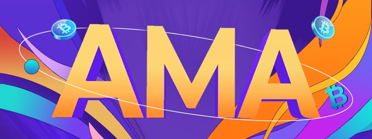

Polkadot is the project that hasn’t lost any attention and popularity from the public since Dr. Gavin founded it in 2017. There’s been claims among the community that Polkadot is launching its mainnet. Today, we are inviting everyone to join the session with Dan Reecer, VP at Web3 Foundation, Global Managing Director for Community and Growth.

<!--truncate-->

Thank you so much for taking your time joining our AMA session with the topic of “The Forefront of Polkadot Ecosystem”. Why don’t we start off by introducing yourself to our audience?

**Dan Reecer:**  
Hey everyone, I am Dan from Web3 Foundation. As a quick introduction, I am focused on Community and Growth for Polkadot and Kusama. I have been following bitcoin since 2013 and working in the industry for two years. I started my career in brand marketing at Eli Lilly & Company in pharmaceuticals, then moved to the blockchain industry to contribute in marketing, operations, and business development capacities. My role at Web3 is focused on the community, global ambassador program, and growth marketing for Polkadot and Kusama.

### What is the plan of high-utility infrastructure for Substrate and Polkadot?

Polkadot and Substrate are build to provide a high utility, high scalability, and a great developer experience. As mentioned by other guests in this chat already, Substrate is a complete game-changer in blockchain development, and we have already seen teams like Polymath's Polymesh project and Nodle who are moving from other ecosystems to begin taking advantage of Substrate. Substrate makes it easy for developers to build custom blockchains with a modular and flexible framework built by some of the best blockchain developers in the world. 

In terms of high utility, Polkadot's scalability and sharding is what makes it unique. Polkadot will be built of multiple shards (parachains), which are custom blockchains built for a specific use case. Instead of current ecosystems where you have 1 choice of blockchain runtime and underlying capabilities, now teams will be able to choose the best parachain to build on (for example, a gaming Dapp built on a parachain optimized for gaming), or if a team finds there is an area of need in Polkadot's ecosystem, they can built their own entire parachain to meet the needs of the market.

### Kusama's code base is almost the same as Polkadot and will have its own parachain slots. What are Kusama's plans for doing this?

That is correct. You can think of Kusama as almost a mirror reflection of Polkadot, but with a slightly different focus and set of use cases. Kusama is built more for fast and lean startups who want to build using the latest tech in the Polkadot ecosystem, but in a more easier manner (hence the lean toward startups). Kusama will also have high throughput and is ideal for use cases where bank-like security is not necessary.

For example, some use cases emerging for Kusama parachains are Gaming, DeFi, DAOs, Marketplaces, and Oracles. For Kusama Dapp use cases, some examples are gaming, music, social networking, messaging, and VR Dapps. These are some examples of the many projects that will be built exclusively on Kusama. However, the second main use case of Kusama is for teams who want to fine-tune their technology infrastructure before moving to a deployment on Polkadot.

### How will Kusama interact with Polkadot in the future?

Yes, the plan is to build a bridge to Kusama, similar to the bridges Polkadot will have to Ethereum, Bitcoin, and other networks. Kusama will likely be the first bridge from Polkadot, but that is not confirmed. As a mentioned before, there will also be some teams who build and fine-tune their project on Kusama before deploying on Polkadot for various reasons. Reasons for moving to Polkadot from Kusama could include the increased backing by Polkadot's larger Validator set (for example, for some DeFi or banking parachains or Dapps) or possibly if there is a specific parachain on Polkadot that a Dapp development team would like to build on, which did not exist on Kusama.

### When will parachains be available after Polkadot officially launches?

I wish I knew the answer to this question . We do not know exactly when parachains will be available, due to development timelines that can shift, but we expect parachains to follow soon after Polkadot launch. Since Kusama gets all of Polkadot's new technology first, it is likely that we'll see a parachain on Kusama before Polkadot.

### What is the team behind Kusama?

Kusama is being built by the same teams behind Polkadot Network. The network was founded in summer 2019 by Gavin Wood, former co-founder and CTO of Ethereum. Kusama is a project of Web3 Foundation, as mentioned before. Web3 Foundation works with best-in-class entities such as Parity Technologies to build Kusama and foster development of the services and applications that will run on it.

### Have any teams already started building with Kusama?

Yes, it has already been an exciting year for Kusama. The team at Acala Network has announced that they will be launching a parachain on Kusama for a DeFi and stablecoin platform. Chainlink also announced they will build an Oracle parachain on Kusama. Chainlink's move to Polkadot and Kusama is their first ecosystem outside of Ethereum which is pretty cool. There are several other projects building or planning to build on Kusama, and these will come to the public as soon as they are ready.

### How can people stay updated on the latest with Polkadot and Kusama?

- One of the best ways is to sign up for email updates here, which I mentioned earlier: (https://hubs.ly/H0p73z-0).
- For Polkadot, you can follow us on Twitter (https://twitter.com/polkadotnetwork) or on WeChat.
- People can also follow Kusama on Twitter (https://twitter.com/kusamanetwork). 
- Also, you can follow us on Crowdcast for all of our online events (https://www.crowdcast.io/polkadot). We've had 20 Crowdcast events in the past 6 months, and a lot more on the schedule.