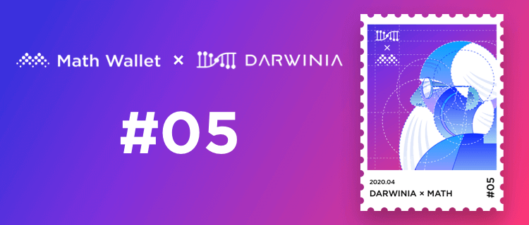

为了感谢达尔文网络和麦子钱包的社区用户，双方决定限量发放 200 枚 非同质化代币 NFT 至社区。

<!--truncate-->

### 领取方式如下

**NFT数量：**200枚
**活动时间：**2020年4月13日 – 2020年4月18日（北京时间）

**领取方式1：**  
1、关注 @DARWINIA & @麦子钱包 官方微博  
2、转发并@三个好友  
3、在DarwiniaNetwork微信公众号后台回复“NFT”获取登记链接  

**领取方式2：**  
1、关注 @DarwiniaNetwork 和 @MathWallet 官方Twitter  
2、转推并@3个好友  
3、加入Darwinia官方电报群：https://t.me/DarwiniaNetwork  
4、填写下列表单：https://bit.ly/2JZVTkT  

**其他条款及细则：**  
1.每个以太坊地址、社交媒体帐号最多获得一个收藏品。  
2.获奖者将被随机选择。  
3.如果您不使用兼容 ERC-1155 的以太坊钱包，将无法显示该 NFT，推荐使用麦子钱包。  
4.要符合获奖资格，您需要在社交媒体上或通过转推/共享等方式在社交媒体上分享收藏品赠送活动。  
5.达尔文限量版 NFT将在活动结束后的7天内铸造并发送到符合条件的地址。  