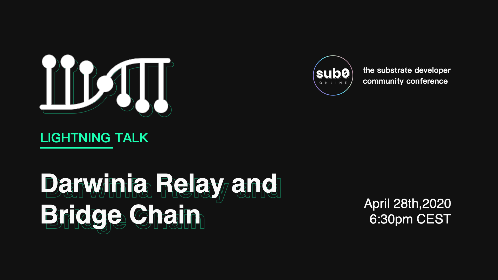

波卡社区开发者大会 Sub0 (Sub0 Online: Substrate Developer Community Conference) 将于北京时间4月28日晚18:00开始。

<!--truncate-->

届时，全世界的 Substrate 开发者将汇聚一堂，学习和分享使用 Substrate 搭建 Web3 解决方案的技巧；部分受到邀请的波卡生态项目也将分享自己是如何将 Substrate 技术运用项目构建中的。

**Darwinia CMO Bree Yin，将会在本次大会讲解「Darwinia Relay」技术细节，内容包括：**

- 阐述资产跨链问题的含义和挑战；
- 回顾目前几种方案的优缺点；
- 「Darwinia Relay」的技术特点；
- 基于Darwinia Relay架设的「Bridge Chain」。

此外，国内波卡生态优质项目Phala Network - Hang Yin将在大会上分享：The Web3 Confidentiality Layer。Bifrost - Bunny Nie也会带来分享：How to Balance Staking Liquidity and High Yield。

Phala实时转播b站直播间：https://live.bilibili.com/22131802

### 详细日程安排：

Fredrik Harrysson - Parity CTO  
18:05【Substrate Overview】

Joshy Orndorff - Parity Substrate 工程师  
18:30【Blockchain and Shared Storytelling】

Tomasz Drwięga, Igor Matuszewski, Bernhard Schuster & Rakan Al-Hneiti - Parity  
19:00【Offchain Workers Workshop】

Maciej Hirsz - Parity 开发  
19:30【Rust: Lifetimes, Traits, and Generices】

Gavin Wood - Parity 创始人  
20:20【Weight Systems】

Kian Paimani - Parity 开发  
20:50【Offchain Phragmen】

Ricardo Rius - Parity Substrate 开发  
21:20【Runtime Upgrade】

Derek Yoo - Purestake  
21:50【Introducing Moonbeam, A Smart Contract Parachain with Ethereum Compatibility】

Phil Li - CEO, Obsidian Labs  
22:20【Launch Your First Blockchain in 5 Minutes Using Substrate IDE】

Spencer Judge - Transparent Systems  
23:10 【Blockchain for Squares】

Mo Dong - Co-founder, Celer Network  
23:40【Bring Mass Adoption and Sustainable Developer Manetization to Every BLockchain】

Dieter Fishbein - Web3 Foundation  
00:10【Substrate Builders Program】

以下为 LIGHTNING TALK

Alex Siman - DappForce  
00:10【Subsocial: A Decentralized Community for Polkadot Ecosystem】

Bree Yin - Darwinia Network  
00:30【How to Build Future Internet of Tokens】

Bunny Nie - Bifrost  
00:40【How to Balance Staking Liquidity and High Yield】

Hang Yin - Phala Network  
00:50【The Web3 Confidentiality Layer】

Matej Nemcek - Starmesh  
01:00【Extracting Value from Orbit】

Albrecht Weiche & Willam Freudenberger - KILT  
01:10【Anonymous Credentials】

Fabian Gompf & Fredrik Harrysson - Parity  
01:20【Substrate Ideas Lab】

更多详细内容请移步：https://sub0.parity.io/

### 关于 Darwinia Network

Darwinia Network，即达尔文网络，是基于Substrate开发的跨链桥接网络，专注于建设未来资产互联网络，包括非标资产拍卖市场，稳定币的跨链，资产交易兑换等领域。Darwinia是波卡生态的重要成员：2019年获得Web3基金会Grant，2020年成为首批加入Parity Substrate Builders计划的项目之一，同时Darwinia也是Web3 Bootcamp入选项目之一。

波卡官方直播间（科学上网）：https://www.crowdcast.io/e/sub0-online?utm_source=website  
Phala实时转播b站直播间：https://live.bilibili.com/22131802