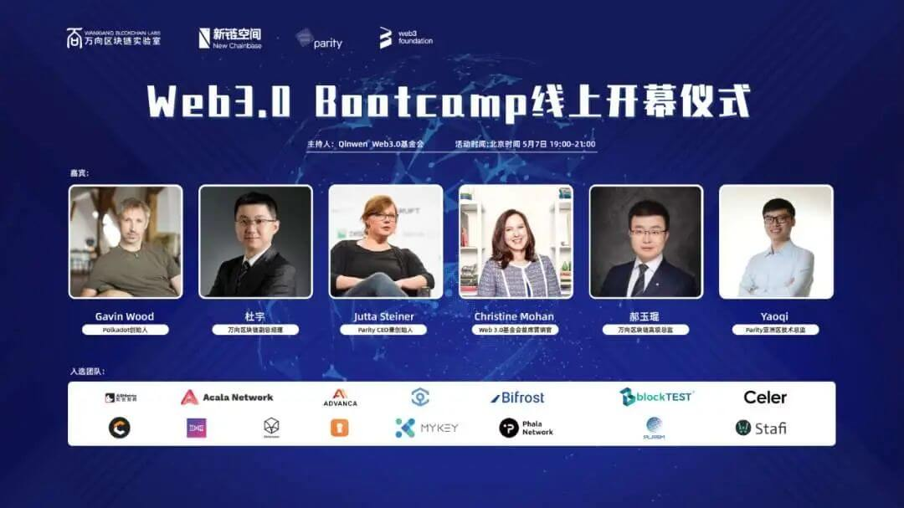

由万向区块链实验室、新链空间、Parity、Web3.0基金会合作发起的“Web3.0 Bootcamp（Web3.0训练营）”首期招募现已完成，Darwinia Network 团队入选，第一期训练营即将开启。

<!--truncate-->

## 什么是 Web3.0 训练营

Web3.0 Bootcamp是一个为期6个月的训练营，原计划筛选培养12支团队，因报名的优秀团队较多，将培养团队扩展至15支。入选团队将在训练营系统化的培训和孵化下，通过Substrate技术框架与Polkadot网络构建web3.0的未来。

## 开营仪式

- 时间：北京时间 2020年5月7日 19:00 
- 平台：Bilibili关注「万向区块链」

## 入选团队

为推动Web3.0生态的多样化发展，入选的15支团队所做项目涵盖多个方面，包括底层平台、应用、区块链插件等 👇

- 云DEXs（ABmatrix） | 基于Substrate和Polkadot技术构建的去中心化跨链交易云平台
- Advanca | 为分布式应用打造的具有隐私保护功能的基础设施
- Acala Network | 致力于打造跨链开放的金融应用体系
- Ankr | 能与各种类型的智能合约api进行交互、并利用不同的协议开发应用程序的分布式云平台
- Bifrost | 解放Staking的流动性
- DevOps（BlockTEST） | 让客户和区块链开发人员轻松构建区块链网络
- Celer Network | 世界领先的二层扩容平台
- Crust | 去中心化存储的激励层协议
- Darwinia | 基于Substrate开发的跨链桥接网络
- Maskbook（Dimension）| 帮助用户加密社交网络内容的浏览器插件
- HashKey Me | 探索DID和IoT结合的通用自我主权身份框架
- MYKEY | 基于多条公有区块链的智能钱包
- Phala Network |  去中心化、去信任化的区块链+TEE统一数据交易基础设施。
- Plasm Network | 可扩展DApp搭建平台
- Stafi | 以Staking资产的流动性为切入口，解决目前链上资产的价值流通障碍

## 训练营议程

训练将分为两个阶段进行：

第一阶段是为期3个月的加速期，在加速期，训练营将会通过一系列课程，帮助团队增强初创企业基础管理能力、区块链技术能力、Polkadot/Substrate专业知识等。

第二阶段是为期3个月的PoC阶段。这个阶段会将重心放在项目的落地应用上，引导入选团队与万向区块链生态中的伙伴合作进行落地应用PoC。

“在如今这个愈发扁平化的世界里，帮助亚洲的区块链初创项目快速落地并融入到全球区块链市场中，是实现全球数字化经济互相连接的重要一环。Web3.0 训练营会帮助各个团队建立公共网络和分布式协议，解决区块链安全性、可扩展性和互操作性桎梏。很开心能看到这些人才济济的团队加入Web3.0训练营，开展一个个有生命力的、至关重要的事业。”
“In the flattened world we now live in, supporting blockchain projects in Asia and putting them on the fast track to global adoption and viability is critical to achieve an interconnected, global, digital economy. Web 3.0 Bootcamp supports teams in building public networks and distributed protocols that solve some of the key scalability, security and interoperability challenges faced by blockchains today, I’m excited to see these talented teams joining our Bootcamp to build viable, critical businesses.”
Gavin Wood

## 什么是Web3.0

Web可以理解互联网的简称。从1.0到3.0、从90年代至今，互联网无论从技术还是规模上都有了举世瞩目的发展。1.0时代，用户与网页之间没有太多交互性可言（门户网站、论坛）；2.0时代（即今天的互联网生态），用户可以很方便的获得并创造他们想要的内容。而Web3.0是什么样子，现在还无法知其全貌。但通过所有波卡系项目的努力，我们可以管中窥豹：希望下一个时代，互联网可以更尊重人和贴近人本身。