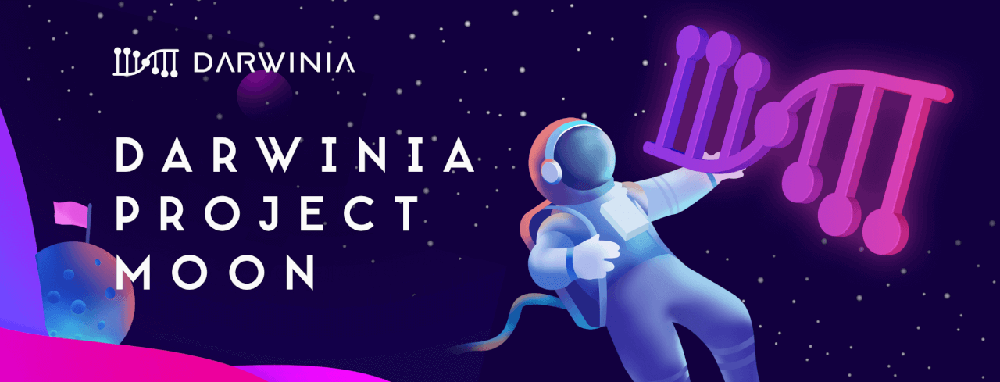

**For this Grand Prix, Darwinia will provide 100 Million CRING rewards.** All rewards can be exchanged for the mainnet RING after the Darwinia Mainnet launched at the ratio of 100:1.

<!--truncate-->

## 2020–05–29: Darwinia will be fair in this Crab Node Grand Prix, the following is a supplementary explanation of the competition rules:

\1. The Online Time and Times of Dropped Connections are the main ranking criteria, while the number blocks produced by nodes is only for reference. Therefore, the participants do not need to worry about losing points if not being elected as an active validator. Active validators, standby validators, and full nodes will be treated fairly.

\2. The ranking algorithm only references the 7-day data (Online Time & Times of Dropped Connections) from 10:00 AM on June 04, 2020 to 10:00 AM on June 10 (UTC + 8: 00). Therefore, the node has nearly a week to prepare and test, so that the node can run steadily.

# # Introduction

On May 11, 2020, Darwinia launched the Crab Network.

Crab Network (Crab for short) is a Canary Network for Darwinia. The positioning of Crab is similar to Polkadot’s Kusama Network. Expect Chaos is a reasonable expectation.

After two weeks of internal testing, the Crab has been able to run stably. In order to allow more users/developers to participate in the operation of the Crab, **Darwinia decided to launch the Crab Node Grand Prix: Darwinia Project Moon.**

**For this Grand Prix, Darwinia will provide 100 Million CRING rewards.** All rewards can be exchanged for the mainnet RING after the Darwinia Mainnet launched at the ratio of 100:1.

# # Event Time

May 28, 2020 10:00 AM — June 11, 2020 10:00 AM (UTC +8: 00)

# # How to Participate

## Run Node

Run the Darwinia Crab node and invite community users to nominate your nodes.

## Nominate

Get CRING at the faucet and participate in the Crab Network node nominating.

# # Event Rewards

**Reward 1**

Darwinia will comprehensively evaluate and rank according to: 1. the number blocks produced by nodes 2. Times of dropped connections 3. Online Time

1–5, reward 2,000,000 CRING / node

5–10, reward 1,500,000 CRING / node

11–40, reward 500,000 CRING / node

## **Reward 2**

For nodes with the top 20 number of Nominators, will be awarded 500,000 CRING / node

## **Reward 3**

Get CRING at the faucet and Nominate, you will share the rewards of 10,000,000 CRING

## **Reward 4**

Darwinia will draw 5 lucky nodes everyday, rewarding 200,000 CRING / node

# # Tutorial

## Running Crab Node

> Attention:
> \1. The format of the node name has to be “Name | The first 10 digits of Crab address”. E.g: Darwinia | 5E2hLjZMeV
> \2. The address needs to have a balance, CRING can be got at the faucet.

Running Crab nodes through official tutorials, requiring a certain technical foundation. Tutorial: https://docs.darwinia.network/en/crab-tut-node

## **Nominate**

- Create Address: https://docs.darwinia.network/en/crab-tut-create-account
- Darwinia Faucet:[ https://docs.darwinia.network/en/crab-tut-get-free-cring](https://docs.darwinia.network/en/crab-tut-get-free-cring)
- Nominating:[ https://docs.darwinia.network/en/crab-tut-nominator](https://docs.darwinia.network/en/crab-tut-nominator)

If you encounter any problems during this process, you can add Darwinia Telegram Group and ask questions in our tech group chat.

## **Telegram Group**

- Darwinia Dev:[ https://t.me/DarwiniaDev](https://t.me/DarwiniaDev)
- Darwinia Official:[ https://t.me/DarwiniaNetwork](https://t.me/DarwiniaNetwork)
- Darwinia Faucet:[ https://t.me/DarwiniaFaucet](https://t.me/DarwiniaFaucet)

# # Event Description

1. The nomination/voting address for reward 2 needs to get CRING at the faucet during the event, If CRING is transferred from another address, is invalid.
2. 5 lucky nodes will be announced every day, and the event rewards will be distributed together after the event.
3. The address for receiving rewards has to be the Crab Network address., registration link: https://apps.darwinia.network/
4. Nominator rewards will be distributed to the user’s voting address and the Validator rewards will be distributed to the Stash Account within 7 days after the event ends
5. The reward for this event is CRING, which can be exchanged for the mainnet token RING at a ratio of 100: 1 after the Darwinia Mainnet launches.
6. The final interpretation of this event belongs to “Darwinia”.

# # Follow Us

- Twitter:[ https://twitter.com/DarwiniaNetwork](https://twitter.com/DarwiniaNetwork)
- Telegram:[ https://t.me/DarwiniaNetwork](https://t.me/DarwiniaNetwork)
- Medium:[ https://medium.com/@DarwiniaNetwork](https://medium.com/@DarwiniaNetwork)
- Reddit:[ https://www.reddit.com/r/DarwiniaFans/](https://www.reddit.com/r/DarwiniaFans/)
- Riot:https://matrix.to/#/!HIyWQGUzgpkxswYMNi:matrix.org?via=matrix.org
