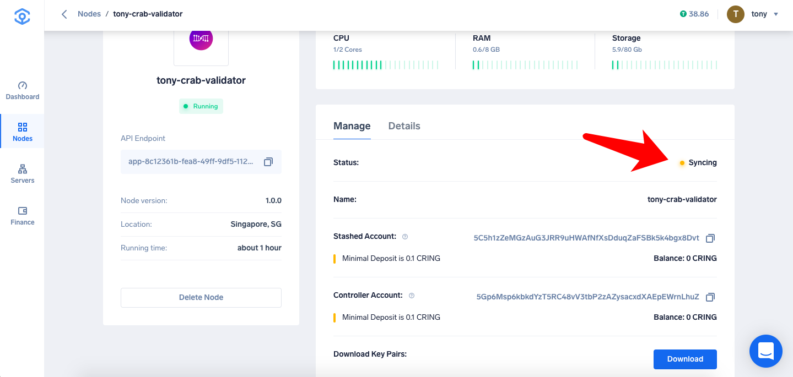
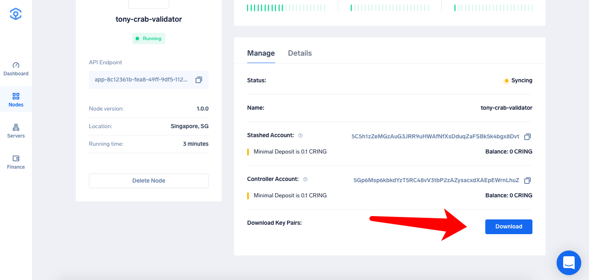

Ankr Network 现已支持「一键」运行 Darwinia Crab 节点。

<!--truncate-->

## 如何通过 Ankr 运行 Darwinia Crab 节点

### 教程：

1、注册Ankr账号

2、在Nodes → Node Market 找到 Darwinia，选择你想要运行的节点类型

### 运行 Full Node

- 选择服务器配置及其他信息

- 运行成功之后可在Telemetry上看到你运行的节点信息：https://telemetry.polkadot.io/#list/Crab

- Tips：
  - 1）Choose Running Mode 分为 Archive 和 Non-Archive 两种模式：Archive 为存储全链数据；Non-Archive 为只保存最近1024区块数据。
  - 2）全节点10刀一个月，按天计费。
  - 3）可以随时删除节点，删除节点2个小时后，节点将从「Your Nodes」列表删除。

### 运行 Validator Node

- 相同步骤参考全节点
- 成功之后可以看到节点在同步中

- 可以点击「Download」下载Crab账号json文件，json文件的默认密码是：anKrpas5wd。

- Tips：
  - 1）验证人节点39刀一个月，按天计费。

## 关于 Ankr Network 
Ankr 正在构建一个分布式计算网络，利用数据中心和边缘设备中的空闲云资源。 计算市场通过惠及市场双方，为云计算释放共享经济。借助 Kubernetes，Docker 容器，区块链和可信硬件等技术，Ankr 正在使新云更便宜，更安全，更便于用户使用。该团队由雄心勃勃的连续创业者和经验丰富的工程师领导，并积极与 SAP 和 Telefonica 等大型科技公司合作，以实现现实世界的应用。
