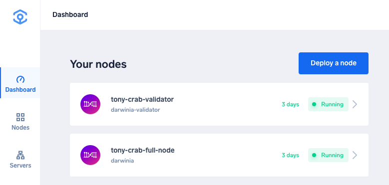
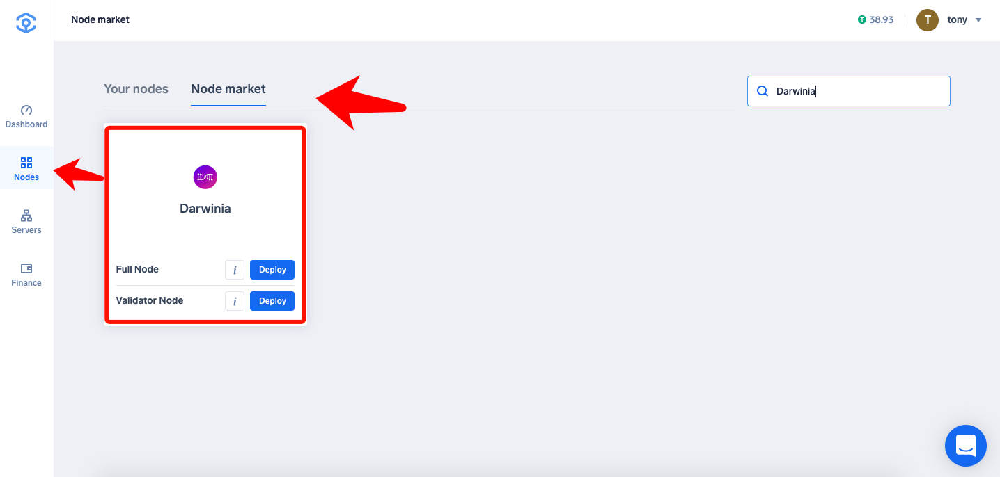
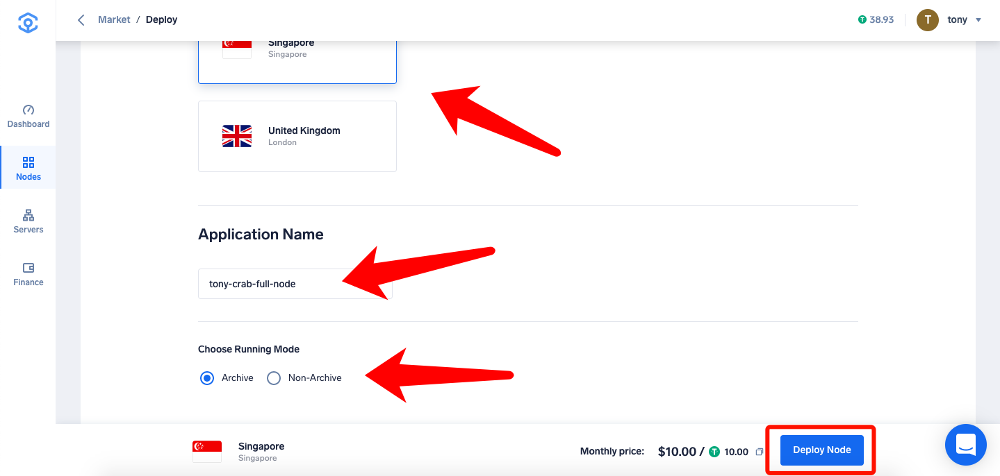
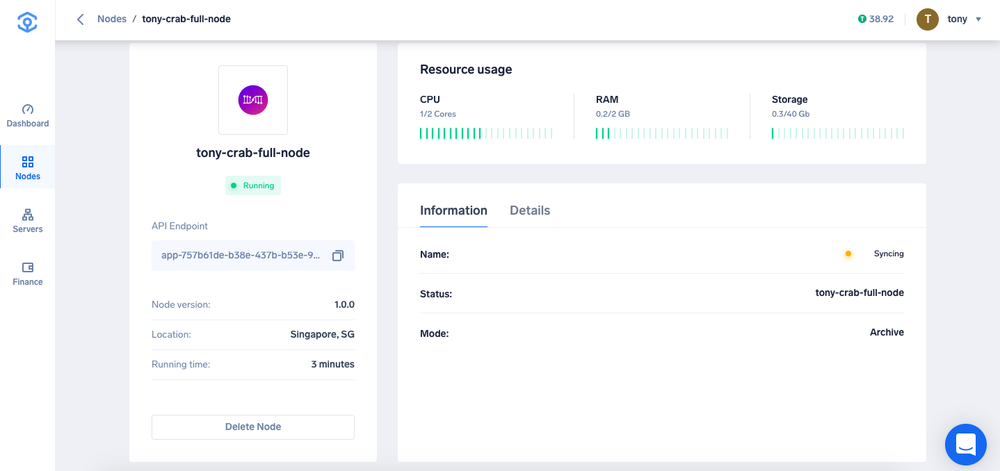

Ankr Network 现已支持「一键」运行 Darwinia Crab 节点。

<!--truncate-->

# 如何通过 Ankr 运行 Darwinia Crab 节点

## 教程：

1、注册 Ankr 账号

2、在 Nodes → Node Market 找到 Darwinia，选择你想要运行的节点类型

## 运行 Full Node

- 选择服务器配置及其他信息

- 运行成功之后可在 Telemetry 上看到你运行的节点信息：https://telemetry.polkadot.io/#list/Crab

- Tips:
  - 1）Choose Running Mode 分为 Archive 和 Non-Archive 两种模式：Archive 为存储全链数据；Non-Archive 为只保存最近 1024 区块数据。
  - 2）全节点 10 刀一个月，按天计费。
  - 3）可以随时删除节点，删除节点 2 个小时后，节点将从「Your Nodes」列表删除。

## 运行 Validator Node

### 部署一个 Validator Node

- 相同步骤参考全节点
- 成功之后可以看到节点在同步中（同步需要较长时间，耐心等待同步完成）

- 红框内可以看到 Ankr 帮你生成的 Session Keys，复制

### 设置 Session Keys

> 在设置 Session Keys 之前，需要先完成 bond 操作

点击「Session 账号」，输入刚刚复制的 Session Keys ，点击「设置 Session Keys」提交。

> session keys 务必填写真实数据，否则会导致漏块，从而收到经济惩罚。

确认无误后，点击「签名并提交」

> 验证人和提名人的身份是互斥的，不可并存。如果您正在提名其他验证人，需要取消提名操作后，再进行后续的操作。

点击「验证」，开始设置验证人参数

- ` 奖励佣金百分比 ` 设置本节点优先分配收益的比重，范围为 **0-100%**。（例：如设置了 **5%** 的奖励佣金，本节点将优先获得节点收益的 **5%**，剩下 **95%** 的节点收益，将依据验证人和投票人抵押的金额，按比例分配；也就是说，` 验证人的收益 = 节点奖励佣金 + 抵押奖励分成 `）

确认无误后，点击「签名并提交」

去「浏览器」查看当前验证人的相关信息

> 参选验证人后会进入「候选」队列，在进入下一个 era 的时刻参与选举。

- Tips:
  - 1）验证人节点 39 刀一个月，按天计费。

## 关于 Ankr Network 
Ankr 正在构建一个分布式计算网络，利用数据中心和边缘设备中的空闲云资源。 计算市场通过惠及市场双方，为云计算释放共享经济。借助 Kubernetes，Docker 容器，区块链和可信硬件等技术，Ankr 正在使新云更便宜，更安全，更便于用户使用。该团队由雄心勃勃的连续创业者和经验丰富的工程师领导，并积极与 SAP 和 Telefonica 等大型科技公司合作，以实现现实世界的应用。

