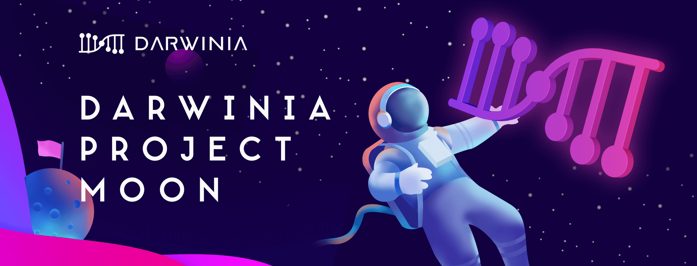
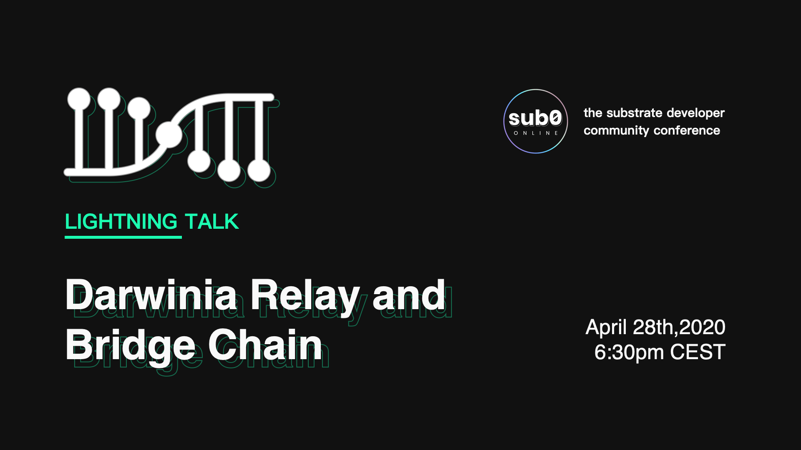
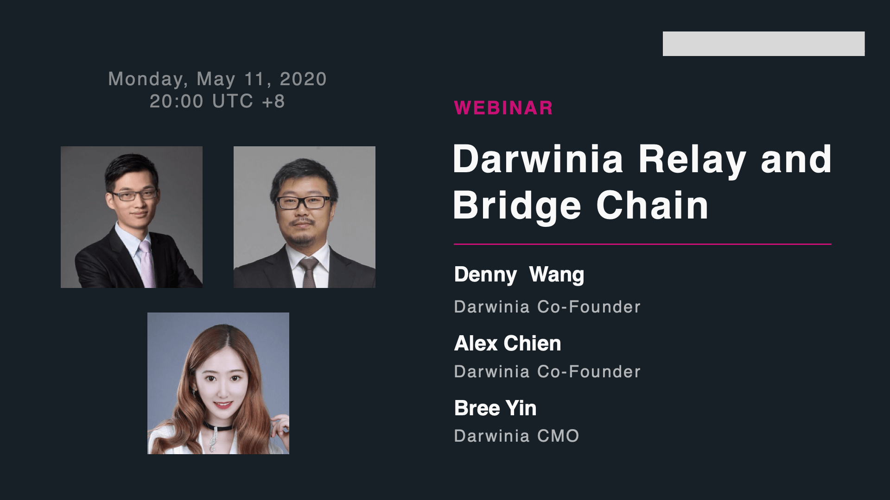
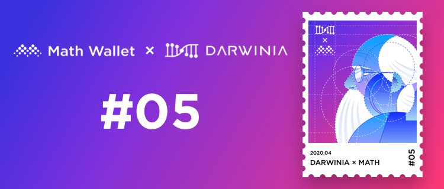

Here’s what’s been happening at Darwinia and what’s coming up next. 

<!--truncate-->

The most exciting update from last month is that we’ve finally launched Crab Network, the Canary Testnet version of Darwinia Mainnet, and Darwinia was selected to join [ Web3 Foundation Bootcamp](https://medium.com/web3foundation/bootcamp-0225-ama-749c9dd396f2).

Thoughts and questions are welcomed!

# Introducing Crab Network

Canary Testnet version of Darwinia Mainnet

We could not be more thrilled to finally launch the [Crab Network](https://apps.darwinia.network)! The positioning of Crab is similar to Polkadot's Kusama Network.

## KPI’s

- Crab Network (1 month since the launch):
  - 7,236 addresses generated
  - 11,289 transactions
  - \> Check out detailed data at [ https://crab.subscan.io/](https://crab.subscan.io/) 

- Community Growth:
  - [Twitter](https://twitter.com/DarwiniaNetwork) (+6779 followers)
  - [Telegram](https://t.me/DarwiniaNetwork) (+3735 community users) 

- [Subscan](https://polkadot-cc1.subscan.io/): A multi-chain explorer for the Substrate & Polkadot ecosystem developed by the Darwinia development team.
  - Support 10+ blockchain networks (including the Polkadot CC1 network)
  - 300+ daily active users
  - 3000+ monthly active users
  - 10000+ monthly visits on average
  - and growing
  - \> Visit [Subscan](https://subscan.io/)

## Product updates
- We have discussed tech details of Darwinia ChainRelay with Alistair Stewart (lead researcher at Web3 Foundation) and Fatemeh Shirazi (research team lead of Web3 Foundation). We’ve got their positive comments on our tech innovations.
- Tech Whitepaper about Darwinia ChainRelay is under progress.
- Darwinia Team is developing Ethereum<->Darwinia cross-chain bridge

## Notable events

1. [ Darwinia Crab Node Grand Prix](https://medium.com/@DarwiniaNetwork/darwinia-project-moon-100-million-cring-grand-prize-3b63e92d1115) just successfully ended on 11th, June. 310 nodes participated in this event, including 80 validator nodes, 52 nominated nodes, 178 full nodes. 1180 community addresses participated in the nomination. 1245 users forwarded our event post on Twitter & Weibo.

2. We participated in Parity’s[ sub0 conference](https://www.crowdcast.io/e/sub0-online), and firstly dived into details of Darwinia tech highlights for the first time. More than 1,000 developers and blockchain enthusiasts participated in the event.

3. We also presented the Darwinia Relay and Bridge Chain on [ Polkadot Crowdcast live event](https://www.crowdcast.io/e/web3-builders-darwinia?utm_source=profile&utm_medium=profile_web&utm_campaign=profile). Many blockchain industry leaders came interacted with us, including Alistair Stewart (lead researcher at Web3 Foundation) and Fatemeh Shirazi (research team lead of Web3 Foundation). We’ve got their positive comments on our tech innovations.
 

4. Darwinia & MathWallet joint NFTDarwinia and MathWallet also issued a joint name NFT. Event browsing, click forwarding, more than 5w people participated. For more amazing events, please follow us on twitter and join our telegram community. This NFT can also be found in Opensea.

5. Regular tech presentation: Chain ReactionWe also have got regular chain reaction Meetup every month, engaging top developers, hitting on cutting-edge technology, tracking industry trending topics, occasionally inviting industry leaders to do a live presentation on Substrate, Rust, Polkadot, etc.

We also invite other Polkadot ecological projects Partners, such as Acala, Phala, to share about their tech highlights.

**Past topics:**

- Yaoqi - Web3.0 blockchain application: the scalability and interoperability of blockchain
- Maggie Parity - Substrate and Alliance Chain
- [Video Review](https://docs.darwinia.network/docs/en/dev-workshop-index#docsNav) 

## Darwinia RING Tokenomics on Medium

RING is the native token for Darwinia Network RING can be used as gas for transactions. Gas includes transaction fees, contract execution fees, network bandwidth charges, storage fees, etc.

\> Read [RING Tokenomics](https://medium.com/@DarwiniaNetwork/darwinia-native-token-ring-2edff029b20e) 

## Funding
We are aiming to raise a second round of $2M before the Darwinia Mainnet launch to reach our next milestone. So we are closely seeking out with early-stage funds to keep them in the loop of our progress. **Introductions are welcome here**.

## Other cool stuff

- Darwinia Deck has been updated.
- Darwinia docs has been launched.
- AMA webinars with Hotbit, Bigone, Biki, Polkabase, etc.
- We cooperated with [Ankr](https://www.ankr.com/) and [Onfinality](https://www.onfinality.io/), allowing users to run Crab node with one-click. The response from the community has been incredible

## What’s next
Darwinia mainnet can be launched in Q3, and this round of private sale is going to be closed before the mainnet launch. If you would like to squeeze into the round-we may have a bit of room left. Message me for more info.

## What is Darwinia Network, key takeaways
- Darwinia Network is a decentralized heterogeneous cross-chain open protocol and bridge chain built on Substrate.
- Darwinia has won Web3 Foundation Grant and joined Substrate Builders Program. 
- Darwinia was selected to join the Web3 Foundation Bootcamp program.
- Darwinia focuses on the construction of decentralized cross-chain token swap, exchange, and market.
- Darwinia also builds infrastructure for single-chain application upgrades, including Defi, game, DEX, NFT market, etc.

## Follow Us
[Website](https://darwinia.network/) | [Twitter](https://twitter.com/DarwiniaNetwork) | [Telegram](https://t.me/DarwiniaNetwork) |[Medium](https://medium.com/@DarwiniaNetwork) 