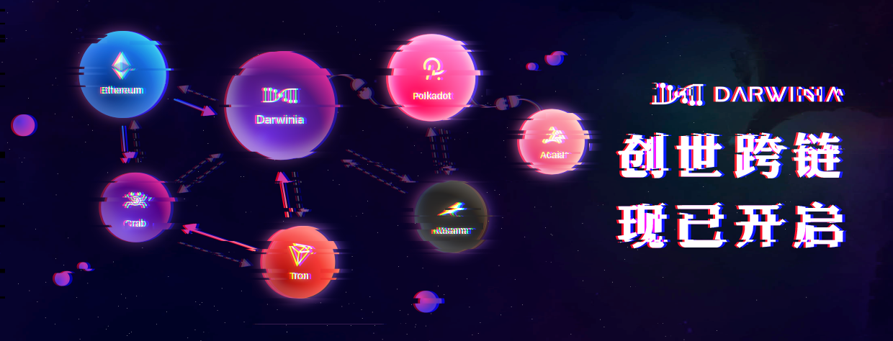

Darwinia 跨链转账已开启，已完成阶段一：创世跨链（Genesis 映射）

<!--truncate-->

此阶段的跨链转账，将在 Darwinia 主网上线后到账，通过 Genesis Block 发至指定账号

## 操作指南：

- 1、在 https://bapp.darwinia.network/ 选择「以太坊」->「跨链转账」
- 2、连接至 ETH/Tron 钱包，填写正确的「Darwinia 主网地址」，选择跨链资产「RING/KTON」

## 注意：

- 1、创世转账的优点是主网启动之后就有 Token 进行 Staking 和转账操作，几乎没有跨链费用（Eth Gas Fee），缺点是这部分 RING 将会被冻结至主网上线。
- 2、创世转账比较适合想在主网上线后希望第一时间进行 Staking 的验证人，不希望短期内丧失流动性的普通用户谨慎选择。
- 3、创世转账功能暂时不会停止，主网上线前会宣布停止时间。

## 跨链转账路线图：

- 阶段 1: 创世跨链 正在进行中
  - 此阶段的跨链转账，将在 Darwinia 主网上线后到账，通过 Genesis Block 发至指定账号

- 阶段 2: 单向跨链 2020 Q3
  - 此阶段的跨链转账，立即到账（可能存在一定的网络延迟），但仅支持发至 Darwinia 主网的单向转账

- 阶段 3: 多向跨链 2020 Q3 - Q4
  - 此阶段的跨链转账，立即到账（可能存在一定的网络延迟），且支持双向或多向转账

## 说明：

- 1、阶段二：单向跨链指的是 Darwinia Relay 桥跨链，将在 Darwinia 主网上线后开启（可能需要治理升级，约一周内），支持以太坊跨到 Darwinia 主网（Tron 可以通过进化星球通道转至以太坊），优点是短期内不需要冻结 RING，也支持「存单」的跨链迁移。
- 2、阶段三：双向跨链是指 Darwinia Relay 桥跨链，支持 Darwinia 跨到以太坊。
