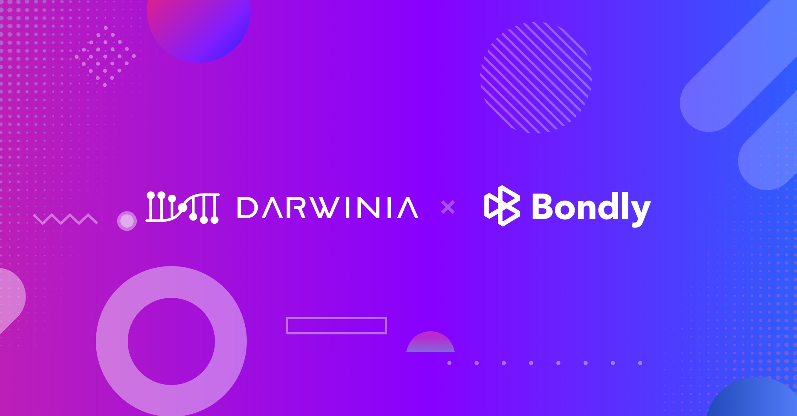

<!--truncate-->

## 什么是身份注册商？

身份注册商的主要工作就是验证链上身份真实性，并根据身份信息的完整性或真实性，授予不同的身份等级。获得一个较高的身份等级，会增加信任度与社区知名度，有利于参与链上治理、竞选验证人等活动。

## 如何查找当前身份注册商？

1. 您可以在 Chain state > Storage > Identity > registrars : Vec \<Option\<RegistrarInfo\>\> 中查看所有身份注册商信息，包括注册商账号、注册费、权限等。
   
   *注：注册费有可能发生变动，申请身份注册前建议查询当前费用，选择合适的注册商。*
  
   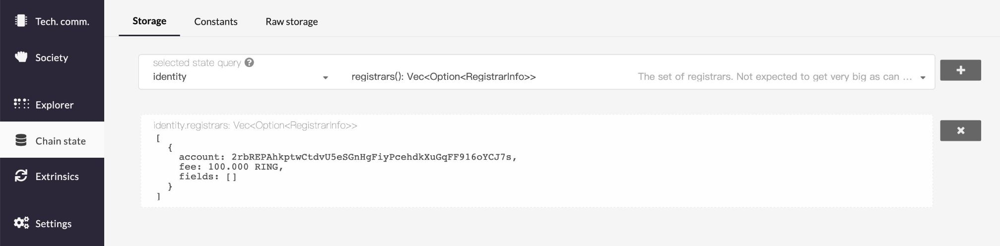

2. 通过 Subscan 浏览器，账户 > 身份筛选，也可以查看该网络的所有身份注册商。
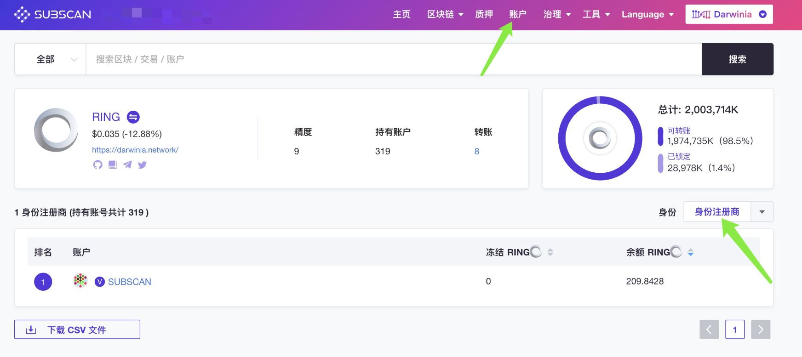

## 如何获得身份认证（加V）？

1. 设置链上身份
   
   * 点击切换账号 > 设置 > 设置链上身份
     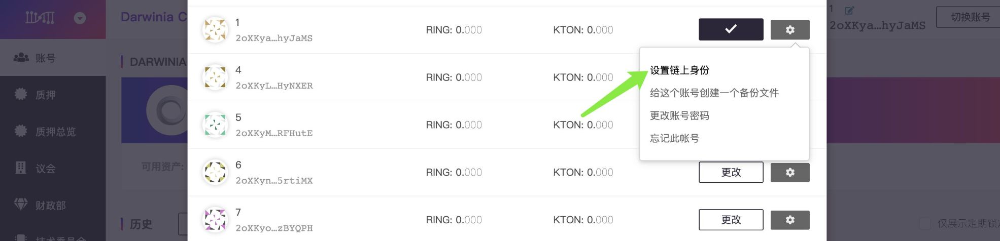
	 
   * 填写链上信息，请确认信息的真实性与格式（格式参考下图），确认无误后点击「设置」。
     
	 *注：请谨慎填写身份信息，身份信息通过验证（加v）后，更改身份信息需要重新验证身份*。

     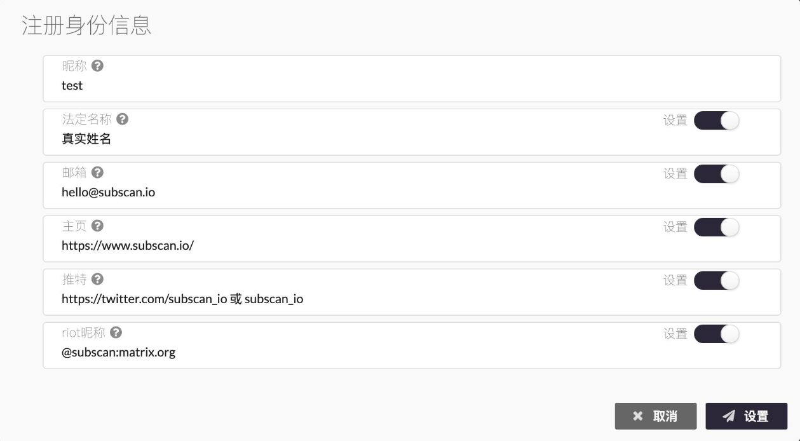

2. 申请验证
   
   点击左侧列表中的「交易」> 选择交易类型：identity / requestJudgement > 设置注册商参数：`reg_index`，`max_fee`，确认无误后点击签名并发送。
   
   下图以 #0注册商 Subscan 为例，`reg_index` 填写 `0`，`max_fee` 填写 `100`。

   *注：查找注册商参数的方法请参考上文 “如何查找当前身份注册商？”*

   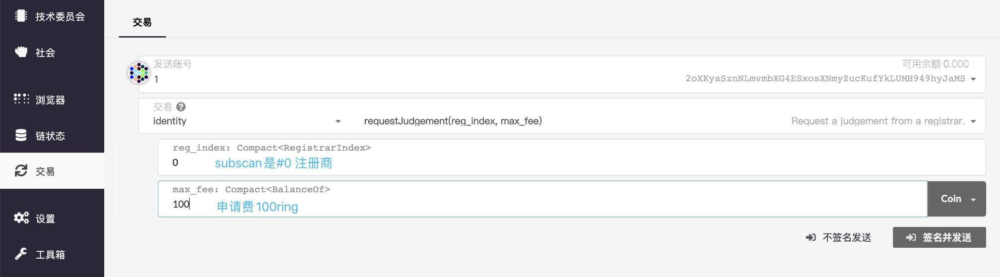

3. 联系注册商完成验证
   
   确认交易发送成功后，请通过注册商留下的身份信息联系注册商，完成验证。每个注册商的验证规则可能都不同，具体规则请联系验证商获取。
   
   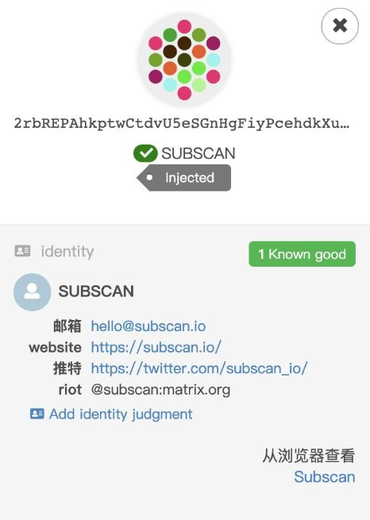

4. 验证完成
   
   全部验证通过后，你的账号将获得身份标识，在验证人中更加瞩目。
  
   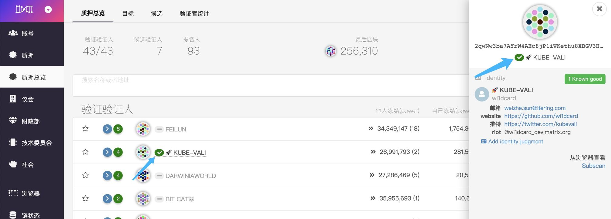

## #0注册商 Subscan 的验证规则

1. 通过社交网络获取验证码
   
   Subscan 会通过您留下的身份信息，向您的邮箱、推特、riot（element）发送一段验证码。

   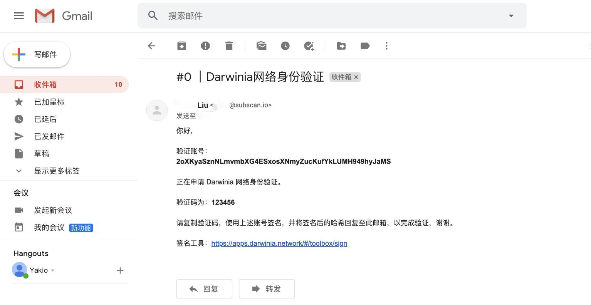

2. 在 sign message 中粘贴并签名
   
   工具箱 > [sign message](https://apps.darwinia.network/#/toolbox/sign)
   
   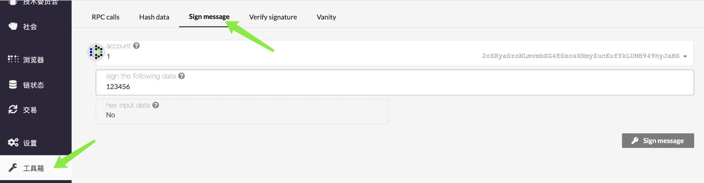
   
    * account 为申请验证身份的账号
	* sign the following data 为验证码

3. 复制签名信息，并回复至对应社交媒体。
   
   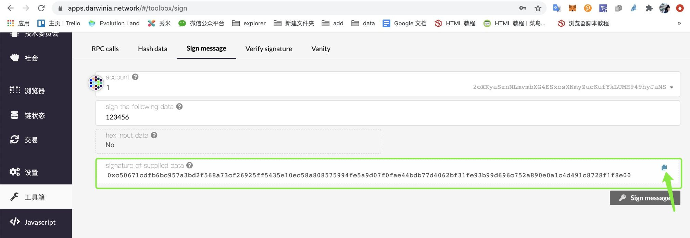

## 身份等级

Subscan 拥有以下等级的授予权限，其中 「一般」 和 「很好」 为 「绿V」，即身份已验证。

* 一般：数据看似合理，但未进行深入检查，例如正式的 KYC 流程。
  *（需要验证 2 个或 2 个以上社交媒体身份信息）*

* 很好：注册商已证明信息正确无误。
  *（需要验证 3 个社交媒体的身份信息，并在线下相识）*

* 未知：默认值，尚未做出验证。

* 过时的：该信息曾经很好，但是现在已经过时了。

* 质量低劣：信息质量低劣或不精确，但可以通过更新进行修复。

* 错误：信息错误，可能表示恶意。
