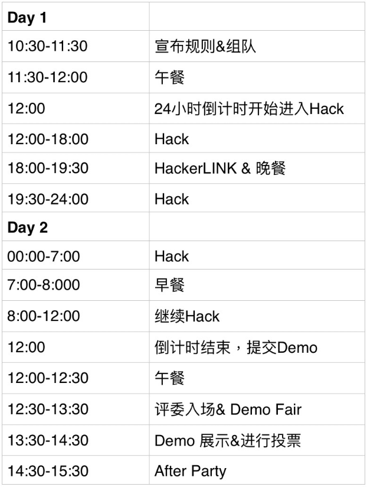
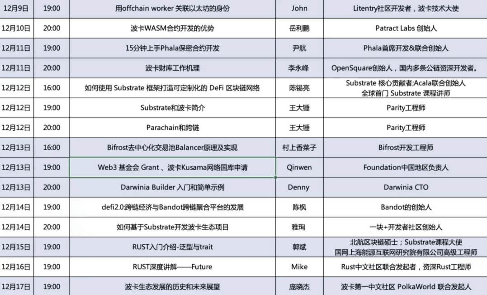
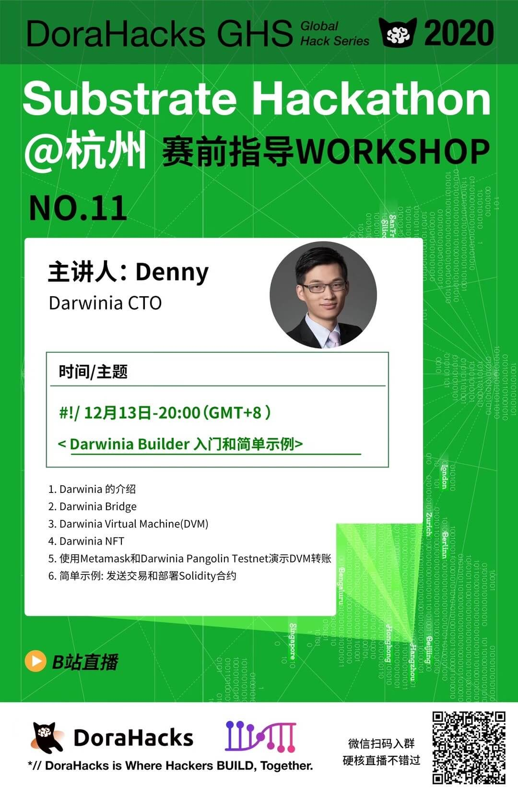
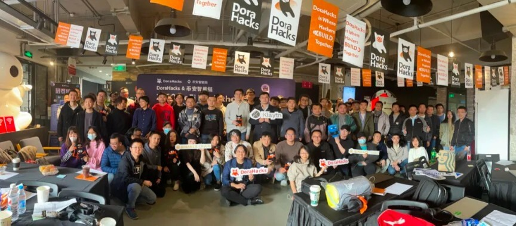
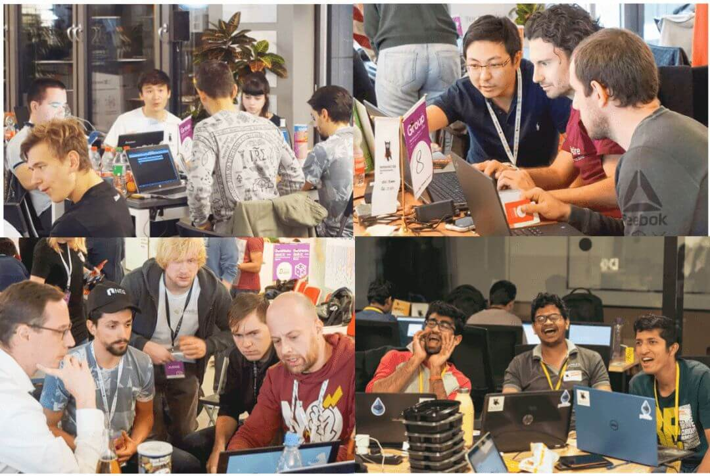
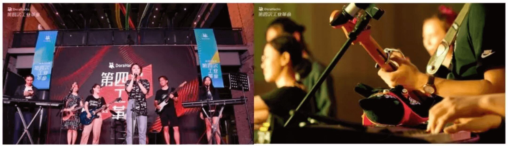
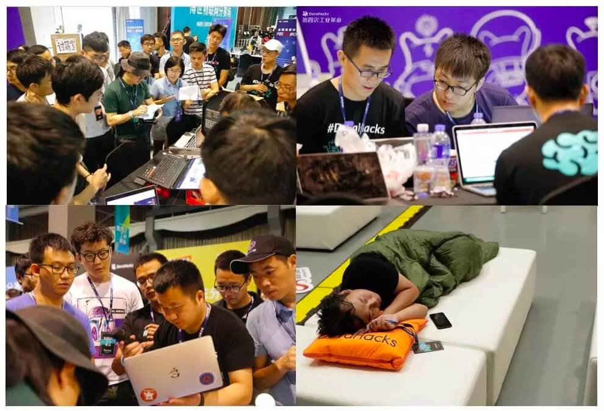
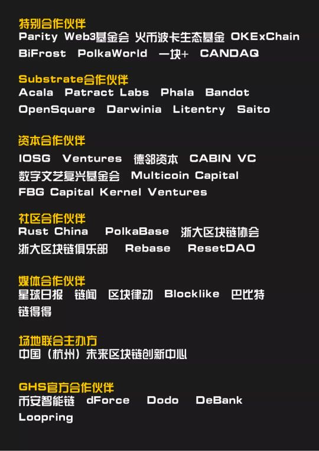
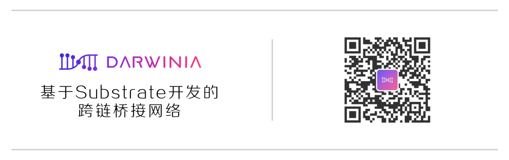

<!--truncate-->

2020 年 12 月 19 日 - 20 日，DoraHacks 在将**杭州**发起 Substrate Hackathon，这场 Hackathon 的主题是**「Substrate 与波卡生态的相关技术」**。活动将再次邀请 50 位区块链工程师、50 位前端工程师、全栈工程师和设计师，Hack Polkadot 波卡生态上的新产品。

除了丰厚的 Grant 和 Bounty 之外，数十位资本合作伙伴和生态合作伙伴将携手在比赛中，挖掘潜力项目和团队，寻找未来之星！15000+ 美元赏金等你来！

波卡国库和火币波卡生态基金提供共 1 万美元的开放 Grant 奖金池；Acala 基金会、Phala Network、Darwinia、Bandot、Litentry 提供了总价值超过 5000 美金的 Bounty 供开发者解决！Darwinia Bounty 还特别提供挖矿 NFT 作为奖励！

**时间**:2020 年 12 月 19 日 - 20 日 

**地点**:杭州｜未来区块链创新中心

## 赛制

* **Defi、NFT、DAO、跨链**:围绕这三个主题基于 Substrate 开发，智能合约创新，或完善已有产品的技术和功能。
* **1 - 5 人团队作战**:基于 Substrate 开发、合约开发、产品开发、经济模型设计、产品设计等不同技能的 Hacker，1 - 5 人为一战队，思想、技能、行业碰撞。(可提前组队也可以现场组队)
* **24 小时极限挑战**:在规定的 24 小时内将创意落地或完善已有的产品 Demo，向现场观众展示 24 小时内完成的增量项目 Demo。
* **招募 100 名 Hacker**:根据 Hacker 提交的报名信息，按报名顺序录取 Hacker，录满 100 名 Hacker 截止报名。
* **报名**:可提前组队报名，也可个人报名现场组队，提前组队的 Hacker 可以把自己的想法发布在 [HackList](http://list.hackerlink.io) 上，Hackathon 现场可以开发自己产品。HackerLink 用户可以免填写报名表单。详情请咨询脑洞猫。
* **赛前 Workshop**:Hackathon 开始之前，会安排赛前的线上指导，帮助 Hacker 们快速了解 DeFi 和 NFT 基础背景、最新进展以及亟待解决的难题。（具体安排见下）
* **Mentor**:现场有成功创业的老 Hacker 游走，可以抓住他们一起 Hack（不要问他们的身价）。
* **餐饮**:活动中的餐饮免费提供。
* **奖金**:波卡国库和火币波卡生态基金提供共 1 万美元的开放 Grant 奖金池；Acala 基金会、Phala Network、Darwinia、Bandot、Litentry 提供了总价值超过 5000 美金的 Bounty 供开发者解决！
* **关于押金**:活动报名时需要提交 100 元押金，现场返还，若在开始前三天若无法参赛可退还押金， 参赛名额即可转移给其他 Hacker。

### 日程安排

Day 2 下午 15:00，Phala、Darwinia、Acala、Bandot、Opensquare、litentry 等项目会陆续分享他们的最新进展，欢迎关注。

## Workshop 安排

在这次 Substrate Hackathon 中，DoraHacks 和波卡生态的伙伴们特地为本次活动设计了系列 Workshop 共计 15 场！

从 12 月 9 日起，将在 B 站 DoraHacks 频道直播中（ https://live.bilibili.com/22389365），与大家不见不散！

### 内容安排

## 参与 Substrate Hackathon 所需技能

* **Substrate 开发**:Substrate，Rust；Substrate 本身以及基于 Substrate 的应用链的开发都使用的是 Rust 语言，一定程度的 Rust 编程知识是需要的。

* **开发者工具**:命令行工具；代码编辑器或者集成开发环境（IDE），如 vscode，intellij idea，clion 等等；Git / Github 常用操作等。

* **Dev**:前端、后端(Runtime)、全栈、移动端等。

* **设计师**:UI / UX 等。

## Substrate Hack 你将收获？

* 实现自己的 idea，成为下一个 Web3 明星项目

* 进一步完善自己项目，增加新的 feature

* 帮助前线 Web3 项目解决问题，获得丰厚赏金

* 结识未来的合作伙伴

* 展示自己的项目给活跃的投资人、社区 KoL

* 一个愉快、充实、美味的周末

## 为什么是 Substrate？

**因为每个人都有做出 Web3 世界独角兽产品的机会。**

Substrate 是由 Parity 公司开发的一个区块链开发框架，提供了区块链开发所需的底层公共组件，可以让普通的开发者快速地开发一条区块链应用，来验证自己的想法。

Substrate 是首个构建区块链的框架。这些区块链可以像 Polkadot 中继链一样独立存在，完成特定任务。Substrate 采用 Rust 语言，能快速、安全、可靠且相对轻松地进行编程。

**通过 Substrate 则可以创建效率高、性能好的区块链。这些区块链可以非常高效、低成本地完成特定工作，解决需要做出权衡的困扰，同时还可以组合不同解决方案。这样就能让不同的区块链在无需信任的情况下实现低成本、快速的互联互通。**

## DoraHacks

DoraHacks 是全球最活跃的极客组织和 Hackathon 组织者之一。Hackathon 是 Hacker 一起创造新产品、开发新技术的地方。

