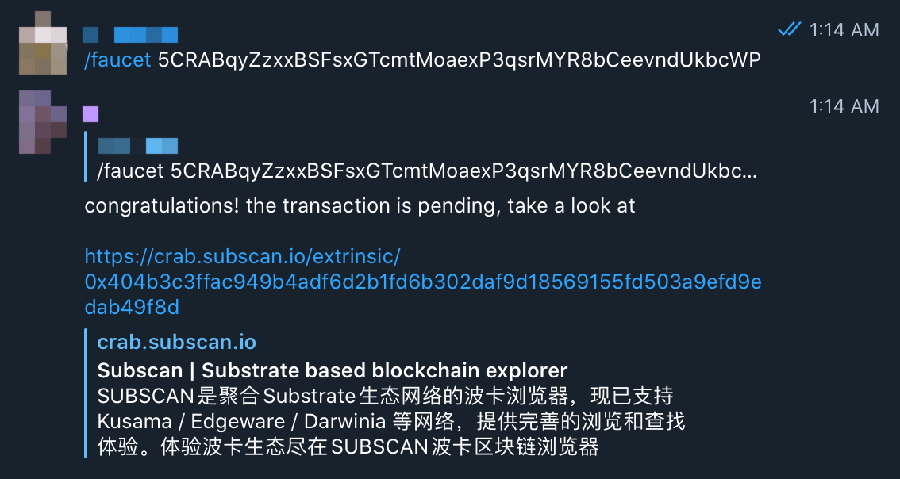

## Get Faucet (cRING)

- Join Darwinia Faucet Channel: [Click Here](https://t.me/DarwiniaFaucet)

- Reply `/faucet + Account containing CRAB`
  - Example: /faucet 5CRABWXr1AqSSqJwv9tzh8gk4mEnrRYV9VWq7VnHh1KxvTBD
  - Attention: There is a space between /faucet and account.

- If your account meets the requirements for issuance, 1000 cRing will be automatically distributed to your account, you can view the transfer record through the browser [crab.subscan.io](https://crab.subscan.io/) via the link below.

## Faucet distribution rules

1) Each Telegram account can successfully receive `1` airdrops within 24 hours.  
2) Each crab network address will be invalid after successfully receiving `1` airdrops.  
3) The address to receive the airdrop needs to be satisfied: the address contains the four letters `CRAB` (case sensitive).  
4) The maximum daily distribution of airdrops is `400`, first come first served.  
5) The number of each airdrop is a fixed value: `1000` cRing.  

## Generate a Vanity account with CRAB

- Click [Vanity account], fill in the conditions you need to filter.
  

   `Search for` : fill in`CRAB`
   >Type here what you would like your address to contain. This tool will generate the keys and show the associated addresses that best match your search. You can use \"?\" as a wildcard for a character.": "",

   `Case sensitive`: select `Yes`
   >Should the search be case sensitive, e.g if you select \"no\" your search for \"Some\" may return addresses containing \"somE\" or \"sOme\"...": "Should the search be case sensitive, e.g if you select \"no\" your search for \"Some\" may return addresses containing \"somE\" or \"sOme\".

   `Keypair crypto type` : Both can be selected

   >Determines what cryptography will be used to create this account. Note that to validate on Polkadot, the session account must use \"ed25519\".": "Determines what cryptography will be used to create this account. Note that to validate on Polkadot, the session account must use ed25519.

- Click [Start Generation] and wait for the account to be generated. Click [+] to select your favorite account for backup.

- Click [Save] and choose to back up the original seed or json file according to your usage habits.

   > Be sure to back up `mnemonics, private keys, json files`, etc. When backing up the json file, please keep the password safe. If the password is lost, the address cannot be restored through the json file, but it can be re-imported through the mnemonic word and private key.