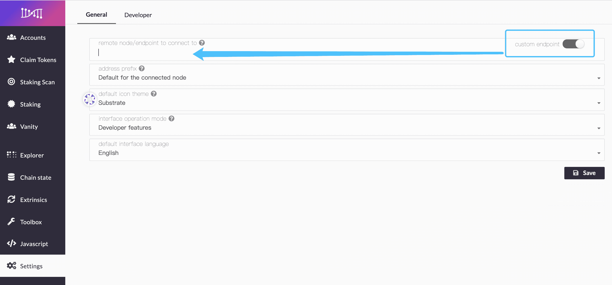
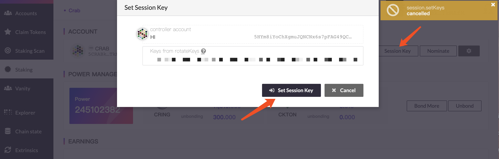
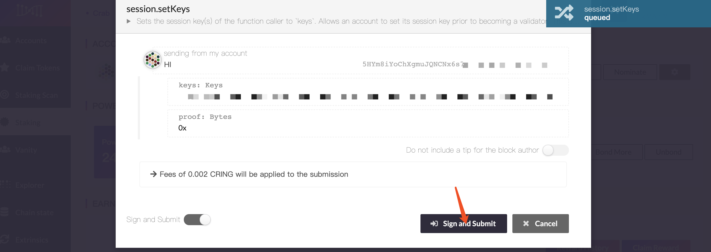
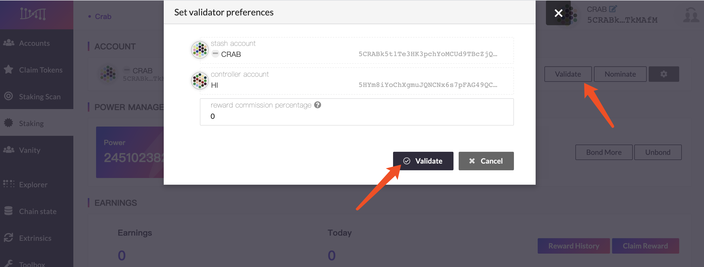
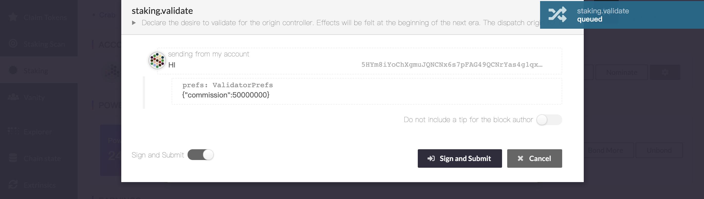
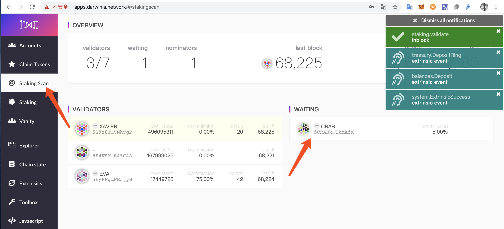

> - Staking is a consensus mechanism based on PoS (Proof of Stake / Proof of Stake). Token holders obtain rewards and benefits through pledge, voting, delegation, and locking.

> - Before participating in staking, please make sure you have at least **1** Darwinia address. If you hold more tokens or have higher security requirements, it is recommended to prepare **2** Darwinia addresses. If there is no address, please refer to: [How to create an account](https://docs.darwinia.network/docs/en/crab-tut-create-account)

> - A small amount of CRING must be prepared in Darwinia-Crab Network's address as fee. If you have no CRING, please refer to: [How to get free CRING through faucet](https://docs.darwinia.network/docs/en/crab-tut-claim-cring)


## Start Staking

### Entrance
- Enter [Darwinia Wallet](https://apps.darwinia.network) and click the [Staking] column on the left , Click [Start staking].


### Fill in the staking parameters


- ` Stash account` Account for stashing tokens. Tokens participating in staking will come from this account. The operations of this account are mostly related to changes in stash.

- `Controller account`  The controller is the account that will be used to control any nominating or validating actions. Should not match another stash or controller.

    > The `Stash account` and` Controller account` can be set to the same account. If you hold more tokens or have higher security requirements, it is recommended to set up different accounts here.

- `Value bonded` The total amount of the stash balance that will be at stake in any forthcoming rounds (should be less than the total amount available).  This part of the tokens will be temporarily bonded. bonding takes 14 days to unbond; you can choose to bond CRING or CKTON.

- `Payment destination` The destination account for any payment as either a nominator or validator.

- `Bond period` Optional; bond CRING promise for 3-36 months to get additional CKTON rewards. (Promise to lock to accept user terms)

    > If you unlock CRING in advance within the lock limit, you will be charged  a penalty of 3 times the CKTON reward.

- After filling in the staking parameters, please click [bond] and [submit]


## Set Validate Parameters

### Generate session key

- **Generate via command**

Enter the following command under the server terminal to receive the returned session keys

	```sh
	curl -H 'Content-Type: application/json' --data '{ "jsonrpc":"2.0", "method":"author_rotateKeys", "id":1 }' 	http://localhost:9933
	```
- **Generate via web wallet**

Click [Settings] on the left to change the interface operation mode to developer mode, turn on [Custom Endpoint], enter the local node address（e.g `ws://127.0.0.1:9944`）, and click [Save] after confirming that it is correct.



Click [Toolbox] on the left, select `author` / `rotate keys` in RPC Calls, click [submit RPC Call]


Copy the generated session key and keep it properly.

- **Q & A:**

*Q: What port is 9933?*

A: The port number specified for `--rpc-port`, the default is 9933

*Q: What port is 9944?*

A: The port number specified for `--ws-port`, the default is 9944

*Q: RPC request returned Method not found*

A: Please add `--unsafe-rpc-external` when the node starts, it is recommended to delete this parameter after the generation is completed and restart the node

*Q: RPC request returned Request header is not in*

A: Please add `rpc-cors all` when the node starts, it is recommended to delete this parameter and restart the node after generation

   > ***If there are still problems, welcome [Submit issue]("https://github.com/darwinia-network/darwinia/issues/new")***

### Set session key

Click [Set session key] on this page, completing the generated session key and submit. 
   > The session key must be filled with real data, otherwise it will result in missing blocks and be slashed.
                                                                                                                       



**After confirming, click [sign and submit]** 
   > The identities of the validator and the nominator are mutually exclusive and cannot coexist. If you are running a validator, you need to cancel the validator before proceeding with the nomination.




**Click [validate] and set the validator parameters**

- `Reward commission percentage` Set the proportion of the node's priority distribution of income, the range is 0-100. (Example: If a 5% reward commission is set, this node will first receive 5% of the node's revenue, and the remaining 95% of the node's revenue will be distributed in proportion to the amount of mortgages validated by the validator and nominator; Validator's income = node reward commission + mortgage reward share)




**After confirming, click [sign and submit]** 




**Go to [staking scan] to view information about validators**
  


   > The operation of validate will take effect after the first epoch of the next era. Prior to this, the validator will be in the [waiting] list.


## Other operations

There are other operations in staking for the following purposes:

- `Stop validate` Leave the validator queue.

- `Bond` &`Bond more` Adds bonded tokens for staking to obtain more power.

- `Unbond` Unbond tokens for staking, and at the same time the power will be reduced proportionally.

  > The 14-day bond period is required to unbond. Tokens that are in the bond period cannot be operated. Please be careful.

- `Reward history` Go to SUBSCAN explorer to view historical reward records

- `Claim reward` Manually claim the reward, and the reward will be distributed in units of era.

  > Please note: 56 era (about 14 days) will be saved, and you will not be able to claim it if it expires.

- `Change controller account` Change the account  that will be used to control any nominating or validating actions. Should not match another stash or controller.
- `Change reward destination` Change the destination account for any payment as either a nominator or validator.
- `Set on-chain identity` Set your personal information, such as display, legal name, email, website, twitter and riot. Other users can view this information and contact you.


