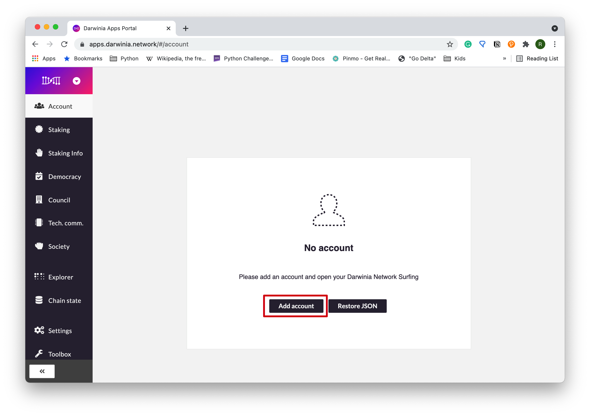
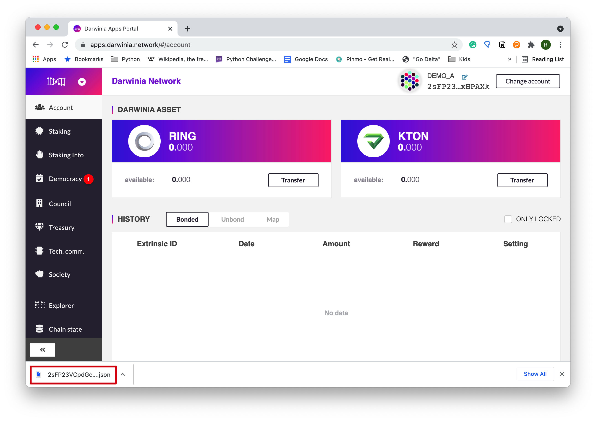
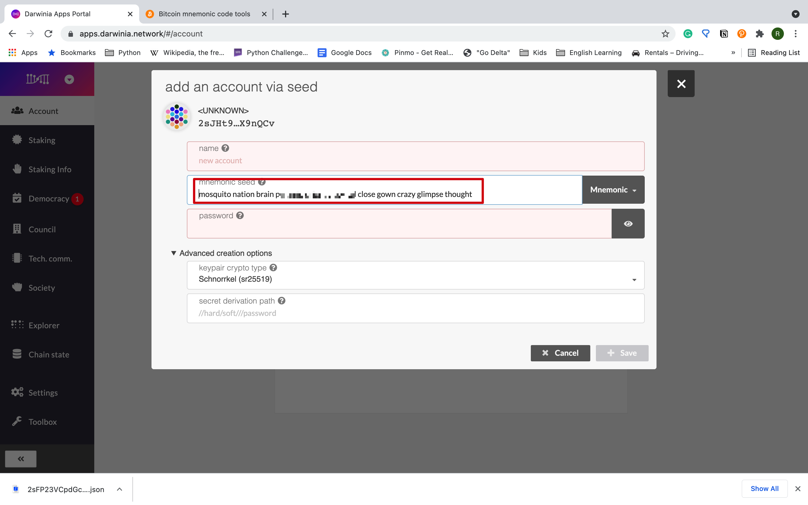
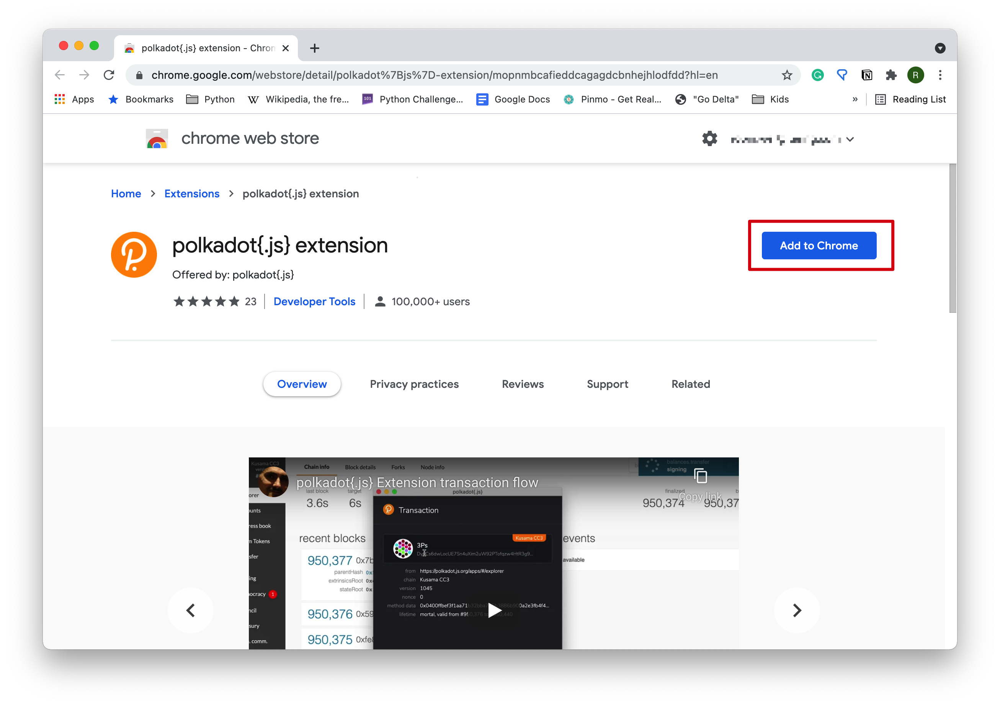
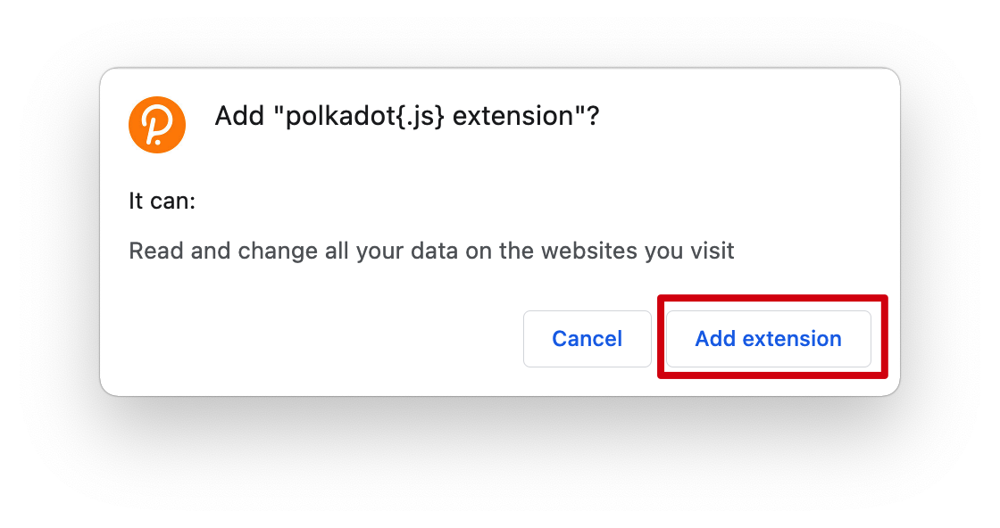
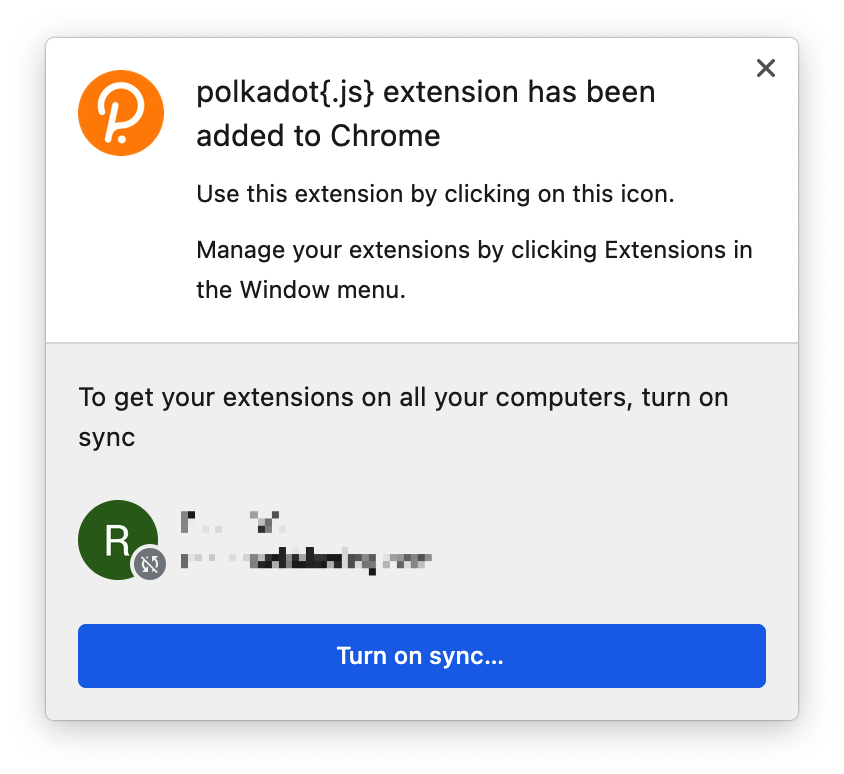
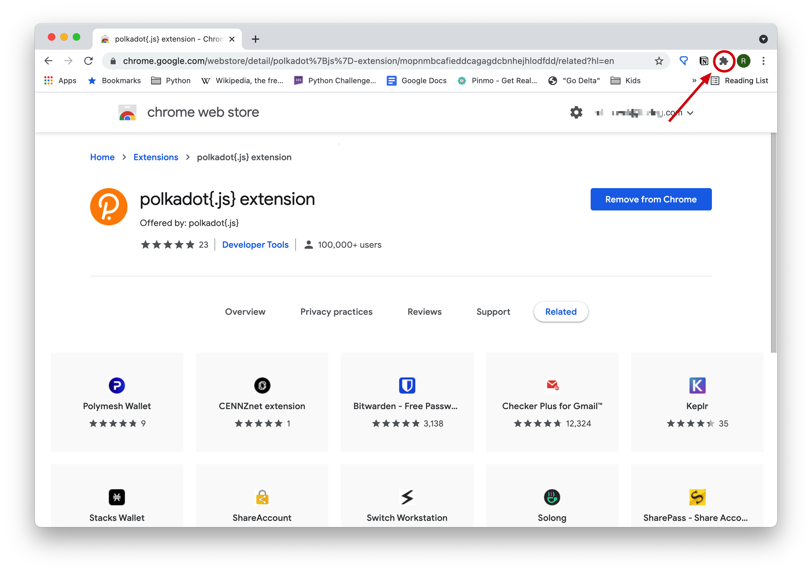
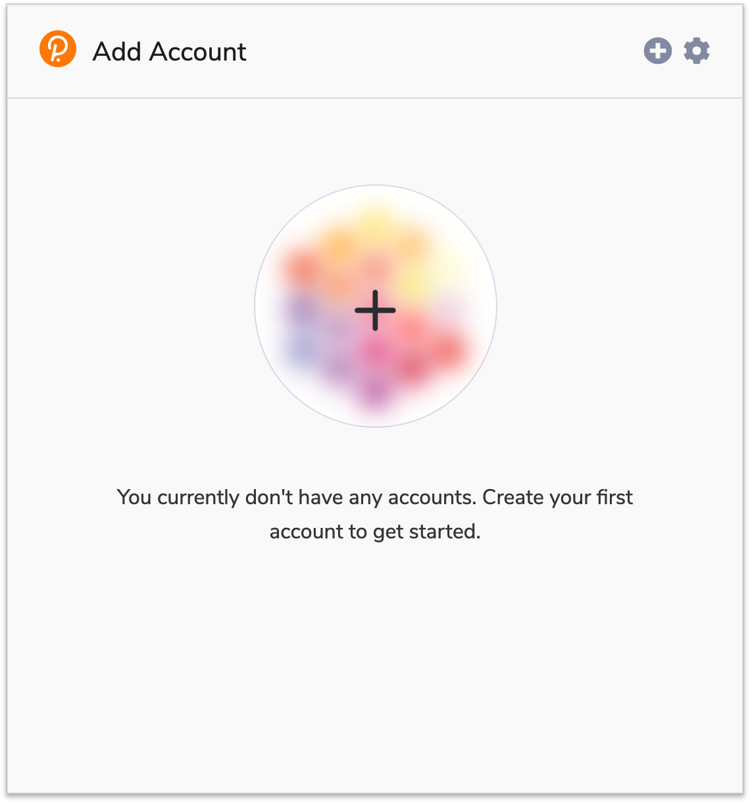
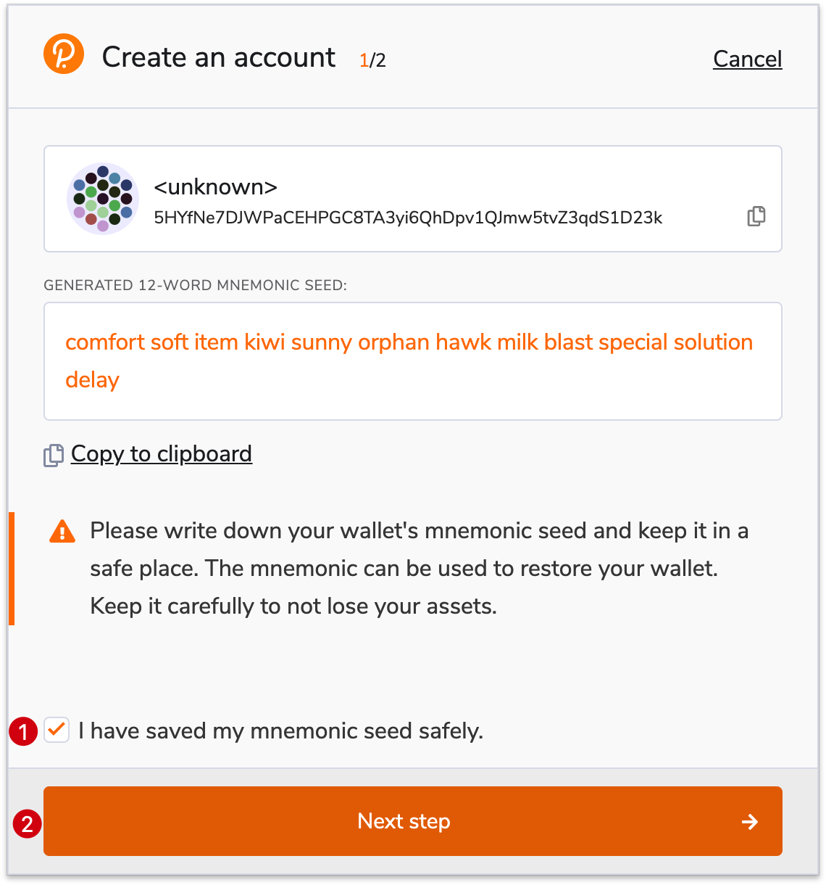

There are three ways to create an account: using the Darwinia Apps Portal, the browser plugin Polkadot.js, or the CLI tool subkey. You may choose anyone at your discretion. **Subscan** is for more advanced users and will not be covered here. If you have already created an account, you can migrate it from various sources by importing your account, as long as you have your `secret phrases` or `secret seed`. We will use **Create**, **Add**, and **Set up** interchangeably in different contexts.

## Using the Darwinia Apps Portal

The first time you visit the Darwinia Apps Portal, you will see a prompt saying, "*You don't have any accounts ... Create an account now.*"

### Create a New Account

Click to close the prompt. Before creating your first account, you need to make sure you are currently on the Darwinia Network.

Now you can go to the Account section and click the button "Add	account" to start.

Mnemonic phrases (or a raw seed) have already been generated for you. Mnemonic phrases are used to create your private key, which is extremely important to keep your assets safe.  **A best practice here is to write them down on a piece of paper and keep it in a safe place**. You need to set a name to your account and a password to encrypt your private key. Click "Save" button.

Click the "Create and Backup Account" button to back up the JSON file of the account.

Then a backup JSON file will be downloaded to your computer, as you can see from the bottom left of the window. You can check the location of the JSON file by clicking it.

You will also see your account appear on the top right of the window. Now you have successfully created your Darwinia account.

### Restore from a JSON Backup File

If you have created an account elsewhere before, you can migrate your account to your current browser, as long as you have the backup JSON file and the password. 

In "No account" window, click "Restore JSON".

Then click the "backup file" text area to choose your backup JSON file.

Then type in your password and click the "Restore" button to restore your account.

Your account is successfully imported(migrated) to your when you see the following prompt.

### Set up an Account via a "Mnemonic Seed"

If you are a fairly advanced user, you can also use your own "Mnemonic Seed" to set up (create, migrate, or restore ) an account. This operation does not require you have the backup JSON file and the password. Steps are similar to the section *Create a New Account*, expect for the *Mnemonic Seed* part. Instead of using the auto-generated mnemonic seed, you can input your own "Mnemonic Seed", as long as it is a valid one.

## Using Polkadot.js Browser Plugin

### Install the Browser Plugin

The browser plugin is available for both [Google Chrome](https://chrome.google.com/webstore/detail/polkadot%7Bjs%7D-extension/mopnmbcafieddcagagdcbnhejhlodfdd?hl=en) and [FireFox](https://addons.mozilla.org/en-US/firefox/addon/polkadot-js-extension). We will show the steps on Chrome below. 

First click "*Add to Chrome*",

and then "*Add extension*".

When it is installed, it looks like this.

### Use Polkadot.js to Add an Account

Click the Polkadot.js logo on the menu bar to launch the plugin. If there are too many extensions installed to Chrome and you cannot find the logo on the menu bar, you can click the "Extension" logo to find it.

The first time you launch the Polkadot.js extension, you will see a Welcome popup window. Click "*Understood, let me continue*" to proceed.

Now click the "**+**" button to set up a new account.

A 12-word mnemonic seed is auto-generated. **Write it down on a piece of paper and keep it in a safe palce**, check "I have saved my mnemonic seed safely", and then click "Next step".

Give your account a descriptive name and set a password for it. Then you can add the account.

### Visit the Darwinia Apps Portal
After adding your account, you can visit the Darwinia Apps Portal to check if it is working. You need to authorize Polkadot.js to use your new account.

Now you can see your account appear on the top right area of the window. You may need to refresh the page to see it.

