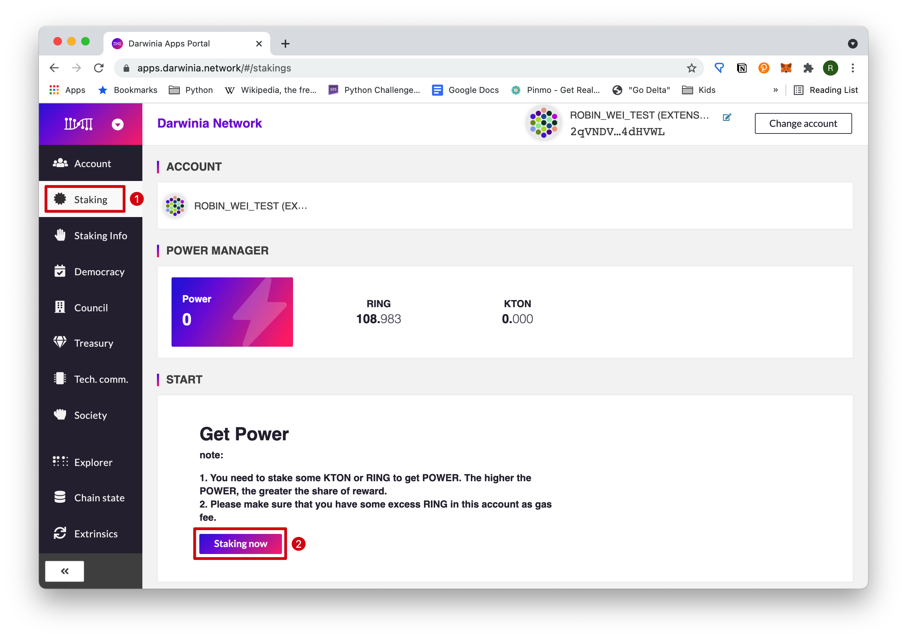
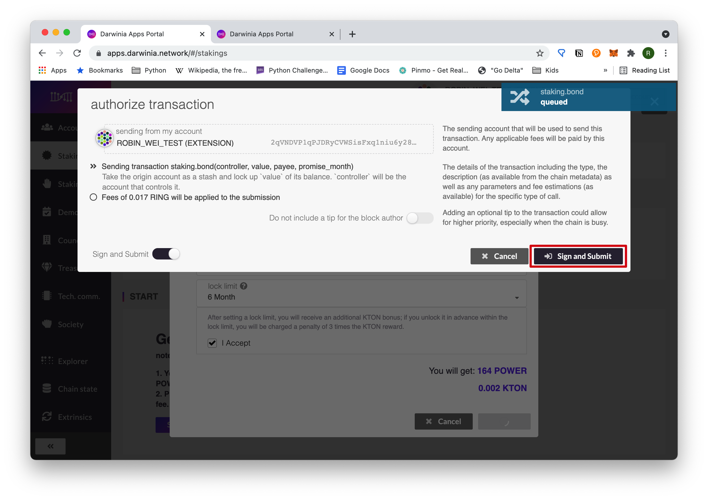
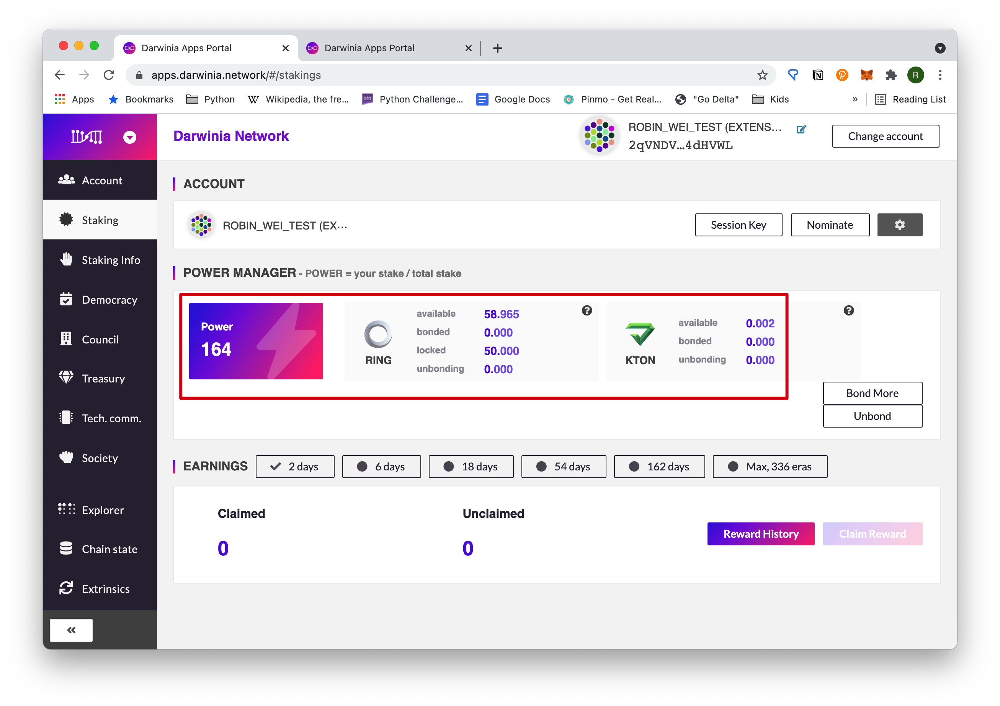
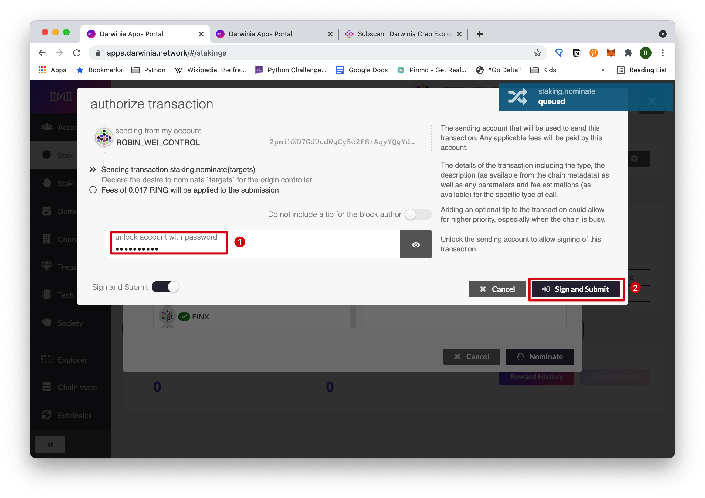
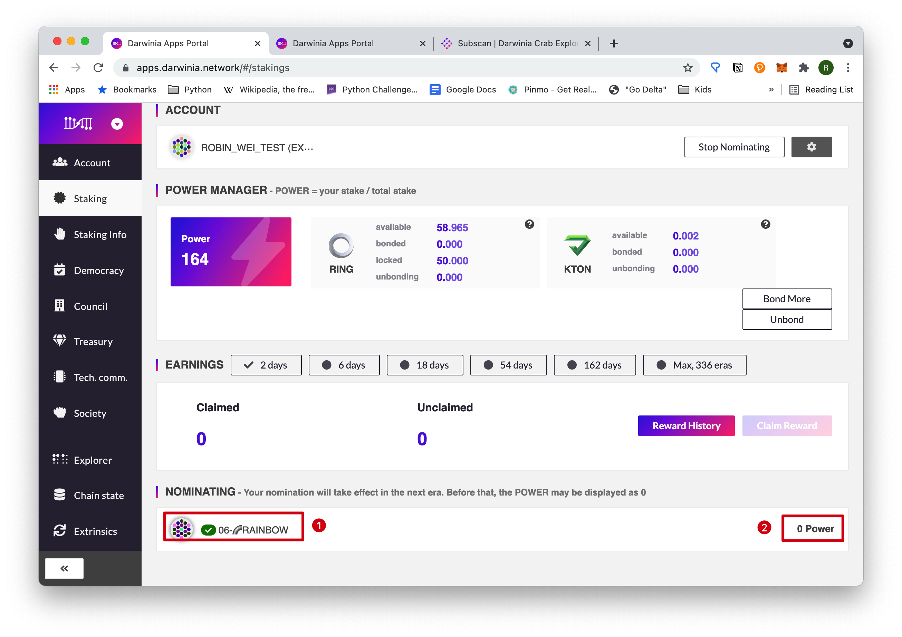

## Intro

Token(RING/KTON) holders can participate in various forms to gain rewards or make a profit. Nominating a validator is an easy starting point. In this article, we will show you how to become a nominator step by step. The steps to nominate a validator can be divided into two phases:
1. Stake your tokens;
2. Select a validator.

## Prerequisites

To nominate a validator, you need to meet these prerequisites:
- You have at least one valid account;
- You have some tokens(Ring/KTON) on your account(s).

## Steps

### Phase I -- Stake the Tokens

After logging in the [Darwinia Apps Portal](https://apps.darwinia.network), you can go to "*Staking*" section and click "*Staking now*" to start.

This is the page for input of the staking information. We will explain these item one by one.

"*stash account*" is the account where your staking tokens come from. "*controller account*" is the account that will be used to actually nominate a nominator in Phase II. These two items can be identical if you only have one account. But if you have more than one accounts, using different accounts for different purposes is a good practice. "*value bonded*" is the amount of token that will be locked in any forthcoming rounds. (You should leave a small amount to pay for the transaction fee.) "*payment destination*" is the account to receive potential gains. *Payment* here means gains. "*lock limit*". After setting these parameters correctly, you can check "*I Accept*". Your estimated gains is displayed. Then you click "*Bond*". 
> "*Stake*", "*Lock*", and "*Bond*" are used interchangeably here, but this might not the case in different contexts.

Click "Sign and Submit" to proceed.

In the *polkadot.js* pop-up window, input your password to authorize the transaction.

You can see the tokens are successfully bonded.

### Phase II -- Select a Validator (Nominate)

Now that you have successfully bonded an amount of tokens, you can click "*Nominate*" to start to nominate a **validator**.

Choose your favorite validator from the list on the left. The selected one will be displayed on the right. You can also unselect a validator on the right by clicking it. Then click "*Nominate*".

> Choosing the best validator requires a strategy that considers various factors, such as the credibility of the validator, commission and the number of nominators. It will not be covered in this article.

Input your password and click "Sign and Submit". You may notice that the control account is used here if you set different accounts in Phase I.

Now you are done with nominating a validator. But you need to wait until the next era for it to become effective, so now you power is still "*0*". 

