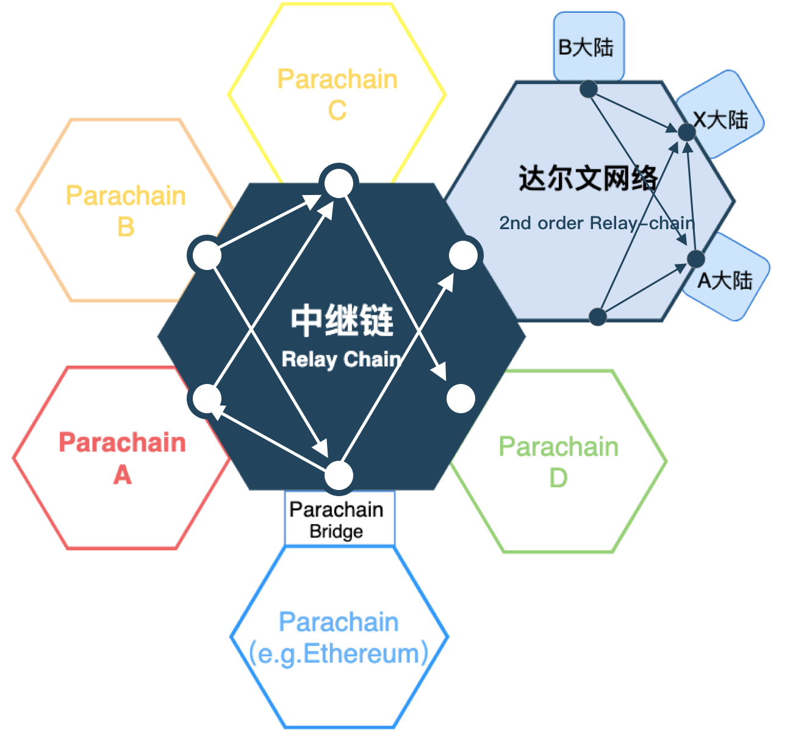

- 功能描述: 达尔文网络的开发架构描述
- 开始时间: 2019-04-28
- RFC PR: None
- Github Issue: None

# 概要

达尔文网络（DARWINIA）基于Substrate开发的跨链应用枢纽和资产互联网络。

达尔文网络是开放的应用跨链协议，主要专注于建设未来资产互联网络，包括游戏资产和非标资产的跨链，稳定币的跨链，应用链跨链等业务。

通过达尔文网络，用户将可以使用达尔文网络来实现资产的跨链转账和流通，开发者可以通过使用达尔文网络便捷的跨链基础服务，实现应用链资产的跨链互联。

# 动机和目的

达尔文网络需要一个很好的跨链技术架构来支撑进化星球的业务体系。

# Guide-level explanation

关于Polkdot的网络拓扑可以参考其白皮书，其网络拓扑的发展会有点像分形结构，即局部的网络拓扑和整体的网络拓扑会是同构且比较相似。下面的图片列出了达尔文网络可能在网络中的位置。

# Reference-level explanation

关于Substrate框架的详细介绍，可以参考下面的一些代码库和文档。

- [https://github.com/paritytech/substrate](Substrate)
- [https://polkadot.js.org/](Polkadot和Substrate工具，接口和JS库).
- [https://docs.substrate.dev/](Substrate文档和上手资料)

# 缺点

比较依赖Substrate的开发设计和进度。

# 理由

- Substrate是Polkadot底层的框架，符合达尔文网络跨链的理念
- 最新的技术框架，比较好的底层模块解耦和支持，可以定制SRML
- 可以很方便的接入Polkadot，站在巨人的肩膀上

# 拓展的模块
- RING模块
- KTON模块
- Staking模块
- eth-relay模块
- eth-backing模块

# 参考

- [1] https://github.com/cosmos/cosmos/blob/master/WHITEPAPER.md
- [2] https://github.com/w3f/polkadot-white-paper/raw/master/PolkaDotPaper.pdf
- [3] https://www.parity.io/substrate/
- [4] https://imgland.l2me.com/files/evolutionland/whitepaper_en.pdf
- [5] https://en.wikipedia.org/wiki/Triffin_dilemma
