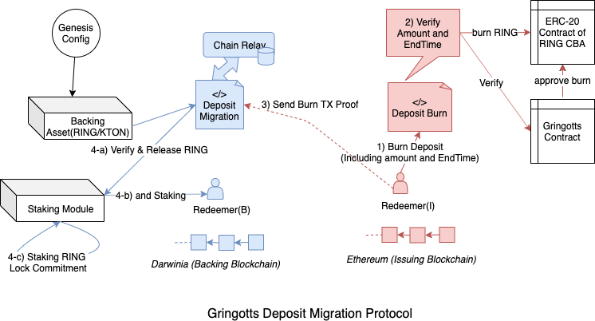

- rfc: 14
- title: 0014-darwinia-token-migration-by-cross-chain-redeem-protocol
- status: Draft
- desc: Darwinia Token Migration By Cross-chain Redeem Protocol
- 

# Darwinia Token Migration By Cross-chain Redeem Protocol

## I. Overview

Before the Darwinia mainnet was launched, some RING / KTON assets already existed on the Ethereum network or the TRON network in the form of ERC20 or TRC20. From the perspective of asset cross-chain, because RING and KTON are defined as the native assets of the Darwinia network, these ERC20 Tokens are essentially cross-chained to the Ethereum network in some form, which can also be understood as CBA (Cryptocurreny Backed Assets), that is, each ERC-20 RING has a corresponding RING that is locked on the Darwinia mainnet. Before the mainnet goes online, the corresponding endorsed assets exist in the Genesis block.

ERC20 Token information of RING and KTON:

-RING Token Address: https://etherscan.io/token/0x9469d013805bffb7d3debe5e7839237e535ec483
-KTON Token Address: https://etherscan.io/token/0x9f284e1337a815fe77d2ff4ae46544645b20c5ff

This article will discuss the Darwinia mainnet on the basis of [RFC-0012: Darwinia Bridge Core: Interoperation in ChainRelay Enabled Blockchains](./rfc-0012-darwinia-bridge-core-interoperation-in-chainrelay-enabled-blockchains) Later, how can ERC-20 RING be redeemed to the Darwinia network, and how to use the design of the Darwinia bridge, how the Token will be transferred in the Darwinia main network and other public chains.


## II. Introduction

### A. Design scope

- RING/KTON cross-chain design of Darwinia's native assets. It mainly describes how to apply ERC-0012 and related cross-chain interoperability protocols to help RING / KTON realize the transfer between Darwinia network and other networks that support smart contracts (for example, Ethereum, TRON, EOS).
- Manage endorsement assets in the genesis block. When Darwinia's mainnet is online, the current native assets corresponding to RING / KTON in the form of ERC20 / TRC20 will be recorded in the genesis block and locked by the endorsement management module to support the subsequent redemption of external assets.
- Other main functions of endorsement management module. The endorsement management module will also meet other cross-chain transfer requirements after the mainnet launch, such as how subsequent users will cross-chain RING / KTON native assets on the mainnet to Ethereum. The issued ERC20 tokens (representing CBA) will share the same ERC-20 smart contract with the existing RING / KTON contract.
- Issuing contract and chain relay of external chain. The feasibility of this part of the solution depends on the implementation of the chain relay. It is mainly how to implement a low-cost and sustainable Darwinia Chain Relay on Ethereum. The details of this part are not described here. For details, please refer to the RFV-0012 VI chapter. . On the basis of Ethereum's implementation of a Darwinia Chain Relay, the external chain needs to add a Hairskin Management Contract to accept the cross-chain transfer transaction certificate on Darwinia and verify it through Darwinia Chain Relay (including transaction existence Proof, consensus proof, transaction content proof, etc.), after the verification is passed, the relevant RING / KTON is issued. This part is an advanced function. Its development and implementation can be independent of the migration function in the endorsement module. At the beginning, it can only support the one-way Ethereum to Darwinia redemption function.
- Termination of Gringotts Contract and Certificate of Deposit Migration Agreement


### B. Terminology

- **Genesis **, Genesis block or ledger data representing the creation status of the blockchain network.
- **CBA **, the full name is Cryptocurrency Backed Assets, that is, assets with crypto asset backends. For details, please refer to XClaim [1].
- **Chain Relay **, Cross-Chain State Verification. It is capable of interpreting the statte of the backing blockchain B and provide functionality comparable to an SPV or light client. It is mainly used to verify the existence of transactions on external blockchain networks Proof and consensus proof.
- **Backing Contract / Module **, the contract or module used to manage endorsed assets in the Backing Blockchain, including functions such as locking and release. In the Darwinia network, the Backing Module is also responsible for managing the endorsed assets locked in the genesis block.
- **Chain Relay Module **, implements the Chain Relay for external blockchain networks (such as Ethereum / Tron) on Darwinia.
- **External Darwinia Chain Relay **, a Chain Relay for Darwinia Network that exists on an external blockchain network.
- **External Issuing Contract **, used to issue ERC-20 Token of native RING / KTON CBA in external blockchain network.

### C. Endorsed Asset Genesis Configuration

When the Darwinia mainnet was launched, CBA endorsement assets existed. Therefore, the asset endorsement information of RING / KTON on other chains needs to be defined in Genesis Config. After the mainnet launch, these endorsed assets will initialize the corresponding native assets, and Lock it in an endorsement contract for special redemption (migration) agreements.

It should be noted that the RING / KTON distributed and locked by Genesis Config will correspond to the total supply of RING / KTON on the public chain when the mainnet is launched.

Genesis Config fragment example:

```json
{
  "backingAssets": {
    "Ethereum": {
      "RING": 100000,
      "KTON": 50000
    },
    "Tron": {
      "RING": 3000,
      "KTON": 200
    }
  }
}

```

### III. RING / KTON migration through special redemption agreement

When a user needs to convert a RING token in the form of ERC-20 into a RING on the Darwinia mainnet, he only needs to send a token burn contract for that part of the RING. After confirming the successful burn, the user sends the transaction certificate to Darwinia The unlocking contract of the network. After the unlocking contract is verified, the corresponding RING token will be released from the endorsement asset module to the redeemer.


#### A. Differences from ordinary redemption agreements

The biggest difference between the RING / KTON special redemption agreement and the ordinary redemption agreement in Darwinia Bridge Core is the backing assets. The endorsement assets that need to be redeemed in the ordinary redemption agreement are previously locked in the Backing Contract through the issuance agreement, but in the RING / KTON special redemption agreement, there is no previous process of locking the issuance of CBA. Backing Assets corresponding to ERC20 RING are distributed and locked through the founding block endorsement.

The original assets locked in the founding block are used to support the RING / KTON redemption function in the form of ERC20 that already exists on other public chains (Ethereum and Tron). When users need to get back the original endorsement assets on the Darwinia main chain, they only need to destroy the RING / KTON CBA Token corresponding to the endorsement assets according to a special redemption agreement.

#### B. Chain Relay SRML module

Chain Relay is a key module for implementing Token cross-chain transfer bridge, similar to a light client that supports SPV. In a smart contract public chain like Ethereum, Chain Relay is implemented using smart contracts, such as [BTCRelay](https://github.com/ethereum/btcrelay). For Darwinia, because it is based on Substrate development and supports SRML modules and on-chain upgrades, there is an additional option. You can implement Chain Relay as a SRML for Darwinia and implement different SRML forms for different public chains. Chain Relay to provide cross-chain support for the corresponding public chain.

For specific implementation, performance and cost are very important considerations, so it is necessary to help the implementation based on some improvement schemes. The related improvement schemes are described in detail in RFC-0012 VI chapter.

#### C. Gringotts Contract Stop and Deposit Certificate Migration Agreement

Gringotts contract implementation:

https://github.com/evolutionlandorg/bank

The function of saving RING for KTON reward in Gringotts contract function corresponds to the function of locking KTON in the commitment of Darwinia Staking module. After Darwinia mainnet is launched, this part of the function will be migrated from the Ethereum (or TRON) smart contract to Darwinia mainnet .

In order to ensure that no new KTON will be issued on other public chains through the regular storage of RING when and after the mainnet is launched. Therefore, the Gringott contract function before the mainnet will stop storing RING and KTON functions, but the RING retrieval function is still Will be retained.

In addition, because the RING is locked in the Gringotts certificate of deposit, and the holder of this part of the RING may wish to participate in Darwinia Staking, it needs to support the function of Gringotts certificate of deposit migration, which mainly includes the following steps (Ethereum as an example):

- Destroy the deposit certificate and the RING in the deposit certificate together. The destruction transaction needs to include the key parameters such as the ID of the deposit, the number of locked RINGs, and the expiration time of the deposit certificate. The destruction contract will compare and verify these key parameters. Destroy the RING Token of the deposit slip. In this way, you only need to prove that the transaction is packaged and exist, you can parse out these key parameters from the transaction, and ensure the correctness of these parameters.

- After confirming the success and finalization of the transaction, the migrant will submit the transaction certificate to Darwinia's certificate of deposit migration module.

- After verifying the correctness of the transaction, Darwinia's deposit slip migration module will perform the remaining migration steps on Darwinia, including a) unlocking the corresponding number of RINGs, b) staking these RINGs, and c) committing locks on these staking RINGs . (Different from the normal process, no KTON rewards will be issued here, because they have already been rewarded in Ethereum)

  


### IV. Ordinary Issuance and Ordinary Redemption Agreements for Cross-chain Transfers

For Darwinia, there is not only the need for token migration after the mainnet is launched, but also the need to cross-chain the original RING / KTON assets on the mainnet to other public chains. Therefore, the ERC-20 RING on Ethereum can not only return to Darwinia one-way through the migration protocol, but also continue to remain on Ethereum, and the RING on Darwinia can also be issued as a CBA on Ethereum through a cross-chain transfer bridge to become ERC-20 RING, this process will be completed by ordinary issuance and redemption agreements, and its protocol flow and design are the same as normal Token cross-chain agreements, without much difference.


## Reference

1. XClaim, https://eprint.iacr.org/2018/643.pdf
2. FlyClient, https://eprint.iacr.org/2019/226.pdf