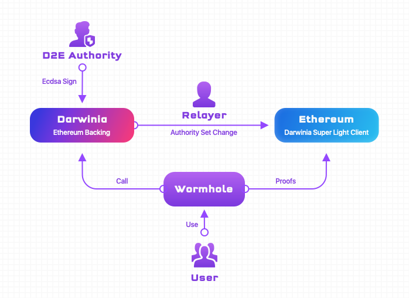

Darwinia-Ethereum Reverse Bridge is a decentralized cross-chain bridge from Darwinia to Ethereum, referred to as D2E bridge. The launch of Darwinia-Ethereum Reverse bridge represents Darwinia completing the third stage of the progressive mainnet launch and the launch of Ethereum-Darwinia bidirectional asset transfer.

The primary function of D2E bridge is to move crypto assets on Darwinia to Ethereum in a decentralized way.  User first  locks his assets in the Backing Module on the Darwinia network, secured by smart contract.  No one is able to extract it.  The super light client implemented by smart contract on the Ethereum observes the state of Darwinia chain, the Issuing Smart Contract on the Ethereum will use the super light client to verify the user submitted Proof of Lock of his asset.  Once the transaction was successfully verified, the Issuing Smart Contract will mint the bridged/mapped ERC20/ERC721 asset to the user's Ethereum address.

Benefiting from the GRANDPA consensus protocol built on Darwinia with irreversible finality, the super light client deployed Ethereum can verify and confirm the user's cryptographic proof in just a few minutes.

The above process is just the opposite of the one-way bridge from Ethereum to Darwinia that has been activated in the previous stage. In addition, because it is the transfer of Darwinia’s native assets to other heterogeneous blockchains, the D2E bridge is often called Darwinia-Ethereum reverse bridge.

# Components of the D2E Bridge

The D2E bridge is mainly composed of the following parts, and its overall structure is as follows:

Most decentralized cross-chain solutions use light clients. A light client is a data structure that only contains the block headers of the blockchain. It does not need to store the large complete block data. It can help users access and interact with the blockchain in a secure and decentralized manner without the need to synchronize the complete blockchain.

But for classic linear light clients implemented using smart contract that store all block header, it is definitely not light.

Darwinia implemented a Super Light Client that submits block headers on demand by introducing Merkle Mountain Range (MMR).

The Super Light Client does not need to save every block header. Only when needed, the bridge relayers submit the required block header to it to meet the data verification requirements. The correctness of the block header submitted by bridge relayers is guaranteed by D2E Authorities. In the future, when the Ethereum precompiled contract supports Ed25519, the correctness of the block header can be guaranteed by Darwinia GRANDPA Authorities.

## Relayers(Bridge Miners)

Since the chain cannot directly access each other, the cross-chain data submission needs to be completed by a third party. This third party is the bridge relayers.

Anyone can become a bridge relayer, and the bridge relayer obtains income by completing the relay task between the bridges. The existence of this kind of incentive can promote the stable existence of bridge relayers to ensure the stable operation of the bridge.

## D2E Authorities

As mentioned earlier, the correctness of the block header cannot be guaranteed by GRANDPA Authorities. This is because the gas required to verify the Ed25519 signature on Ethereum is very high. Therefore, if GRANDPA Authorities directly verifies the block header, the cost of cross-chain will be very high at the current high price of Ethereum.

So Darwinia used an additional set of Authorities to accomplish this. This set of Authorities was elected by a vote of the Council. The increase or decrease of members will be decided by the Council. The core element of D2E Authorities is the simulation of the GRANDPA protocol, replacing the encryption Algorithm from Ed25519 to Ecdsa which is not supported by Ethereum.

Anyone can apply to become an Authority, and then the Council will vote to decide whether to approve their application. Once they become an Authority, they must perform the authority's duties. Before a Darwinia block header is submitted to Ethereum, the Ecdsa signature must be performed on the MMR Root required to verify the block header.

In addition to the responsibility of signing the MMR Root, when the Authority set is changed, the original Authorities also need to sign the new set of Authorities, so as to complete the Authorities change process.

Authority will be motivated when it completes its duties. If it fails to complete its duties within a certain period of time (before "the block height at the time of the signature request sent + 100"), it will be punished. All RINGs staked at the time of application will be slashed.

## Ethereum Backing module on Darwinia

Ethereum Backing is a module that backs the issuance of Darwinia assets on Ethereum.  Simply put, assets transferred to Ethereum need to be locked in this module.

Therefore, when users want to transfer assets to Ethereum through the D2E bridge, the first step to do is to lock the assets in the Ethereum Backing module.  Wormhole application will help you accomplish this and collect cryptographic proof-of-lock.

# Improvement plan

The decentralized cross-chain transfer bridge between Darwinia and Ethereum not only has design difficulties, but also has some engineering challenges. For example, the current GRANDPA Justification Proof contains the cryptographic signature of Ed25519, but the current Ethereum Smart contracts have not yet supported Ed25519's signature verification in precompiled contracts. If you directly use smart contracts to implement the signature algorithm, you will face the problem of excessive gas costs. Although there have been related improvement proposals, such as EIP665, it is still in Draft state and has not been implemented yet. In order to solve these practical engineering problems, we innovatively designed a set of GRANDPA Authorities proxy mechanisms. By embedding this set of proxy modules in Darwinia Runtime, we successfully implemented a set of Ethereum standard secp256k1 ECDSA encryption signatures to proxy Ed25519 signatures.

The D2E bridge will not stop here, and its development work will continue. The next improvement plan will focus on the following aspects.

## BEEFY protocol
Before EIP-665 is not adopted by Ethereum, BEEFY will be a more general way.

Parity is developing a secondary protocol of GRANDPA called BEEFY (Bridge Efficiency Enabling Finality Yielder) for Substrate. This protocol is based on GRANDPA Finality, and its purpose is to allow Substrate-based chains to more efficiently bridge non-Substrate blockchains. Currently mainly ETH mainnet.

This protocol is on top of GRANDPA Finality. It will run a separate round of BFT agreement where each voter will be voting on the same thing. Namely, each voter will be voting on the MMR root of the latest block finalized by GRANDPA.

The D2E bridge plans to use BEEFY to implement the light clients after BEEFY matures in the future.

## Directly use GRANDPA Justification for block verification in the super light client on the Ethereum side

If EIP-665 is adopted by Ethereum, the cost of verifying GRANDPA Justification in Ethereum smart contracts will be greatly reduced, and then GRANDPA Authorities can be used to replace Authorities for block verification.

## Reduce the numbers of public keys and signatures through Merkle trees

## Generalize and frameworklize

## Support arbitrary token registration and cross-chain transfer
