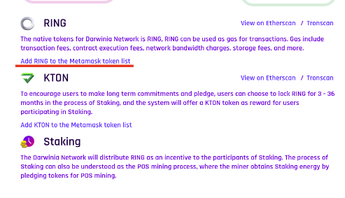

You will find answers to the most frequently asked questions. Thanks for reading!

We cannot express enough thanks to all Darwinia ambassadors for their continued support and encouragement, especially Megan, who has made an outstanding contribution to this document.

If you have any more questions, please join us [here](https://t.me/DarwiniaNetwork) or direct them to: support@darwinia.network

### What is the history of Darwinia Network?

The Darwinia Network project started in late 2018 when Parity released the Substrate toolkit project. Darwinia implements a decentralized network that plays as a relayer chain between major blockchains and enables asset transfers in a decentralized and permissionless non-custodial way.

* Darwinia was designed to operate as a parachain of Polkadot but can also work in Solo mode as an independent network with its own consensus, security, and cross-chain functionality which adopted for backup and mitigation of Polkadot-based technical issues.
  
* Darwinia team has developed an Application SDK based on Polkadot’s Substrate and Darwinia Web applications in order to facilitate the development of different applications running on Darwinia Network.

* We’ve also developed a leading blockchain explorer [Subscan](https://www.subscan.io/) for Polkadot and Substrate Community.

Before launching Darwinia, the team also developed several other products including the blockchain-based game [Evolution Land](https://www.evolution.land/), Itering ID, Itering DKMS Solution, etc.

* **DKMS**: A Decentralized Key Management System
* **Subscan**: A high precision blockchain data explorer and visualization tool for Substrate-based blockchains.
* **Itering ID**: A set of air-gapped signing tools, capable of tranferring by scanning QR code
* **NFT Shifter**: An easy to use tool to create and deploy blockchain NFT assets.
* **Evolution Land**: A cross-chain blockchain game to demostrate blockchain capabilities and get users onbord to Darwinia Network. 

### What is the relationship between Darwinia Network and Evolution Land?

Evolution Land is the first cross-chain game in the Darwinia Network ecosystem. Please check out more details here: [EvolutionLand Docs](https://docs.evolution.land/)

### What is the relationship between Darwinia Network and Polkadot? 

Darwinia Network is the first game chain on Polkadot. The development of Darwinia network is based on Polkadot and Substrate framework. Darwinia network will play as a parachain of the Polkadot network in the near future.

### What will happen if Darwinia Network is no longer a parachain?

Even if Darwinia Network will be voted off the Polkadot parachain set, it wil still work as a "Solo Chain" with it's its own consensus and security infrastructure.

### What are RING and KTON in Evolution Land?

RING and KTON in Evolution Land is the ERC-20/TRC-20 token. Evolution Land use RING in Darwinia Network as the payment token in game.

### What is the Power?

Users participate in staking, and the rights and interests obtained by bond RING or KTON are called Power.

### How to get Power and how to calculate the amount of Power?

Bond RING or KTON can get Power, where the bonded RING total amount and KTON total amount respectively correspond to 1/2 of Power total amount.

* Total Power = 1 (Decimals: 10^9)
* Power obtained by bonded RING = number of bonded RING / current total number of bonded RING * (total power / 2)
* Power obtained by bonded KTON = number of bonded KTON / current total number of bonded KTON * (total number of Power / 2)

### What is the Power share?

Power share is the percentage of Power held in Power total.Power share can reflect the influence on the entire network. The larger the Power share.The greater the Power share, the greater the influence of the decision made on the entire network.

* Power share = Power held / Total Power * 100%

### Why does my power share increased & reduced?

The change of Power share depends on two factors:

* Changes in the number of self bonded assets
* Changes in the number of current network total bonded assets
  

Therefore, if you find that the “Power share” has changed without any operation or no change in the self bonded assets, it is normal and may be caused by the change in the current total number of bonded assets on the network.

### Why can I not find RING/KTON within Metamask?

You need to add RING/KTON to Metamask as a custom token. Please visit the Website homepage to see how to do it.

### How long do I need to wait for unstaking/withdrawing my tokens?

It takes 14 days to unbond tokens from staking.

### How much RING is locked in staking pools?

Please click [here](https://etherscan.io/token/0x9469d013805bffb7d3debe5e7839237e535ec483?a=0x649fdf6ee483a96e020b889571e93700fbd82d88) to check out the current figures on Etherscan.io.

### What was the IEO or ICO? 

Due to laws and regulations, no ICO or IEO has been conducted.  We performed several rounds of community airdrop in the past to encourage users to participate in our test network as well as in Evolution Land, a blockchain game within Darwinia Ecosystem.

### Will KTON be listed anywhere else?

KTON is mainly traded via decentralized exchanges such as Uniswap.  It can be also found on hoo.com, mxc.com, poloniex.com, etc. and more. Check out coinmarketcap.com regularly to find all the latest exchanges who support KTON and RING trading pairs.

### Is the Darwinia network only used for blockchain games?

Darwinia Network was originally designed to be the low-level cross-chain solution for Evolution Land, but evolved into an independent decentralized cross-chain infrastructure which now benefits the whole crypto industry.  Dapps from gaming, NFT to Defi, Stablecoin can all leverage Darwinia Networks bridge chain to upgrade themselves from single chain application to a multi-chain/cross-chain version.

### How do I transfer the RING from my wallet into my Darwinia account?

RING resides on various blockchain networks, currently it supports Ethereum and TRON.  Mainnet is coming soon.  If you mean transfer your ERC20 RING on Ethereum wallet to your Darwinia native wallet.  You can do that at [https://wormhole.darwinia.network](https://wormhole.darwinia.network).

### When I copy-paste your contract id into metamask to add as a custom token, it does not like it at all.

We have detected and received several reports regarding fake RING and KTON token contracts. 

Unfortunately the [address](https://etherscan.io/token/0x5d144af283c6aa7bab4abf99369032cbdc56ccc9) you mentioned is a fake address.

The real token address are shown below, they are also published at [Native Tokens](https://docs.darwinia.network/docs/en/wiki-us-tokens).

### Are RING and KTON ERC-20 tokens on Uniswap legit? 

There are legitimate RING and KTON trading pairs on Uniswap but there are some fake tokens as well.  Please confirm and ensure the token addresses are correct according to the information below before swapping.

* [**RING**](https://uniswap.info/token/0x9469d013805bffb7d3debe5e7839237e535ec483)

* [**KTON**](https://uniswap.info/token/0x9f284e1337a815fe77d2ff4ae46544645b20c5ff)

RING is also available at Tron’s Justswap:

* [**RING**](https://justswap.io/#/scan/detail/TFCBjh9pt2sTWmJJRpbqyxfi5xW81xH4UR/TL175uyihLqQD656aFx3uhHYe1tyGkmXaW)

### How many exchanges have listed RING or KTON?

There are around 8 centralized and decentralized exchanges that are trading RING or KTON at the time of writing.  The list keeps growing, please check out [this page](https://coinmarketcap.com/currencies/darwinia-network/markets/) for a real time answer.

### Why does it show RING on Justswap? Is it a real one?

Yes, Darwinia Network is a cross-chain infrastructure project, it supports Ethereum and Tron at the moment, there are some RINGs transferred to Tron network, although the majority of supplies are on Ethereum at the moment. The Justswap RING trading pair is legit, but they're fake ones as well, please make sure you are trading with this RING ([detail](https://justswap.io/#/scan/detail/TFCBjh9pt2sTWmJJRpbqyxfi5xW81xH4UR/TL175uyihLqQD656aFx3uhHYe1tyGkmXaW)).

### Where can I read about Darwinia’s tokenomics?

Please check out [here](https://docs.darwinia.network/docs/en/wiki-us-tokens). You can also move to the Economical model page on the Darwinia new Website.

### What's the circulating supply of RING and KTON?

* [RING](https://api.darwinia.network/supply/ring)

* [KTON](https://api.darwinia.network/supply/kton)

### What's the difference between ChainX and Darwinia?

We are both developing bridges, but ChainX's bridge operates under a federated custodial model where a group of nodes use multisig to manage the assets, mint, and redeem, and carries counterparty risk because it is semi-centralized. Sure is better than a fully centralized model, but there could still be collusion if assets' value is high enough.

Darwinia's bridge is based on super light client and assets are secured through Smart Contract. Foreign chain event awareness is done through light client (SPV model) and  asset minting and redemption are based on the light client, not one or several people saying so. 

Short Answer: Darwinia is trustless and decentralized, without similar counterparty risk compared to ChainX.

### Is there a need to perform a token swap for RING or KTON once the mainnet is live? Will they expire as ERC20 tokens?

No, your ERC20 and TRC20 versions of Darwinia tokens will not expire but continue to coexist on different blockchains as long as Darwinia Network does and supports cross-chain transfer.

### I waited two weeks for my tokens to unbond from staking but only a small portion were released and the rest are locked somehow. How do I get them back so I can stake again?

If you have bonded any tokens while participating in council election, those tokens will be locked and can be released by sending this extrinsic to cancel:

