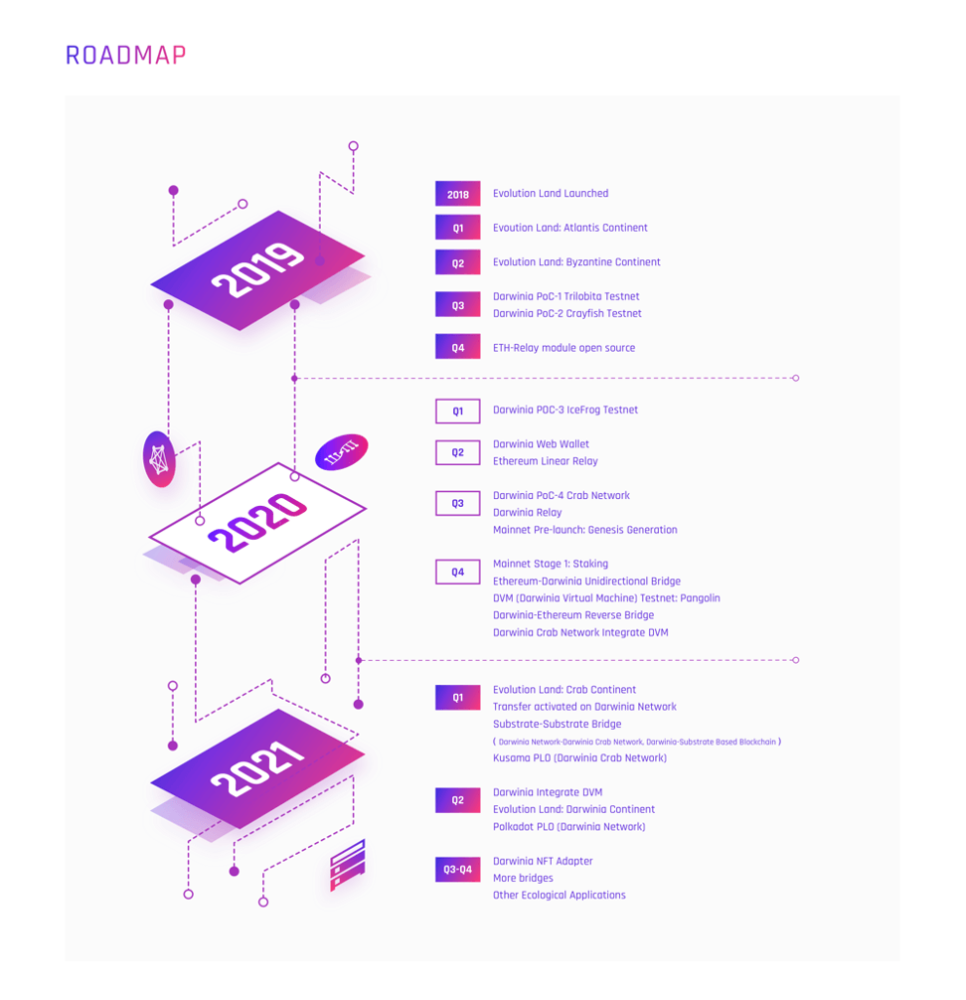
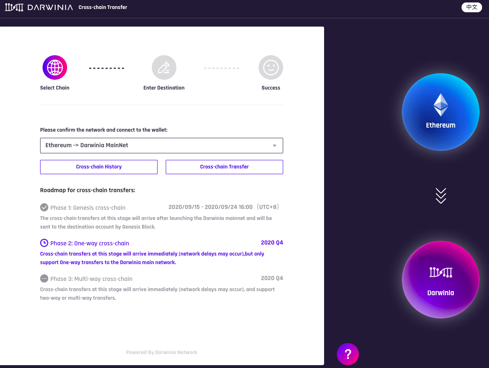

To help the community get to know the Darwinia ecosystem quickly, we have broken it down into the six sections below: General, Developers, Tokenholders, Community Building, Mainnet related, and Lexicon where you will find answers to the most frequently asked questions. Thanks for reading!

We cannot express enough thanks to all Darwinia ambassadors for their continued support and encouragement, especially Megan, who has made an outstanding contribution to this document.

If you have any more questions, please join us [here](https://t.me/DarwiniaNetwork) or direct them to: support@darwinia.network

## GENERAL

### I’m new to Darwinia. Where is the best place to start?

First and foremost, hello and welcome to the Darwinia Network Community! Darwinia is a trustless and decentralized cross-chain bridge protocol developed by Itering on Substrate that provides interoperability and identifiability of tokens between modern and legacy blockchains such as between Polkadot, TRON, and Ethereum networks, and more. Check out some of the links below for more detailed info:

**Reddit**: [https://www.reddit.com/r/DarwiniaFans](https://www.reddit.com/r/DarwiniaFans) 

**Github**: [https://github.com/darwinia-network](https://github.com/darwinia-network)

**Twitter**: [@DarwiniaNetwork](https://twitter.com/DarwiniaNetwork) 

**Medium**: [https://medium.com/@DarwiniaNetwork](https://medium.com/@DarwiniaNetwork)

**Website**: [https://darwinia.network/](https://darwinia.network/)

**Discord**: [https://discord.gg/KMZVeyM](https://discord.gg/KMZVeyM) 

**Web Forum**: [https://talk.darwinia.network/](https://talk.darwinia.network/)

**Whitepaper**: [https://darwinia.network/Darwinia_Genepaper_EN.pdf](https://darwinia.network/Darwinia_Genepaper_EN.pdf)

**Dev Channel**: [https://t.me/DarwiniaDev](https://t.me/DarwiniaDev)

**Official Telegram**: [https://t.me/DarwiniaNetwork](https://t.me/DarwiniaNetwork)

**Documentation and FAQs**: [https://docs.darwinia.network/en/](https://docs.darwinia.network/en/)

Also, we have launched the Darwinia Ambassador Program, and two pathways have been developed for contributors: Technology and Education. Please apply for the application [here](https://docs.google.com/forms/d/e/1FAIpQLSdh5k7yOikRsZBzIHz0VtMQ0Xg_Ps3skOiBGh3elGkZIJUFSw/viewform). 

### What is the history of Darwinia Network?

The Darwinia Network project started in late 2018 when Parity released the Substrate toolkit project. Darwinia implements a decentralized network that acts as a chain relay between major blockchains and enables asset transfers in a decentralized and permissionless non-custodial way.

* Darwinia is designed to operate as a Parachain of Polkadot but also has the ability to function in Solo mode as an independent network with its own consensus, security, and cross-chain functionality for redundancy or mitigation of Polkadot-based technical issues.
  
* The team has developed an Application SDK based on Polkadot’s Substrate and Darwinia Web applications in order to facilitate the development of different applications on the foundation of the Darwinia Network. The SDK will help bootstrap adoption among non-blockchain users and developers.

* We’ve also developed a leading explorer product for the Polkadot and Substrate Community, [Subscan](https://www.subscan.io/).

Prior to launching Darwinia, the team also developed several other products including the blockchain-based game [Evolution Land](https://www.evolution.land/), Itering ID, Itering DKMS Solution, and more.

* **DKMS**: A Decentralized Key Management System
* **Subscan**: A high precision data explorer and visualization for Substrate-based blockchains.
* **Itering ID**: A set of air-gapped signing tools, capable of scanning QR coded transactions
* **NFT Shifter**: An easy to use tool to create and deploy blockchain NFT assets.
* **Evolution Land**: A cross-chain blockchain game to showcase blockchain capabilities and onboard new users to Darwinia Network. 

### Who is Itering?

Itering is a software company established in Singapore in 2018 specializing in research and development of blockchain infrastructure, and primarily focused on cross-chain technology. At present, we are developing the Darwinia Network based on the Substrate framework, and committed to building the future Internet of tokens. 

In addition to Darwinia Network, we continue our research and development in the realm of NFTs and their integral relationship with blockchain-based games. So far, our blockchain game Evolution Land has been launched on two blockchain-based ‘continents’: Ethereum and Tron. In the future, Evolution Land will become the first important game application in the Darwinia ecosystem.

For more details about us, please check here: [Itering IO](https://www.itering.io/)

### Does Darwinia have a roadmap?

* 2018 Q4 Evolution Land Launched
* 2019 Q1 Evoution Land: Atlantis Continent
* 2019 Q2 Evolution Land: Byzantine Continent
* 2019 Q3 Darwinia PoC-1 Trilobita Testnet
* 2019 Q3 Darwinia PoC-2 Crayfish Testnet
* 2019 Q4 ETH-Relay module open source
* 2020 Q1 Darwinia POC-3 IceFrog Testnet
* 2020 Q2 Darwinia Web Wallet
* 2020 Q2 Ethereum Linear Relay
* 2020 Q3 Darwinia PoC-4 Crab Network
* 2020 Q3 Darwinia Relay
* 2020 Q3 Mainnet Pre-launch: Genesis Generation
* 2020 Q4 Mainnet Stage 1: Staking
* 2020 Q4 Ethereum-Darwinia Unidirectional Bridge
* 2020 Q4 DVM (Darwinia Virtual Machine) Testnet: Pangolin
* 2020 Q4 Darwinia-Ethereum Reverse Bridge
* 2020 Q4 Darwinia Crab Network Integrate DVM
* 2021 Q1 Evolution Land: Crab Continent
* 2021 Q1 Transfer activated on Darwinia Network
* 2021 Q1 Substrate-Substrate Bridge（Darwinia Network-Darwinia Crab Network, Darwinia-Substrate Based Blockchain）
* 2021 Q1 Kusama PLO (Darwinia Crab Network)
* 2021 Q2 Darwinia Integrate DVM
* 2021 Q2 Evolution Land: Darwinia Continent
* 2021 Q2 Polkadot PLO (Darwinia Network)
* 2021 Q3 Darwinia NFT Adapter
* 2021 Q3-Q4 More bridges
* 2021 Q3-Q4 Other Ecological Applications
* ============

### What is the relationship between Darwinia Network and Evolution Land?

Evolution Land is the first cross-chain game in the Darwinia Network ecosystem. Please check out more details here: [EvolutionLand Docs](https://docs.evolution.land/)

### What is the relationship between Darwinia Network and Polkadot? 

Darwinia Network is the first game chain on Polkadot. The development of Darwinia network is based on Polkadot and Substrate framework. Later Darwin network will become a parachain of the Polkadot network.

### What happens if Darwinia Network is no longer a parachain?

Even if Darwinia Network is voted off the Polkadot parachain set, it will still work as a "Solo Chain", where it's responsible for its own security.

### What are RING and KTON in Evolution Land?

RING and KTON in Evolution Land is the ERC-20/TRC-20 token, Evolution Land will use RING in Darwinia Network as the payment token in game.

## DEVELOPERS

### I’m a developer. Where can I find some tools/resources？

You can check out these materials below:

* [Genepaper](https://darwinia.network/Darwinia_Genepaper_EN.pdf)

* [Darwinia Network Github](https://github.com/darwinia-network)

* [White (Technical) paper](https://darwinia.network/ChainRelay_Technical_Paper(Preview)_EN.pdf)

### How can I contribute?

Two programs have been set up for developers, the Grant Program and Bounty program.

**Grant Program**

Darwinia Grant will focus on funding the development of the Darwinia ecosystem, such as development of the Darwinia Network, development and maintenance of the Darwinia Appchain, and related theoretical research. Please check out the [details](https://github.com/darwinia-network/collaboration/blob/master/grant/README.md) here. 

**Bounty Program**

We will rate the issues in Darwinia and invite community developers to help with the fix. Community developers can get rewards after fixing the problem and being reviewed. The rewards for fixing different levels of issue will be different. Please Please click [here](https://github.com/darwinia-network/collaboration/blob/master/bounty/README.md) to check more details. 

You can also join the [dev group](https://t.me/DarwiniaDev) for more latest details.

## COMMUNITY BUILDING

### What can I do to help build the Darwinia Community?

You can help the Darwinia Community grow in any one of these five roles:

**Content Creator**

Help educate and spread the word about our community out in the broader public through writing informative and insightful articles, creating video content, blogs, graphic design, podcasts, or any other artistic production form.

**Meetup Organizer**

Host online or offline Darwinia meetups, technical workshops or hackathons, or connect with local blockchain enthusiasts to help educate them about Darwinia and discover potential new users or partners through discussion and communication.

**Translator**

Translate and share Darwinia-related content in different languages and expand Darwinia's ecological applications to non-English speaking communities.

**Moderator**

Help keep Darwinia official social media channels (Telegram, Twitter, Medium,etc.) informative, productive, and create a pleasant, sustained, and viable environment for community members in multiple languages across various platforms.

**Beta Tester**

Explore and troubleshoot Darwinia Ecological Applications and submit detailed bug reports according to our requirements. The Darwinia development team has also pioneered a number of products prior to the launch of the Web3.0 SDK as well such as Itering ID.

## TOKEN HOLDER FAQ

### What is the Power?

Users participate in staking, and the rights and interests obtained by bond RING or KTON are called Power.

### How to get Power and how to calculate the amount of Power?

Bond RING or KTON can get Power, where the bonded RING total amount and KTON total amount respectively correspond to 1/2 of Power total amount.

* Total Power = 1 (Decimals: 10^9)
* Power obtained by bonded RING = number of bonded RING / current total number of bonded RING * (total power / 2)
* Power obtained by bonded KTON = number of bonded KTON / current total number of bonded KTON * (total number of Power / 2)

### What is the Power share?

Power share is the percentage of Power held in Power total.Power share can reflect the influence on the entire network. The larger the Power share.The greater the Power share, the greater the influence of the decision made on the entire network.

* Power share = Power held / Total Power * 100%

### Why does my power share increased & reduced?

The change of Power share depends on two factors:

* Changes in the number of self bonded assets
* Changes in the number of current network total bonded assets
  

Therefore, if you find that the “Power share” has changed without any operation or no change in the self bonded assets, it is normal and may be caused by the change in the current total number of bonded assets on the network.

### Why can I not find RING/KTON within Metamask?

You need to add RING/KTON to Metamask as a custom token. Please visit the Website homepage to see how to do it.

### What's the difference between Ring and KTON?

RING = normal staking and currency for blockchain fees

KTON = professional staking for node operators

### What is the utility of the RING token?

RING is the native token of the Darwinia Network. It is used to pay for fees in a similar manner to how ETH is used on the Ethereum network and can also be used for staking.

### What is the total supply of RING tokens?

Total supply of RING will be 2 billion upon launch of mainnet and supply grows at approximately 5% annually. 100% of newly minted RING goes to staking reward pools to incentive validators and nominators who take care of the security of the network.

### What is the utility of the KTON token?

KTON is the commitment token of the Darwinia Network and for the purpose of staking and/or operating a validator it is the preferred choice vs. RING alone.

When users voluntarily lock their RING for some period between 1 month and 36 months they receive KTON as a reward.  When used for staking, rewards are split equally between the RING and KTON staking pools.  For example, if you lock 10K RING for a year, you will get 1 KTON immediately and 10K RING back in a year’s time. 

### What is the total supply of KTON tokens?

KTON token supply was initially zero and can only be minted when users lock their RING in the process of staking. It also has some deflationary mechanisms built-in.

### How long do I need to wait for unstaking/withdrawing my tokens?

It takes 14 days to unbond tokens from staking.

### How much RING is locked in staking pools?

Please click [here](https://etherscan.io/token/0x9469d013805bffb7d3debe5e7839237e535ec483?a=0x649fdf6ee483a96e020b889571e93700fbd82d88) to check out the current figures on Subscan.io.

### What was the IEO or ICO? 

Due to laws and regulations, no ICO or IEO has been conducted.  We performed several rounds of community airdrop in the past to encourage users to participate in our test network as well as in Evolution Land, a blockchain game within Darwinia Ecosystem.

### Will KTON be listed anywhere else?

KTON is mainly traded via decentralized exchanges such as Uniswap.  It can be also found on hoo.com, mxc.com, poloniex.com, etc. and more. Check out coinmarketcap.com regularly to find all the latest exchanges who support KTON and RING trading pairs.

### Is the Darwinia network only used for blockchain games?

Darwinia Network was originally designed to be the low-level cross-chain solution for Evolution Land, but evolved into an independent decentralized cross-chain infrastructure which now benefits the whole crypto industry.  Dapps from gaming, NFT to Defi, Stablecoin can all leverage Darwinia Networks bridge chain to upgrade themselves from single chain application to a multi-chain/cross-chain version.

### How do I transfer the Ring from my wallet into my Darwinia account?

RING resides on various blockchain networks, currently it supports Ethereum and TRON.  Mainnet is coming soon.  If you mean transfer your ERC20 RING on Ethereum wallet to your Darwinia native wallet.  You will need to do a cross-chain transfer.  When mainnet is launched, the first decentralized bridge will be set up between Ethereum and Darwinia, you can do that at [https://wormhole.darwinia.network](https://wormhole.darwinia.network).

### When I copy-paste your contract id into metamask to add as a custom token, it does not like it at all.

We have detected and received several reports regarding fake RING and KTON token contracts. 

Unfortunately the [address](https://etherscan.io/token/0x5d144af283c6aa7bab4abf99369032cbdc56ccc9) you mentioned is a fake address.

The real token address are shown below, they are also published at [Native Tokens](https://docs.darwinia.network/docs/en/wiki-us-tokens).

### Are RING and KTON ERC-20 tokens on Uniswap legit? 

There are legitimate RING and KTON trading pairs on Uniswap but there are some fake tokens as well.  Please confirm and ensure the token addresses are correct according to the information below before swapping.

* [**RING**](https://uniswap.info/token/0x9469d013805bffb7d3debe5e7839237e535ec483)

* [**KTON**](https://uniswap.info/token/0x9f284e1337a815fe77d2ff4ae46544645b20c5ff)

RING is also available at Tron’s Justswap:

* [**RING**](https://justswap.io/#/scan/detail/TFCBjh9pt2sTWmJJRpbqyxfi5xW81xH4UR/TL175uyihLqQD656aFx3uhHYe1tyGkmXaW)

### How many exchanges have listed RING or KTON?

There are around 8 centralized and decentralized exchanges that are trading RING or KTON at the time of writing.  The list keeps growing, please check out [this page](https://coinmarketcap.com/currencies/darwinia-network/markets/) for a real time answer.

### Why does it show RING on Justswap? Is it a real one?

Yes, Darwinia Network is a cross-chain infrastructure project, it supports Ethereum and Tron at the moment, there are some RINGs transferred to Tron network, although the majority of supplies are on Ethereum at the moment. The Justswap RING trading pair is legit, but they're fake ones as well, please make sure you are trading with this RING ([detail](https://justswap.io/#/scan/detail/TFCBjh9pt2sTWmJJRpbqyxfi5xW81xH4UR/TL175uyihLqQD656aFx3uhHYe1tyGkmXaW)).

### Where can I read about Darwinia’s tokenomics?

Please check out [here](https://docs.darwinia.network/docs/en/wiki-us-tokens). You can also move to the Economical model page on the Darwinia new Website.

### What's the circulating supply of RING and KTON?

* [RING](https://api.darwinia.network/supply/ring)

* [KTON](https://api.darwinia.network/supply/kton)

### What's the difference between ChainX and Darwinia?

We are both developing bridges, but ChainX's bridge operates under a federated custodial model where a group of nodes use multisig to manage the assets, mint, and redeem, and carries counterparty risk because it is semi-centralized. Sure is better than a fully centralized model, but there could still be collusion if assets' value is high enough.

Darwinia's bridge is based on super light client and assets are secured through Smart Contract. Foreign chain event awareness is done through light client (SPV model) and  asset minting and redemption are based on the light client, not one or several people saying so. 

Short Answer: Darwinia is trustless and decentralized, without similar counterparty risk compared to ChainX.

### Is there a need to perform a token swap for RING or KTON once the mainnet is live? Will they expire as ERC20 tokens?

No, your ERC20 and TRC20 versions of Darwinia tokens will not expire but continue to coexist on different blockchains as long as Darwinia Network does and supports cross-chain transfer.

### I waited two weeks for my tokens to unbond from staking but only a small portion were released and the rest are locked somehow. How do I get them back so I can stake again?

If you have bonded any tokens while participating in council election, those tokens will be locked and can be released by sending this extrinsic to cancel:

### How do I stake or lock RING to receive KTON?

**As per the Stonky guide**:

* First go [here](https://darwinia.network/) and create a wallet on Darwinia. (Do not forget to switch to Darwinia mainnet. The crab is a testnet. Left upper corner of the wallet, click and switch it.)

* Then go [here](https://wormhole.darwinia.network/) and click on Ethereum, then click on Cross-chain Transfer.
  
  

* Another screen will pop up, again select Cross-chain Transfer on this page. At that point metamask will pop up, and you can now transfer. Now paste your Darwinia address, select tokens you are transferring, select submit. Make sure to have 10 RING in metamask as well as a little ETH to pay the transfer fees.
  
  

(Don't be alarmed by your tokens takes a long time to show up in wallet, the ethereum network is congested. Expect 35min)

**In mainnnet wallet**

you need to bond them (leave a tiny bit out for fees) and nominate a validator. once you do that in the next era (about 24h) your amount is properly staked, and after one more era (24h more) you start receiving daily rewards.

On the left there are 2 staking pages. the first one is what you stake. there you should find your amount, and by clicking bond you can select lock time.

Once you do that you go to the other staking page where all the nominators are. you can nominate multiple, but i just nominated one and worked fine, the difference is probably in commission but they're quite similar, (the one i use has 5% for instance. you can do this step after you stake.)

About the nominators i believe is all good, about the power that's flexible and may go slightly up or down depending on the share in the pool you join.

### If the Ethereum to Darwinia Network bridge is only open one way for now, and KTON are only minted when users stake their RING and not transferable from Crab testnet, where did the existing supply of KTON in circulation come from?

The existing KTON in circulation were mined or generated within the game Evolution Land.

## MAINNET RELATED

### What can we do in the "Genesis Generation" stage?

RINGs and KTONs on Ethereum and TRON can be cross-chain transferred to Darwinia Mainnet.

CRINGs of Darwinia Crab can be swapped to RINGs of mainnet at a ratio of 100 to 1.

### Should I participate in the "Genesis Generation"? What are the pros and cons?

Users must seriously think about their needs.

Pros: Users can participate in staking as soon as possible to get rewards.

Cons: Users' coins will lose liquidity for a while. May be until mid-November. TRON and Crab's cross-chain bridge has no plans yet, and it will take longer to lose liquidity.

### Is there a deadline for "Genesis Generation"?

Yes. The deadline for "Genesis Generation" is 2020-09-24 8:00 UTC or 2020-09-24 16:00 Beijing.

### Does "Genesis Generation" charge fees?

Only the transaction fee of the source network.

### When will the Ethereum-Darwinia mainnet cross-chain bridge open?

In the second stage of the launch (approximately 1 month after the end of the "Genesis Generation"), the Ethereum-Darwinia one-way bridge will be opened first, through which RINGs and KTONs on Ethereum can be transferred to the Darwinia mainnet network.

In the third stage of the launch (approximately 0.5 or 1 month after the second stage), the Ethereum-Darwinia bidirectional bridge will be opened, and RINGs/KTONs can be freely transferred between these two networks.

### When will the TRON-Darwinia cross-chain bridge open?

Currently, the cross-chain transfer of RINGs and KTONs on the TRON to Darwinia mainnet can only be done during the "Genesis Generation". The TRON-Darwinia cross-chain bridge will be implemented in the fourth stage.

### When will the Crab-Mainnet cross-chain bridge open?

Currently, the cross-chain swapping of CRINGs to RINGs can only be done during the "Genesis Generation". The cross-chain bridge of Crab-Mainnet will be implemented in the fourth stage.

### When will RINGs and KTONs on Darwinia mainnet be transferred to Ethereum?

After the third phase of the mainnet launch, users can transfer their RINGs and KTONs between Darwinia mainnet and Ethereum through the Ethereum-Darwinia two-way cross-chain bridge.

### How to participate in Mainnet Staking?

Before the second stage, only those users who are now participating in the "Genesis Generation" can participate in staking when the first stage of the mainnet is opened.

Other users need to wait until the second stage opens before they can transfer their RINGs or KTONs to mainnet to participate in staking.

### How to deposit RINGs to get KTONs?

Currently, you can deposit RINGs to KTONs in the v1 version of Gringotts in Ethereum and TRON, but this function will be disabled when the "Genesis Generation" stage ends.

This function can only be performed on the mainnet in the future. Users can get additional KTONs rewards by locking their RINGs 1~36 months.

### When can I transfer on Darwinia mainnet?

After the third stage of the mainnet is opened, users can transfer their RINGs and KTONs on the mainnet.

### Can I genesis cross-chain transfer KTONs only?

No. Because when you are participating in staking on the mainnet, a small number of RINGs is required as a gas, so you must transfer some RINGs as gas to the mainnet. It is recommended to have at least 1 RING, which can be 100 CRING mapping to RING, or transfer 1 RING to the main network.

### The deposit receipt can be transferred to the mainnet now?

No. It can be transferred to the mainnet only after the second stage opened.

### How to get your Darwinia mainnet address?

[Create account](https://docs.darwinia.network/docs/en/wiki-tut-create-account)

### Can the genesis swapping or transferring be executed multiple times?

Yes. As long as there is a balance that can be used.

### What are the parameters of the mainnet?

One block: about 6 seconds

One Epoch: 2400 blocks ≈ 4 hours

One Era: 6 Epoch ≈ 24 hours

Unbonding duration (the days to wait after unbond): 14 days

Validator seats: 15

Council seats: 7

Technical committee seats: 7

The annual inflation rate is around 5%

Inflation allocation: 50% to Validators, 50% to Treasury

Transaction fee allocation: 20% to Validator, 80% to Treasury

*Note: When mainnet is finally launched, some parameters may be adjusted according to the actual*

### How long will it take for the results to come out after participating in the validator election?

When getting into the next era, that is up to 24 hours.

## LEXICON

### RING

RING is the native token of Darwinia Network.  It's used to pay for the GAS fee of the on-chain transactions and cross-chain services.  RING can be staked for staking rewards and obtaining voting power to participate in the governance.

* **Ethereum**
  
  Spec: ERC20
  
  Precision: 18

  Smart Contract Address（Ethereum): 0x9469d013805bffb7d3debe5e7839237e535ec483

* **Tron**
  
  Spec: TRC20

  Precision: 18

  Smart Contract Address（Tron): TL175uyihLqQD656aFx3uhHYe1tyGkmXaW

### KTON

KTON is a derivative commitment token of RING (Darwinia Network native token), which encourages long-term involvement. RING holders can voluntarily lock RING for 3–36 months and get KTON as rewards, compensating for the liquidity loss.  KTON can be staked for staking rewards and obtaining voting power to participate in the governance.

* **Ethereum**
 
  Spec: ERC20

  Precision: 18

  Smart Contract Address (Ethereum): 0x9f284e1337a815fe77d2ff4ae46544645b20c5ff

* **Tron**
  
  Spec: TRC20

  Precision: 18

  Smart Contract Address (Tron): TW3kTpVtYYQ5Ka1awZvLb9Yy6ZTDEC93dC

RING and KTON, similar to the relationship between spot and options (futures), through this dual-pass design, while encouraging long-term investors, it can reduce the risk of exchange manipulation of the network to a certain extent, and can effectively maintain network security Establish loyalty and create a beneficial governance system.

At present, some RING and KTON exist in the Ethereum network and the Tron network in the form of ERC-20 and TRC-20. These TOKENs will be transferred to the Darwinia main network by 1:1 cross-chain conversion after the Darwinia main online.

### cRING and cKTON

cRING and cKTON are the tokens of the Darwinia Crab network, and their parameters are consistent with the RING and KTON in the Darwinia mainnet, and use the same Staking mechanism and inflation model.

After the Darwinia main network is launched, a Token Bridge between the Darwinia main network and the Crab network will be created to enable cRING and RING to be exchanged with each other, with a conversion ratio of 100 cRING = 1 RING.

**Please contact us directly if you have questions or suggestions.**

Email: support@darwinia.network

Telegram: [t.me/DarwiniaNetwork](https://t.me/DarwiniaNetwork)

