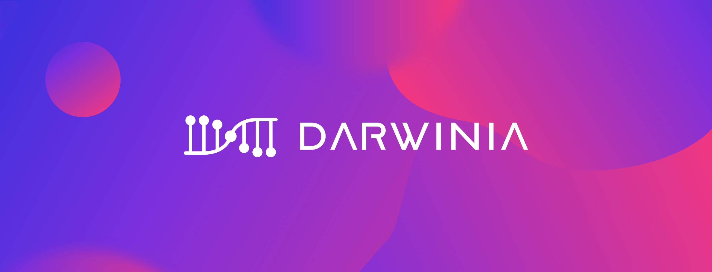

Darwinia Network is a decentralized cross-chain bridge network building on Substrate, which is the "Web 3.0 cross-chain bridge hub" of the cross-chain ecology. It provides a safe and general bridging solution, connects to Polkadot, Ethereum, TRON and other heterogeneous chains by cross-chain transfer of assets and remote chain calls. The application areas of Darwinia Network include DeFi, cross-chain NFT trading, games, etc.

Darwinia Network has gained a high reputation and recognition along the way to build the decentralized cross-chain bridge protocol. In 2020, Darwinia was written in Polkadot light-paper as one of the friends of Polkadot and Substrate. And Darwinia was selected to join Substrate Builder Program and Web3.0 Bootcamp, and for the outstanding work in Substrate Builder Program, Darwinia Network was officially awarded the Level 2 badge by Parity. The products and tools developed by Darwinia have been rewarded three W3F Grants. Polkadot founder Gavin Wood also highlighted Darwinia Network as “Projects to watch.”

Darwinia has been building a permissionless non-custodial bridge protocol, featuring efficiency, low cost, decentralization of cross-chain tokens and NFTs transfer, as well as other cross-chain operations.

Darwinia bridge solution integrates technologies, including super-light client, zero-knowledge, and optimistic verification mechanisms.

Darwinia bridge distinguishes from other bridges in terms of quality and how decentralized the bridge is, could carry high-value cross-chain asset transaction.
