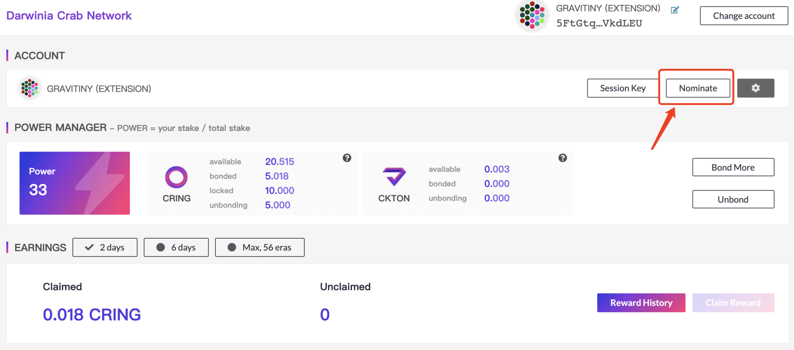
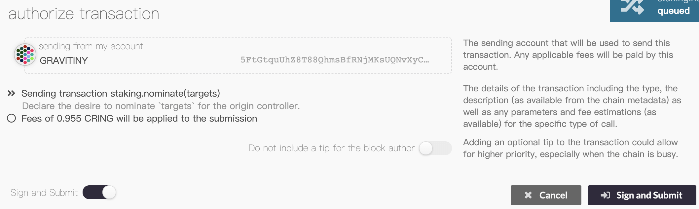
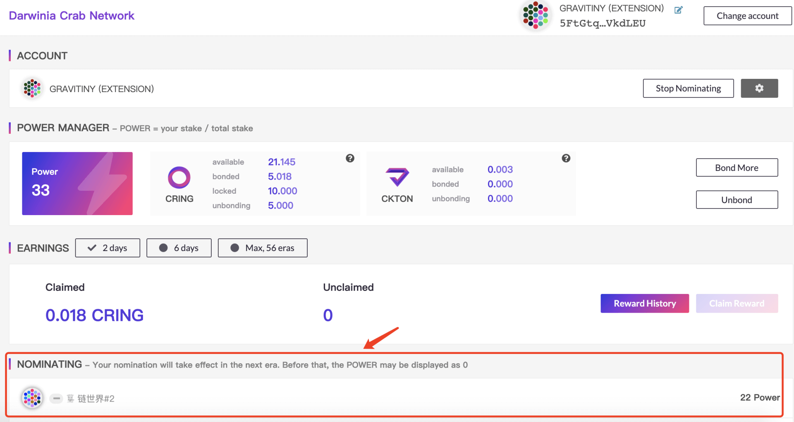
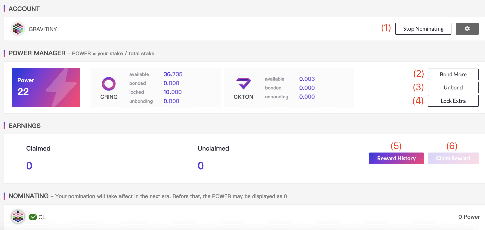
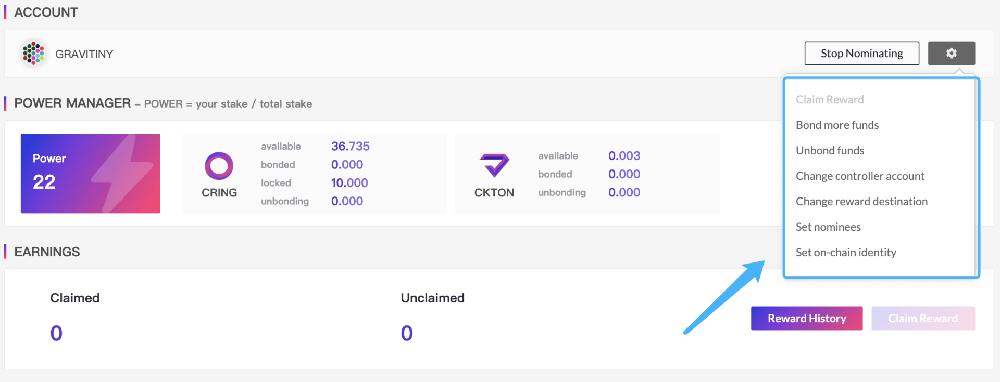

> - Staking is a consensus mechanism based on NPoS (Proof of Stake / Proof of Stake). Token holders obtain rewards and benefits through pledge, voting, delegation, and locking.

> - A small amount of RING must be prepared in  Darwinia Mainnet Network's address as fee.

You may have a account with `RING/KTON` and want to earn fresh `RING/KTON`. You could do so as validator, which requires a node running 24/7.
If you do not have such node or do not want to bother, you can still earn `RING/KTON` by nominatoring another validator.

Specially attention should be paid to:

1. Pick your validators carefully - if they do not behave properly, they will get slashed and you will lose `RING/KTON` as well.
2. While your `RING/KTON` are staked by nominating a validator, they are `locked`(bonded). You can receive new `RING` in your account but you cannot stake as validator
or transfer `RING` away from your account. You can un-nominate at any time to stop staking your funds. There is an unbonding period of 14 days on Darwinia main network.

## Start Staking

1. Enter [Darwinia Wallet](https://apps.darwinia.network) and lick the [Staking] column on the left , Click [Start staking].
   
   

2. Fill in the staking parameters.

   
  
  - ` Stash account` Account for stashing tokens. Tokens participating in staking will come from this account. The operations of this account are mostly related to changes in stash.
  
  - `Controller account`  The controller is the account that will be used to control any nominating or validating actions. Should not match another stash or controller.

     > The `Stash account` and` Controller account` can be set to the same account. If you hold more tokens or have higher security requirements, it is recommended to set up different accounts here.
	 
  - `Value bonded` The total amount of the stash balance that will be at stake in any forthcoming rounds (should be less than the total amount available).  This part of the tokens will be temporarily bonded. bonding takes 14 days to unbond; you can choose to bond RING or KTON.

  - `Payment destination` The destination account for any payment as either a nominator or validator.

  - `Lock limit` Optional; bond RING promise for 1-36 months to get additional KTON rewards. (Promise to lock to accept user terms)

     > If you unlock RING in advance within the lock limit, you will be charged  a penalty of 3 times the KTON reward (In the absence of sufficient KTON, the RING can not be used for payment of fines).

3. After filling in the staking parameters, please click [Sign and submit].
   
   

## Nominate a validator

1. After completing the staking parameters, click [Nominate] on this page.
   
   

     > The identities of the validator and the nominator are mutually exclusive and cannot coexist. If you are running a validator, you need to cancel the validator before proceeding with the nomination.

2. Choose your favorite validator.
   
   

3. Sign and submit
   
   

4. View information about nominated validators
   
   

     > The operation of nominating validators will take effect from the next era, and it is normal to temporarily delay.

## Tokens' statuses

The tokens' statuses are following:

- `available` The amount of tokens that are able to transfer, bond and transfer.

- `bonded` The amount of tokens that cannot operated directly but does not have lock limit, which is used to gain voting power and can be taken out at any time (with a 14-day unbonding period) or add lock limit.

- `locked` The amount of tokens that cannot be operated and has a lock limit, which is used to gain voting power and earn additional KTON rewards.

- `unbonding` The amount of tokens that has been unlocked but in the unbonding period.
  

## Other operations

There are other operations in staking for the following purposes:

- `Stop nomination` cancels all nominees.

- `Bond` & `Bond more` adds bonded tokens for staking to obtain more power.

- `Unbond` unbond tokens for staking, and at the same time the power will be reduced proportionally.
  
- `Lock Extra` Add lock limit for bonded tokens to obtain KTON rewards.

  > The 14-day bond period is required to unbond. Tokens that are in the bond period cannot be operated. Please be careful.

- `Reward history` Go to SUBSCAN explorer to view historical reward records

- `Claim reward` Manually claim the reward, and the reward will be distributed in units of era.

  > Please note: 56 era (about 56 days) will be saved, and you will not be able to claim it if it expires.

- `Claim Reward` Manually claim the reward, and the reward will be distributed in units of era.

- `bond more funds` Adds bonded tokens for staking to obtain more power.

- `Unbond funds` Unbond tokens for staking, and at the same time the power will be reduced proportionally. 

- `Change controller account` Change the account  that will be used to control any nominating or validating actions. Should not match another stash or controller.

- `Change reward destination` Change the destination account for any payment as either a nominator or validator.

- `Set nominees` Re-nominate validator

- `Change session key` If you want to upgrade to become a validator, you need to fill in this item. [How to become a validator](https://docs.darwinia.network/docs/en/wiki-tut-validator)

- `Set on-chain identity` Set your personal information, such as display, legal name, email, website, twitter and riot. Other users can view this information and contact you.

