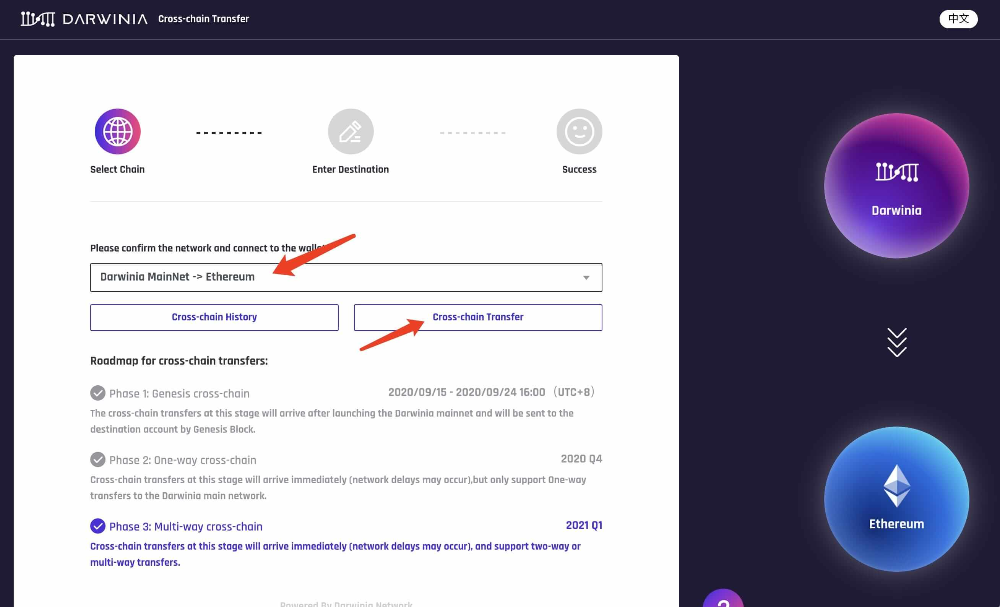
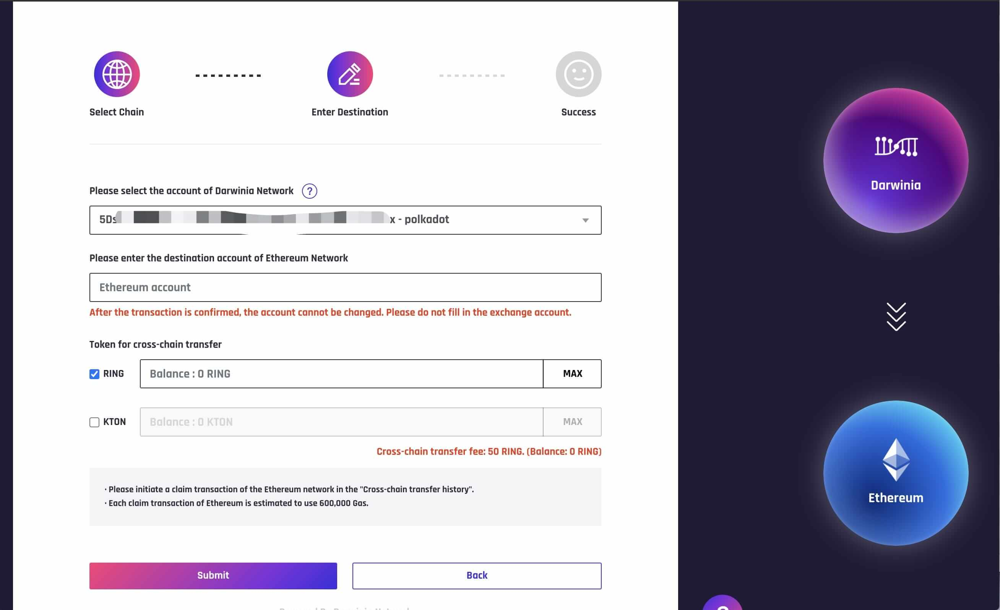
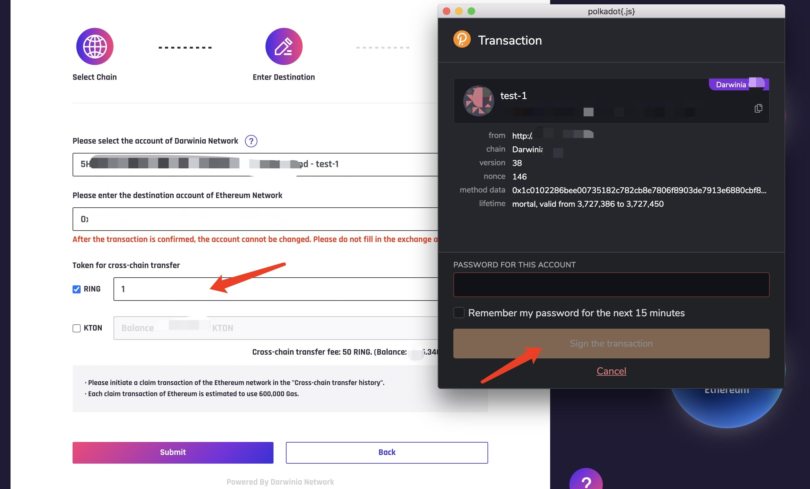
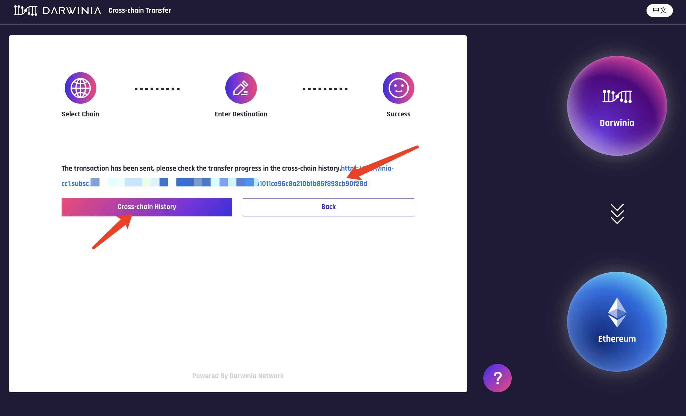
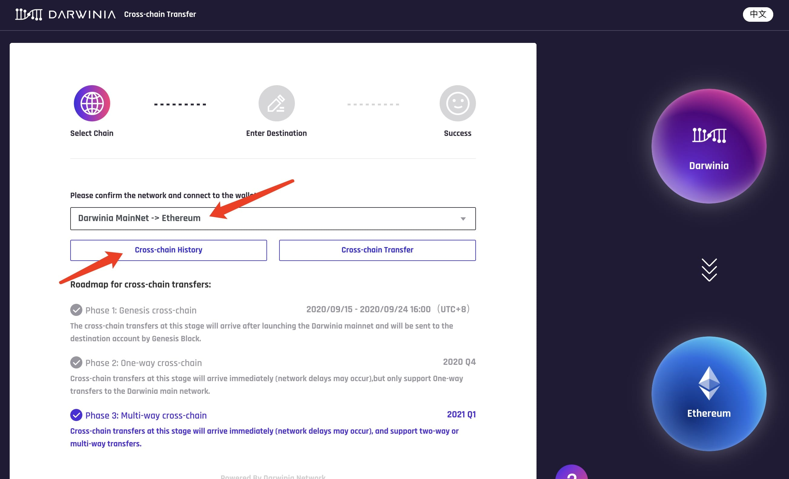
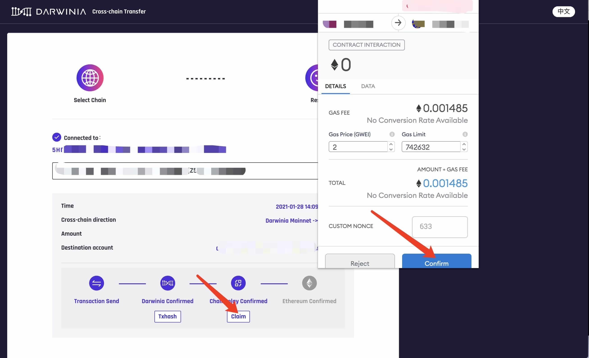

## About Wormhole

[Darwinia Wormhole](https://wormhole.darwinia.network/) is a cross-chain transfer tool developed based on the Darwinia Cross-Chain Bridge. Currently, several cross-chain bridges have been opened, and more bridges are under development. Users can choose cross-chain bridges to transact by their local wallet according to their requirement. The entire cross-chain process is completely decentralized and traceable. Wormhole is equipped with Transfer Process and History function to facilitate fund management.

## About Darwinia -> Ethereum Bridge 

Based on the previous 'Ethereum to Darwinia Network Bridge', Wormhole will open the 'Darwnia Network to Ethereum' cross-chain transfer on January 28, 2021. Darwinia users can transfer their RING and KTON to Ethereum through the bridge. At this point, the milestone of two-way transfer between Ethereum and Darwinia is officially completed.

## How To Transfer

### Preparation

1. Download Chrome
2. Install the following plugin
   
   * [**Polkadot.js**](https://polkadot.js.org/extension/)

   * **MetaMask wallet**: [Download link](https://chrome.google.com/webstore/detail/metamask/nkbihfbeogaeaoehlefnkodbefgpgknn)

### Cross-Chain Operation Process

**Darwinia cross-chain to Ethereum process is divided into two steps**:

1. **Lock tokens (RING, KTON) on Darwinia Network**

2. **Receive the tokens (RING, KTON) on the Ethereum**
   
   > Currently (January 28, 2021), Ethereum Gas Fee is relatively high. The second step of transfer requires sending an Ethereum transaction and approximately 600000 Gas (25 gwei about 0.015 ether, 50 gwei about 0.03 ether, 100 gwei about 0.06 ether). Thus, small amount transactions are not recommended.

The details of the two steps are following:

#### Lock tokens (RING, KTON) on Darwinia Network through Wormhole

1. Enter [Wormhole](https://wormhole.darwinia.network/). Click the Darwinia planet on homepage, the page will display the cross-chain bridges that have been opened. Click the Cross-Chain Transfer bottom under Ethereum planet to start the journey.
   
   

2. Select 'Darwinia Network -> Ethereum' in 'Network Select' column, then click 'Cross-Chain Transfer'.
   
   

   > This step requires [Polkadot.js](https://polkadot.js.org/extension/) plugin.

3. Fill in the cross-chain transfer information, select Darwinia network account to transfer, and fill Ethereum receiving address. 
  
   > After the cross-chain transfer, the receive operation is required. Therefore, the receiving address must be filled in a non-exchange account. 

4. Then, select the token and fill the amount in the 'Cross-Chain Transfer Token' column. 
   
   > When filling the amount of RING, please keep 2~3 RING as gas and 50 RING as handling fee (dynamic). Cross-chain operation supports simultaneous transferring RING and KTON. If you need to transfer KTON at the same time, please check the ☑️ KTON checkbox and enter the amount of KTON.
   
   

5. After confirming, click the 'Submit' button and sign through Polkadot.js.
   
   

6. After the transaction has been successfully sent, you can click the 'Subscan' link for transaction details and click 'Cross-Chain History' for transfer progress.
   
   

#### Receive tokens (RING, KTON) on Ethereum

**After locking RING, KTON on Darwinia Network, you need to receive it on Ethereum to complete.**

1. Switch to 'Darwinia Network -> Ethereum' in select network column. Click 'Cross-Chain History'.
   
   

2. Click 'Connected', select the Darwinia Network account to view cross-chain history. 
 
   > If it has been transferred successfully and no record in cross-chain history, please wait for about 1~2 minutes and refresh the page.

   
   
   > Estimated time：
   >  - `Wormhole read to transfer record` ~ 1 min
   >  - `Transaction sent successfully` 6-12 s
   >  - `Darwinia Network confirmation` ~ 1 min
   >  - `Block bridge connected successfully` 30s -60s
   >  - `Ethereum confirmation` It depends on the gas fee paid by the user

3. After 'Receive' button is lit, click the button and Metamask will pop-up. Then, enter the password to complete receiving process.
   
   

4. Click 'View Transaction' to get details through Etherscan
   
   

   

**Please contact us directly if you have questions or suggestions.**

Email: support@darwinia.network

Telegram: [t.me/DarwiniaNetwork](https://t.me/DarwiniaNetwork)

