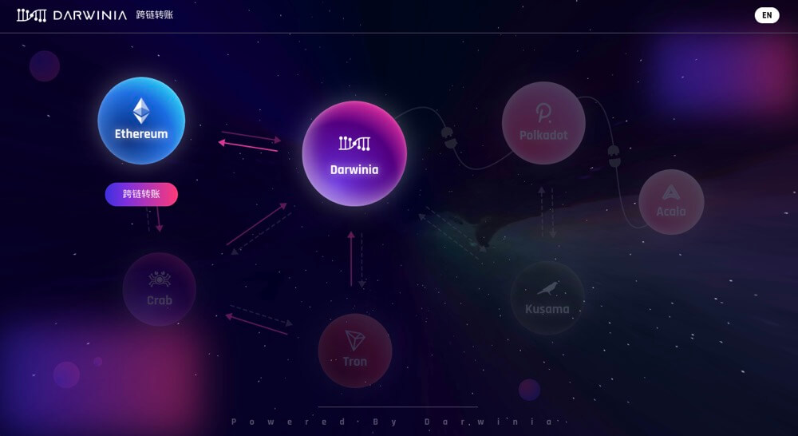
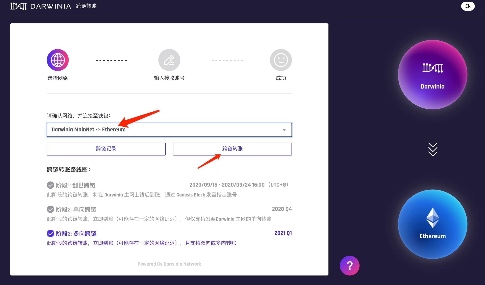
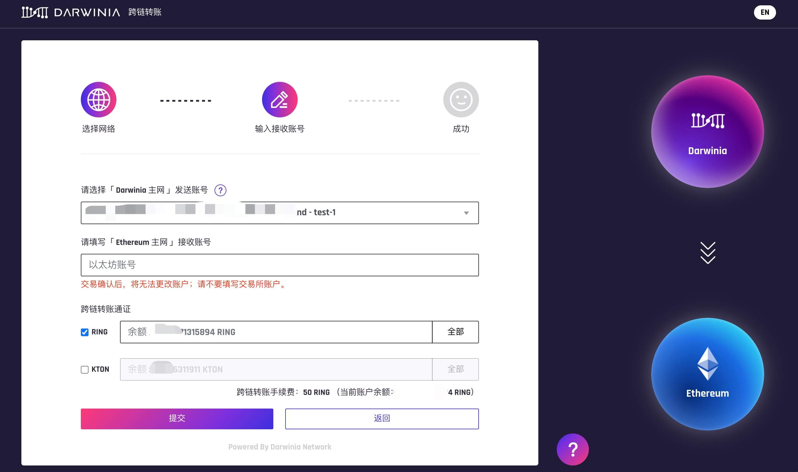
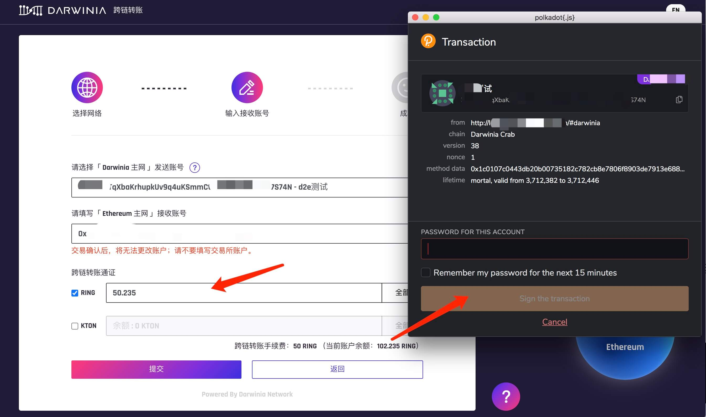
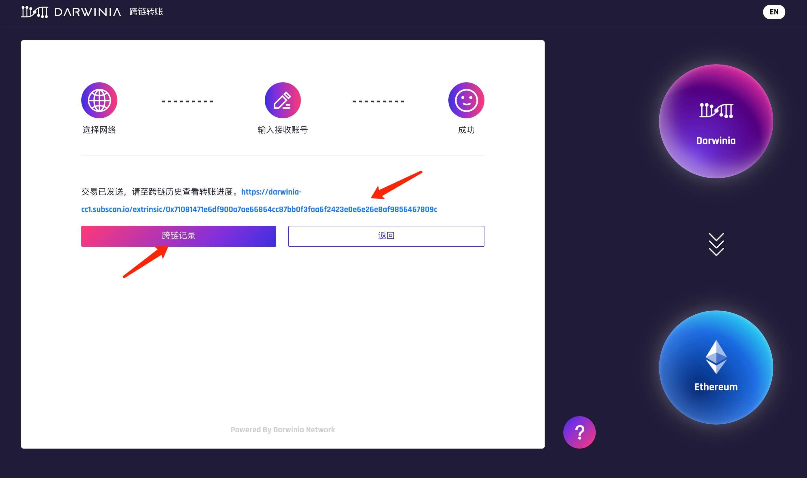
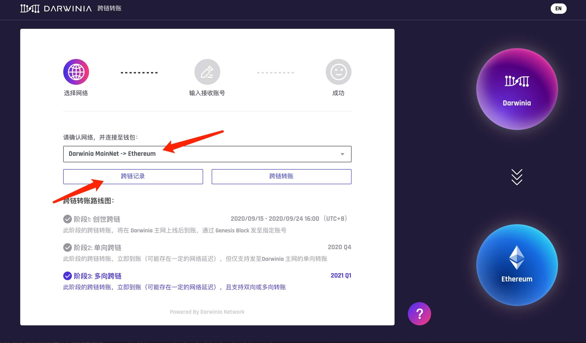
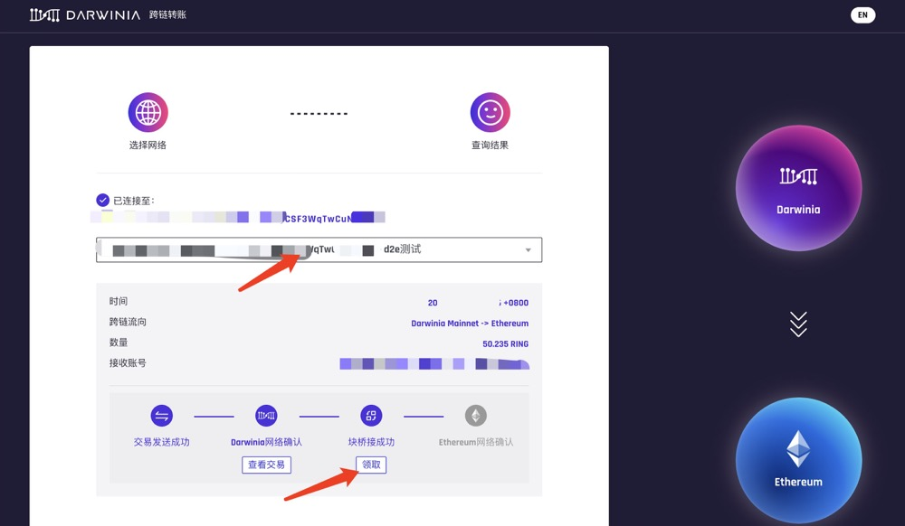
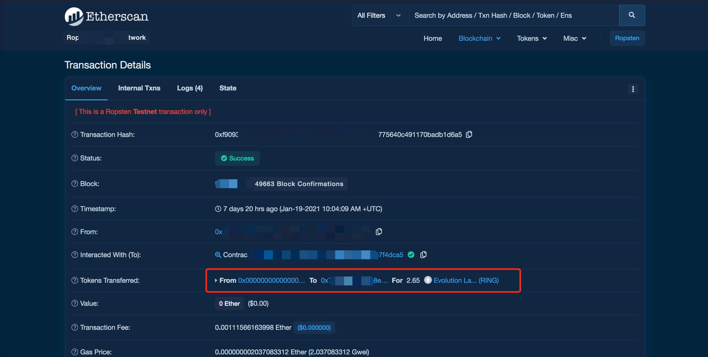

虫洞已于2021-01-28日支持 「达尔文网络 到 以太坊主网」的跨链转账，达尔文网络用户可以通过达尔文桥接网络将RING,KTON跨链转账到以太坊主网。

达尔文跨链到以太坊主网操作分为两个步骤：

1. **在达尔文网络上锁定通证（RING, KTON）**
2. **在以太坊网络上领取通证（RING, KTON）**

> 当前（2021-01-28）以太坊Gas费较高，跨链转账第二步骤需要发送一笔以太坊交易，预计消耗 600000 Gas (25 gwei约0.015 ether，50 gwei约0.03 ether， 100 gwei约0.06 ether)，所以不建议进行小额RING，KTON的跨链。

下面分别对2个步骤进行详细介绍。

## 通过 Wormhole 在达尔文网络锁定通证（RING, KTON）

1. 进入 [虫洞 - Wormhole](https://wormhole.darwinia.network/)，在「首页」点击「Darwinia」星球后，「Ethereum」 星球下会出现 「跨链转账」，点击进去。

    

2. 在「选择网络」栏切换到「Darwinia Network -> Ethereum」后，点击「跨链转账」。

   

    > 该步骤操作需要安装 **Polkadot.js 浏览器插件** 可以通过[安装插件教程](https://docs.darwinia.network/docs/zh-CN/wiki-tut-create-account#%E9%80%9A%E8%BF%87-polkadotjs-%E6%B5%8F%E8%A7%88%E5%99%A8%E6%8F%92%E4%BB%B6)进行安装。

3. 填写跨链转账信息，选择需要跨链的「Darwinia 主网账号」并填写「以太坊主网接收地址」，**跨链转账后还需要在以太坊网络进行领取操作，所以以太坊主网接收地址务必填写一个非交易所账号** 。在「跨链转账通证」栏目中勾选需要跨链的通证，并且填写数量，RING的数量填写时请注意保留 「2-3 RING燃料费 + 跨链手续费 50RING(动态)」。跨链操作支持同时操作RING和KTON，如果需要同时跨链转账RING和KTON，请勾选☑️KTON复选框，并且输入对应数量。

    

4. 点击表单下方「提交」按钮，会调用Polkadot.js浏览器插件，确认信息无误后，输入密码进行签名，提交跨链操作。

    

5. 交易已发送，可以通过点击「Subscan」链接，查看交易详情。点击「跨链记录」查看转账进度。

    

## 通过 Wormhole 在以太坊网络领取通证（RING, KTON）

通过在达尔文网络锁定RING,KTON后，需要在以太坊主网进行领取，完成跨链最后一步。

1. 在「选择网络」栏切换到「Darwinia Network -> Ethereum」后，点击「跨链记录」。

    

2. 点击「已连接至」，选择发起跨链的达尔文账号，查询转账记录。**如果已经跨链，「跨链记录」中没有对应记录，请稍等1-2分钟后刷新页面重新查询**。

    

    > 跨链耗时预估：
    >  - `虫洞读取到跨链转账记录` ~ 1 min
    >  - `交易发送成功` 6 - 12 s
    >  - `Darwinia网络确认` ~ 1 min
    >  - `块桥接成功` 30 - 60s
    >  - `Ethereum网络确认` 取决于用户领取支付的Gas费高低

3. 待「领取」按钮点亮时，点击「领取」，会弹起MetaMask插件，输入密码，完成领取操作。

    

4. 点击「查看交易」，可以通过「Etherscan」获取交易详情。

    

    

**Please contact us directly if you have questions or suggestions.**

Email: support@darwinia.network

Telegram: [t.me/DarwiniaNetwork](https://t.me/DarwiniaNetwork)

