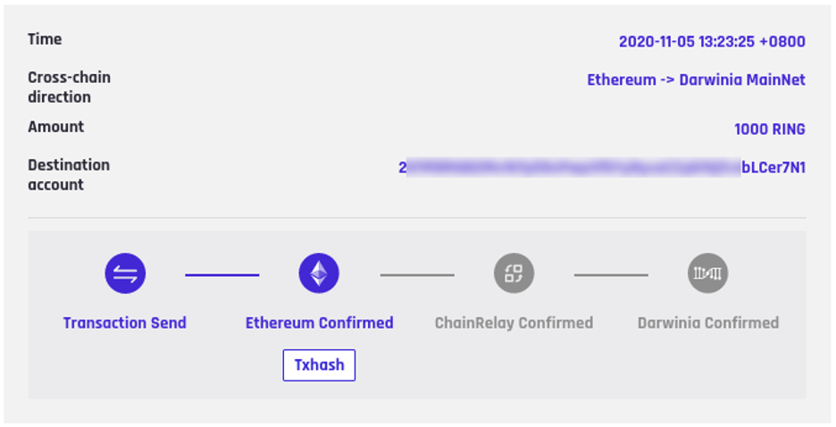

## Why cross-chain transfer

The assets on the mainnet can be used to participate in staking, and the current ROE is relatively high. After the genesis cross-chain stage, there is no way to transfer more assets to the mainnet. But it can now be done with the Ethereum-Darwinia one-way bridge. The users who hold Gringotts deposit receipt or Ethereum erc20 ring and kton can transfer their assets to the mainnet through the Ethereum-Darwinia one-way bridge. After reaching the mainnet, you can participate in staking to get rewards.

Let's use the tools provided by Darwinia to make an Ethereum-Darwinia one-way bridge cross-chain transfer.

## How to Cross-chain Transfer

1. Open [Wormhole](https://wormhole.darwinia.network/) and click [Ethereum]

    

2. Then click the [Cross-chain Transfer] button under [Darwinia] to enter the cross-chain transfer page, select [Ethereum -> Darwinia Mainnet] in the drop-down box, and then click [Cross-chain Swap]. 

    

    At this time, a MetaMask window will pop up to prompt you to connect to MetaMask and select your ethereum address containing darwinia assets (make sure there is enough ETH to pay the network gas fee), click [Next], and then click [Connect]:

    

3. After successfully connecting to MetaMask,there will be a form displayed. Fill in the correct [Darwinia Network account] (address starting with 2), and select the [asset type], and fill in the transfer [Amount]. 
   
   

   Click [Approve] ( When using the cross-chain bridge for the first time, there will be a [Approve] step), click [Confirm] in the pop-up Metamask window.

4. After [Approve] is completed, click the “Submit” button, and click “Confirm” in the pop-up Metamask window, the page jumps to:

    

5. That’s all you need to do. And the next step is to wait for the transaction confirmation on Ethereum and Darwinia.

## View the transfer confirmation progress

1. Click [Cross-chain History] to view the transfer confirmation progress:

    

2. After the Darwinia transaction confirmed, you can click [Txhash] to open subscan to view the details of the transaction:

    

 We can see that using the Darwinia Ethereum-Darwinia one-way bridge to do cross-chain transfer is a very simple and easy thing.
    

**Please contact us directly if you have questions or suggestions.**

Email: support@darwinia.network

Telegram: [t.me/DarwiniaNetwork](https://t.me/DarwiniaNetwork)

