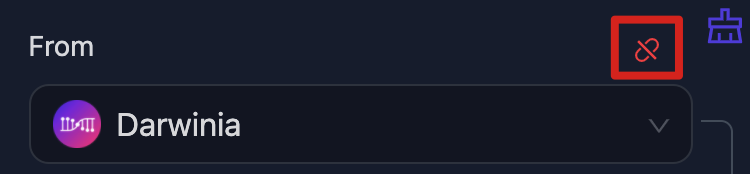
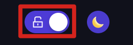
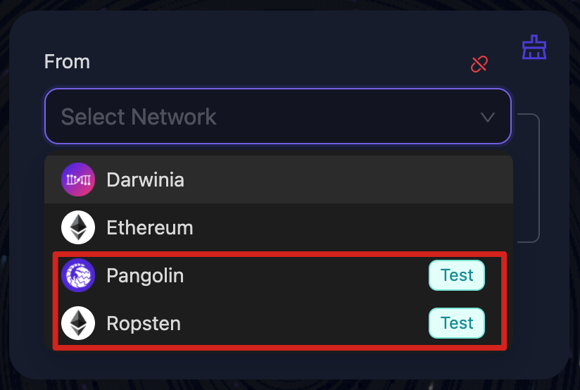
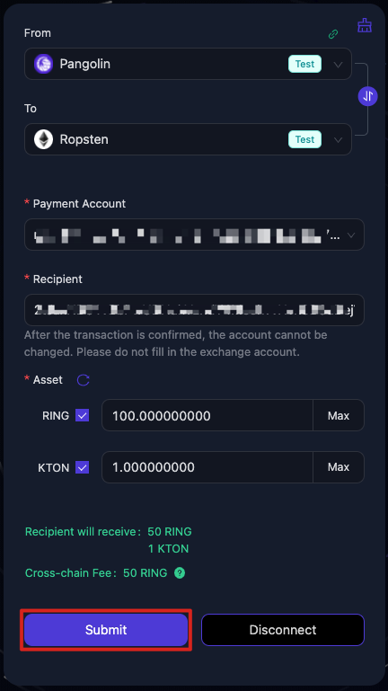
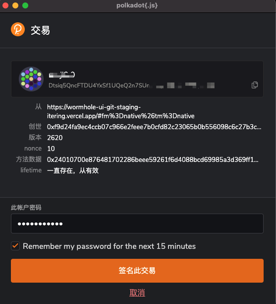
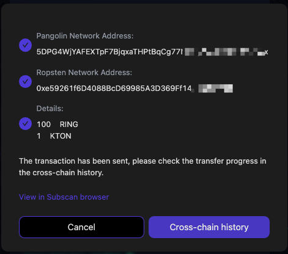

# Wormhole User Guide

## Definitions

Source network: The network of the account from which the assets come.

Target network: The network of the account to which the assets go.

## Network

You must set up the correct source and target networks before performing cross-chain transfer. If the source network is not selected, you will not see any of the options associated with the transfer. If the target network is not selected, some options will not be available and the transfer will not start.

### Network selection

Source network: Click on the network on the top(**From**) to select the source network;

Target network: Click on the network on the bottom(**To**) to select the target network.

- Whether you select the source network or the target network first is optional. Note that if you  select the source network first, only those target networks that are supported will appear in the drop list of Target Network. Similarly, if you select the target network first, only those source networks that are supported will appear.
- If you want to see all available source (target) networks, you need to clear the target (source) network.

### Connect

Once you have selected the source network, you can connect to it by clicking on the corresponding button below.

Clicking on this will connect you to the source network of your choice.

If  you change the source network after a successful connection, you will need to re-initiate the connection by clicking on the switch button.

### Disconnect

Once you have an established connection, you can click the ***Disconnect*** button on the bottom right to disconnect from it at any time.

### Network Status

You can see the network connection status on the top right of the source network panel.

    Meaning of Different Icons:

      - Red: the network is currently disconnected.
      - Green: the network is connected to the selected source network.
      - Yellow: the network is connected, but the connected network does not match the selected source network.

### Quick Switch & Reset

You can switch the source and target networks by clicking on the switch icon on the right between the source and target networks.

You can clear the selected source and target networks by clicking on the clear icon on the top right of the network selection panel.

### Show/Hide test network

By default, only the official network is displayed in the network selection panel. If you wish to use a test network, you can turn it on or off by clicking on the switch on the top right of the page.

Once you have allowed the test network to be displayed, you can see the test network options when selecting a network.

## Cross-chain

Once you have selected the networks, you can see the form entries that need to be filled in to complete the current cross-chain transfer.

### Transfer Flow

When the form is filled in and the page is error-free, you can click on the ***Submit*** on the bottom left of the panel to perform the transfer.

The complete transfer process usually consists of the following (taking Pangolin to Ropsten as an example).

1. Fill in the transfer form and make sure that the options are correct.

    

2. Click on the ***Submit*** button to enter the transfer process.
3. ***Confirm*** the assets and the amount to be transferred.

    

4. Source network authorization.

    

5. Receive an alert that the transfer is complete.

    

After clicking on the cross-chain button, you will see an indication of the progress of the transfer on the top right of the page.

### Fee

The required form information  for each cross-chain transfer may vary, so please refer to the actual form for details.

Please ensure that the balance in your transfer account is sufficient to cover the fee. The amount of the fee will be queried in real time at the time of the cross-chain operation, please refer to the actual result.

### Special Items

Some cross-chain transfers require special conditions, e.g.

### Ethereum To Darwinia

When filling in the transfer amount, the following error message may appear if the authorization amount is  insufficient. This is usually the case when transferring funds for the first time using an account.

