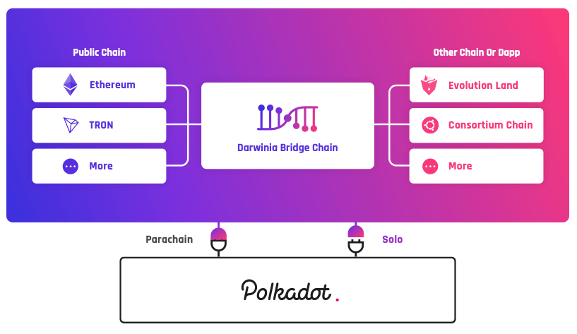
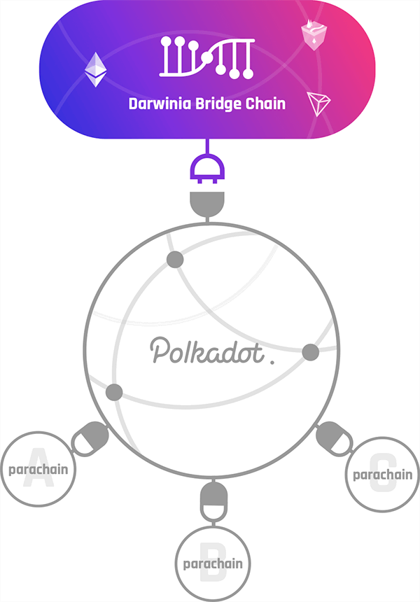

## Introduction

Blockchain network is being layered and specialized, while public chains cover consensus, security and cross-chain transfer of data or tokens, second-layer networks and side-chains are now targeting specific applications.

The innovation of new technologies as Polkadot and Substrate in lines with the trends of progression. Under such circumstances, Darwinia, a cross-chain network protocol to build the internet of tokens, chooses to join these trends of ecology and technology, with layered networks, cross-chain interactions, application-oriented design, user experience, etc. conducted  as our key design features and principles.

In the process of using blockchain technology to create new DAPP, we found several problems for the mass promotion and utilization of blockchain technology:

### The current blockchain infrastructure is not yet able to meet the requirements of user experience.

At present, the user experience problem of blockchain dapps is mainly reflected in two aspects. First, crypto wallets is still not easy to use for those who have never accessed blockchain and cryptocurrency. The necessity of private key backup and the inability to retrieve tokens if the password is forgotten are still big cognitive thresholds for users. Second,  low-TPS of the public chain, and the gas fee costs are also  big obstacles for users that are accustomed to  free  services.

### Traditional game vendors lack blockchain experience

The development of blockchain games require certain accumulation of blockchain technology and it could be costly for traditional game developers to build a complete blockchain development platform from the start.

### Blockchain dapps are split among different public chains 

Due to the heterogeneity of public chains, blockchain dapps developers need to develop the same game for each public chain in order to reach multiple public chain community, and the cost is relatively high.

We hope to use the most advanced blockchain technology and framework to construct an open network and application suite to solve these problems. This network and application suite combines blockchain trusted technology with a Web3 infrastructure with the following features: layered network design, cross-chain interaction, developer-friendly, best user experience, and high concurrency and customization.

### Architecture Design

Darwinia Network is a blockchain network based on Substrate technology. Darwinia Network is part of the Polkadot ecosystem, and at the same time differentiated from Polkadot, Darwinia Network focuses on cross-chain token Blockchain games or Dapps can easily perform cross-chain token transactions and transfer  through the Darwinia Network. For example, Cryptokitties can transform its NFT (Kitties) on the Ethereum into NFT on EOS through the Darwinia chain; players on the Ethereum and players on the EOS can play Evolution Land game simultaneously through the Darwinia Network. At the same time, thanks to the Polkadot ecosystem, Darwinia Network can link to a wider range of games and players.

The architecture relationship of Darwinia network is shown as below.

## Solo Mode

To this end, we divided the operating mode of Darwinia relay chain into Solo mode and Polkadot connection mode:

Darwinia Network can choose to operate as an independent public-chain network and is responsible for its own consensus security, with its core business and application services, including the cross-chain functionality of each application chain, controlled by Darwinia Network itself.

## Parachain Mode

In Polkadot connection mode, Darwinia bridge chain , it also serves as a Parachain for Polkadot.

Since Polkadot network adopts shared security model, the cross-chain security of the parachains will be guaranteed by the validators of Polkadot Relay Chain in the Polkadot connection mode. After Darwinia Network switches to the connected mode, the original validators and Staking mechanisms will be used to ensure local consensus within the Darwinia Network, which will help achieve faster block confirmation and higher TPS. This local consensus mechanism will also help Collator to determine that the block submitted to the Polkadot validators does not violate Polkadot global consensus.

### Polkadot Slot Bid Incentive Proposal

In the connection mode, Darwinia Network may initial such proposal under this design, to provide benefits to participants who lock their DOT and support Darwinia to its Polkadot Parachain slot bid.

When Darwinia Network switches to polkadot connection mode, DOT owners in the Darwinia community may lock their token through biding lock, and receive benefits from the incentive proposal.

