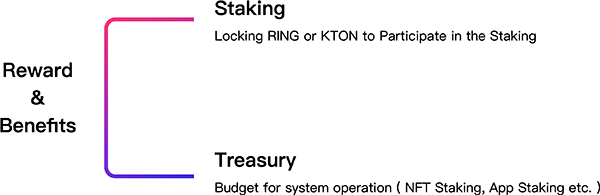

The benefits of Darwinia Network include block reward and transaction fees. The transaction fees include block fees, cross-chain staking fees, App-chain access fee and other related fees. (e.g from Evolution Land)

Treasury is primarily used for payment of system proposal budgets, and may include system operation proposals such as NFT mining or App mining, Polkadot slot bidding incentives, or for eco developer support.
