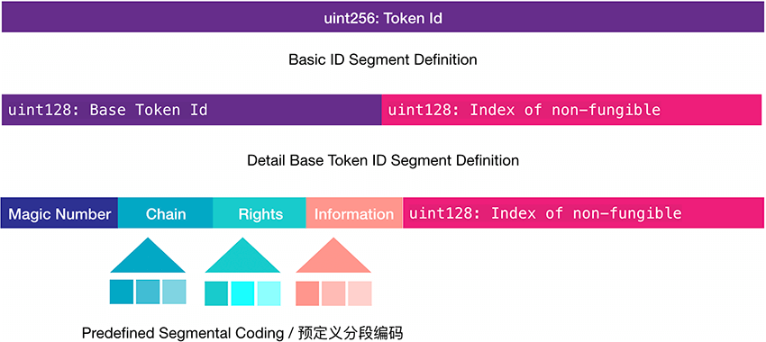

In blockchain network, we use a single ID stand to mark different items. In the virtual realm, due to the existence of different ledger or blockchain network (domain), different items with different ID are identifiable within one domain, but the observers within one realm cannot identify item IDs from other domains.

The current design of many existing ERC721 blockchain applications is mainly for the identification of intra-domain products, and does not take into account the re-use of products from different domains, which leads to a situation that single Token ID cannot identify a unique product when re-using non-fungible products, and it also needs to carry a lot of domain information, which could be very complicated to implement.

To solve this issue, we designed an Interstellar Product Coding Standard, that enable different public chain and different products to have a single ID in the Darwinia Network, to allow easy cross-chain transfer for NFT products.

