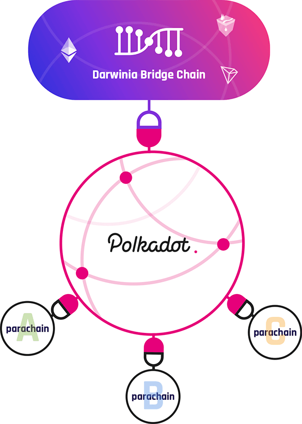
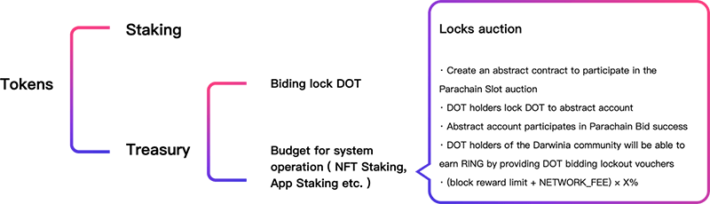

In Polkadot connection mode, Darwinia bridge chain , it also serves as a Parachain for Polkadot.

Since Polkadot network adopts shared security model, the cross-chain security of the parachains will be guaranteed by the validators of Polkadot Relay Chain in the Polkadot connection mode. After Darwinia Network switches to the connected mode, the original validators and Staking mechanisms will be used to ensure local consensus within the Darwinia Network, which will help achieve faster block confirmation and higher TPS. This local consensus mechanism will also help Collator to determine that the block submitted to the Polkadot validators does not violate Polkadot global consensus.

### Polkadot Slot Bid Incentive Proposal

In the connection mode, Darwinia Network may initial such proposal under this design, to provide benefits to participants who lock their DOT and support Darwinia to its Polkadot Parachain slot bid.

When Darwinia Network switches to polkadot connection mode, DOT owners in the Darwinia community may lock their token through biding lock, and receive benefits from the incentive proposal.

