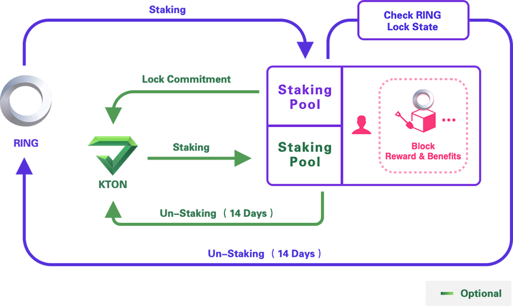

### KTON

To encourage users to make long term commitments and pledge, users can choose to lock RING for 3 - 36 months in the process of Staking, and the system will offer a KTON token as reward for users participating in Staking. During the committed pledge period, users cannot unlock their RING. (Unless they utilise triple the amount of KTON as penalty). 

As a result, during RING staking process, users can choose to lock RING for a period to receive KTON. The initial supply amount of KTON should be zero, yet before the Darwinia mainnet launch, some users have already started locking their RING in Evolution Land, so there will be some KTON supply at the time of mainnet launch. The earliest design to obtain the KTON by locking the RING appears in the Gringotts of Evolution Land. The related introduction can refer to the Gringotts KTON model.

KTON can be pledged to receive Staking power, so as to participate in POS mining as well. Users may Stake via pledging KTON. However, if the user takes back his or her staking KTON, then the related POS mining will be stopped, and it will take 14 days for the unpledged KTON to arrive. 
