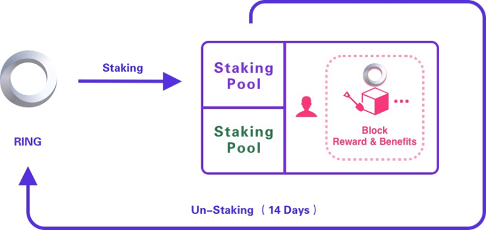

The Darwinia Network will distribute new RING generated on the blockchain as an incentive to the participants of Staking. The process of Staking can also be understood as the POS mining process, where the miner obtains Staking energy by pledging tokens for POS mining. The term POS mining refers to providing computing capability of traditional web and network service to serve the users in the Darwinia Network.

Generally speaking, users can perform POS mining by pledging the base token “RING”. If users start to retrieve the RING from Staking pledge, the mining will stop, and the unpledged “RING” will take 14 days to fully arrive. Based on the role of a staking participant, the participant may or may not provide the basic computing power and network bandwidth to the Platform. Only the staking participants that act as validators provide computing capabilities to users in the Darwinia Network to insert and query the data on the network.  The role is well documented in the section of the staking hash rate. 

According to complexity, Staking can be divided into basic and [advanced](./wiki-us-staking-advanced) versions:

### Basic Staking

