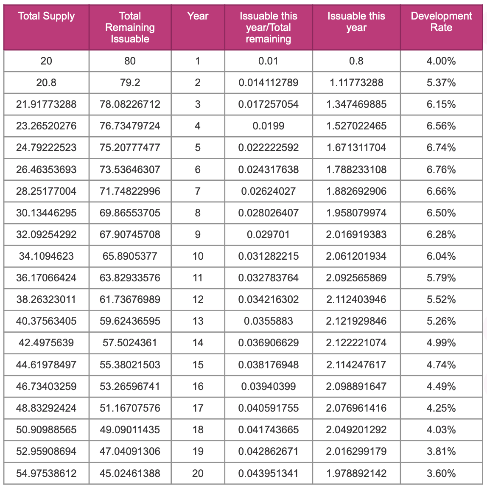

Darwinia uses NPoS (Nominated Proof-of-Stake) as its mechanism for selecting the validator set. It is designed with the roles of `validators` and `nominators` to maximize chain security. Those who are interested in maintaining the network can run a validator node.

The system encourages RING/KTON holders to participate as nominators. Nominators may back up to 16 validators as trusted validator candidates.

The staking system pays out rewards essentially equally to all validators regardless of stake. Having more stake on a validator does not influence the amount of block rewards it receives.

Distribution of the rewards are pro-rata to all stakers (nominators and validator) after the validator payment is deducted. In this way, the network incents the nomination of lower-staked validators to create an equally-staked validator set.

## Basic

Users can stake RINGs for NPoS mining. If users unbound the staking RINGs, mining would stop, and the unbound RINGs will be fully transferable after 14 days.


## Advanced

To encourage long-term locking and commitment, users can commit to locking RING for 1 - 36 months during the process of Staking RING, and the system will reward them with one KTON. They cannot unlock the RING during the commitment period (unless they pay three times KTONs as a penalty).

KTONs can also be staked in NPoS mining. If users unbound the staking KTONs, then mining will stop and the unbinding KTONs will be fully transferable after 14 days.


## Validators and nominators

There are two roles in the NPoS mechanism, the validator and the nominator. And there is a time period for a completed process of an NPoS mechanism named `era`. The `era` is a period of time around one week; it will be delayed or advanced based on the different network and computing environments of the participants. A validator can hold a validator pool in an `era`, and nominators can participate in it. An account can only assume a single role in one `era`.

Since validator slots are limited, most of those who wish to stake their RING/KTON and contribute economic security to the network will be nominators.

Validators do most of the heavy lifting: they produce new block candidates in BABE, vote, and reach a consensus in GRANDPA.

Nominators, on the other hand, have far fewer responsibilities. These include monitoring their validators' performance (uptime), keeping an eye on changing commission rates (a validator can change commission at any time), and monitoring the general health of their and their validators' accounts. Thus, while not precisely set-it-and-forget-it, a nominator's experience is pretty hands-off.

## Validator pool

A validator pool consists of an elected validator together with the nominators backing it.

## Staking Power

Whether you are participating in staking with RING or KTON, the essence is to gain `Power` by staking RING/KTON and then use that power for NPoS mining.

The staking power of an account, similar to that in PoW, represents its contribution to staking at that moment. It is determined by the RING and KTON staked to it and will disappear once the staking ends and cannot be transferred or reassigned.

- The validator pool's Power

    `The validator pool's Power percentage`: The proportion of staked assets in this validator pool to the total staked assets.

    `The validator pool's Power`： Total Power * `The validator pool's Power percentage`

- The Power of an account in a validator pool

    `The account's Power percentage` ：The proportion of staked assets to the total staked assets.

    `The account's Power` ：Total Power * `The account's Power percentage` .

    `The Power of an account in a validator pool` ： `The account's Power` / N (Suppose the account has nominated N validators).

Then, with the above two data, we can calculate：

`The account's Power percentage in a validator pool`： `The Power of an account in a validator pool` / `The validator pool's Power`。

## Staking Rewards Distribution

For each validator pool, we keep a list of nominators with the associated stakes.

The general rule for rewards across validator pools is that two validator pools get paid essentially the **same amount of tokens** for equal work, i.e. they are NOT paid proportional to the stakes in each pool. There is a probabilistic component to staking rewards in era points and tips that should average over time.

We thus give nominators an economic incentive to shift their preferences to lower staked(has lower powers) validators gradually that gain a sufficient amount of reputation. The reason for this is that we want the stake across validator pools to be as evenly distributed as possible, to avoid a concentration of power among a few validators.

After an era, the system will distribute the additional RINGs generated as rewards (see Inflation) equally to all validator pools in the era, and after each validator pool receives the rewards, a portion will be deducted as commission fees and distributed to the validators, and the remainder will be divided into two equal parts, one for the validators and nominators who staked RING and the other for the validators and nominators who staked KTON. These two parts are awarded to the accounts according to their shares in the validator pool. So to get more rewards, users should choose validator pools with less power.

## Accounts

There are two types of accounts for managing your funds: `Stash` and `Controller`.

- **Stash:** This account holds funds bonded for staking but delegates some functions to a Controller. As a result, you may actively participate with a Stash key kept in a cold wallet, meaning it stays offline all the time. You can also designate a Proxy account to vote in [governance](https://wiki.polkadot.network/docs/learn-governance) proposals.
- **Controller:** This account acts on behalf of the Stash account, signalling decisions about nominating and validating. It sets preferences like payout account and commission. If you are a validator, it also sets your [session keys](https://wiki.polkadot.network/docs/learn-keys#session-keys). It only needs enough funds to pay transaction fees.

Controller and Stash account keys can be either sr25519 or ed25519. For more on how keys are used in Polkadot and the cryptography behind it see [here](https://wiki.polkadot.network/docs/learn-keys).

## Slashing

Slashing will happen if a validator misbehaves (e.g. goes offline, attacks the network, or runs modified software) in the network. The misbehaving validator and their nominators will get slashed by losing a percentage of their bonded/staked tokens, and slashed tokens go to the Treasury.

Validator pools with larger total stake backing them will get slashed more harshly than less popular ones, so we encourage nominators to shift their nominations to less popular validators to reduce the possible losses.

To prevent the network from validators’ attacking or unstable block validation, the network implements a mechanism to punish the validators and their nominators by confiscating a portion of their staked tokens when an attack or error occurs. The process and mechanism of the penalty is the slash algorithm. Since there are two different tokens (RING and KTON) existing in the Darwinia Network, a supplementary explanation of slash algorithm is required.

The punishment-related parameter in the Staking system is in percentage. In the slashing event, tokens staked by the validator and their nominators will be slashed by a certain percentage, RING or KTON.

In the staking system of Darwinia Network, there are four main states for RING: account balance, in staking, staking lock, un-staking, so there exist two different states for staked RINGs: in staking and staking lock, and the RINGs in staking lock may have different unlock date. In the occurrences of slashing, it is essential to confirm the sequential and priority of RINGs that are being slashed. The staking system will follow the order of unlocking expiration and slash tokens with earlier expiration dates first. The staked tokens that are not locked will be slashed first, and then the locked tokens with the earlier expiry date.

## Inflation

The total cap of the block reward (MAX_BLOCK_REWARD_YEAR) is adjusted once a year. The block reward of year N is 1 - (99 /100)^sqrt(N) of the total remaining issuable.

```
Total remaining issuable RING = HARD_CAP - CURRENT_SUPPLY

Supply in the next year = supply in the previous year + total actual reward in the year
```

The total number of `HARD_CAP` for RING is 10 billion.

According to the annual block reward limit and the block interval (in seconds), you can calculate the block reward top limit (`MAX_BLOCK_REWARD`) for each block of the year.

```
Block Reward Limit for Each Block = Total Reward Limit for the Year × Block Interval Time /Total Number of Seconds per Year ( 365 * 24 * 3600)
```

The following table shows RING’s Annual development statistics:


